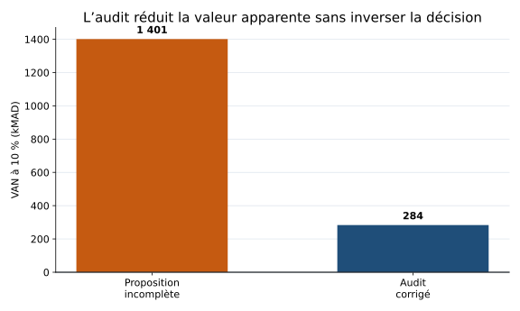
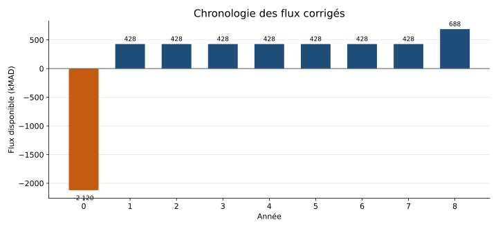
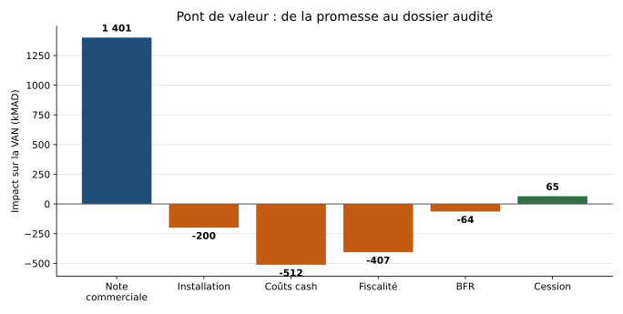
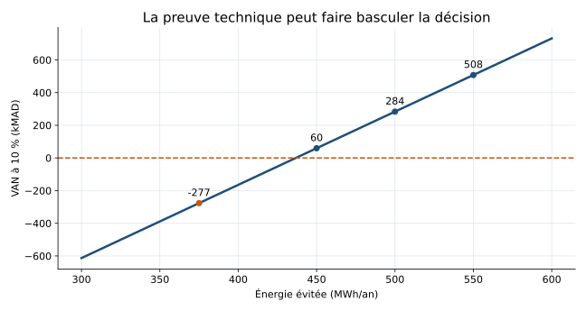
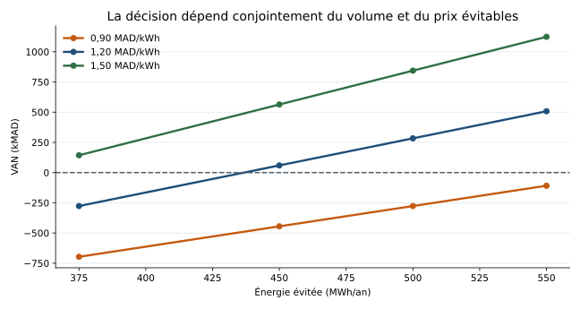
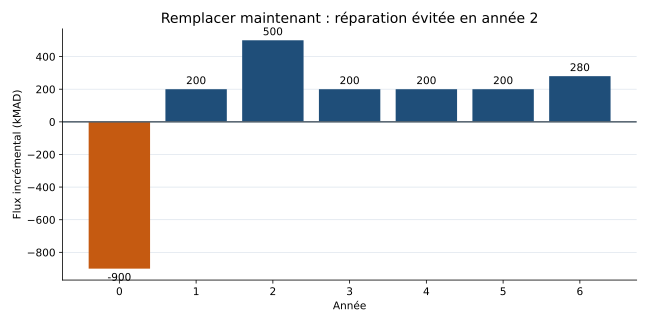
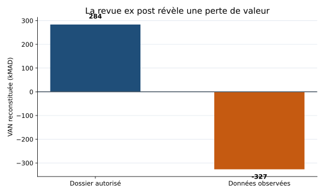



```{webr}
#| label: live-setup-seance1
#| include: false
#| echo: false
#| output: false
#| autorun: true
#| timelimit: 0
# Séance 1 : audit d'un investissement, cas fictif Atlas Process
# Unité monétaire : milliers de MAD (kMAD). Aucune donnée de marché.
# R de base seulement. Paramètres fiscaux pédagogiques, non droit marocain.
parametres <- function() list(n=8L, taux=.10, impot=.30,
  achat=1800, installation=200, bfr=120, gain_mwh=500,
  prix_kwh=1.20, maintenance=60, opportunite=36, cession=200)
van <- function(flux, taux) sum(flux/(1+taux)^(seq_along(flux)-1))
annuite <- function(taux, n) sum(1/(1+taux)^(1:n))
fmt <- function(x, digits=2) format(round(x,digits),big.mark=' ',decimal.mark=',',
  nsmall=digits,scientific=FALSE)
modele <- function(p=parametres()) {
  stopifnot(p$n>=1, p$n==as.integer(p$n), p$taux> -1,
            p$impot>=0, p$impot<=1, p$bfr>=0)
  an <- 0:p$n
  investissement <- p$achat+p$installation
  # MWh * 1000 kWh/MWh * MAD/kWh / 1000 MAD/kMAD
  economie <- p$gain_mwh*p$prix_kwh
  amort <- investissement/p$n
  ebitda <- economie-p$maintenance-p$opportunite
  ebit <- ebitda-amort
  # Les économies fiscales sont immédiatement utilisables par hypothèse.
  impot <- ebit*p$impot
  exploitation <- ebit-impot+amort
  capex <- c(investissement,rep(0,p$n))
  delta_bfr <- c(p$bfr,rep(0,p$n-1),-p$bfr)
  # Valeur comptable nulle à la fin de la huitième année.
  cession_nette <- c(rep(0,p$n),p$cession*(1-p$impot))
  fcf <- c(0,rep(exploitation,p$n))-capex-delta_bfr+cession_nette
  data.frame(annee=an,economies=c(0,rep(economie,p$n)),
    couts_cash=c(0,rep(p$maintenance+p$opportunite,p$n)),
    amortissement=c(0,rep(amort,p$n)),EBIT=c(0,rep(ebit,p$n)),
    impot=c(0,rep(impot,p$n)),flux_exploitation=c(0,rep(exploitation,p$n)),
    CAPEX=capex,variation_BFR=delta_bfr,cession_nette=cession_nette,
    FCF=fcf,FCF_actualise=fcf/(1+p$taux)^an)
}
# APPLICATION 1 : rapprochement de la proposition et du dossier corrigé
application1 <- function() {
  p <- parametres(); d <- modele(p)
  brut <- c(-p$achat,rep(p$gain_mwh*p$prix_kwh,p$n))
  comparaison <- data.frame(dossier=c('Commercial incomplet','Audit corrige'),
    besoin_initial=c(p$achat,p$achat+p$installation+p$bfr),
    VAN=c(van(brut,p$taux),van(d$FCF,p$taux)))
  print(comparaison,row.names=FALSE)
  barplot(comparaison$VAN,names.arg=comparaison$dossier,
    col=c('#c55a11','#1f4e79'),ylab='VAN (kMAD)',main='Effet de l audit',las=1)
  abline(h=0,col='gray50'); invisible(comparaison)
}
# APPLICATION 2 : chronologie des flux
application2 <- function() {
  p <- parametres(); d <- modele(p)
  print(round(d,2),row.names=FALSE)
  barplot(d$FCF,names.arg=d$annee,col=ifelse(d$FCF<0,'#c55a11','#1f4e79'),
    xlab='Annee',ylab='Flux disponible (kMAD)',main='Investir puis recuperer les flux')
  abline(h=0); invisible(d)
}
# APPLICATION 3 : test de la preuve technique, pas prévision de marché
application3 <- function() {
  gains <- c(375,450,500,550)
  resultats <- data.frame(gain_mwh=gains,economie_kMAD=NA_real_,VAN=NA_real_)
  for(i in seq_along(gains)) {
    p <- parametres(); p$gain_mwh <- gains[i]
    resultats$economie_kMAD[i] <- gains[i]*p$prix_kwh
    resultats$VAN[i] <- van(modele(p)$FCF,p$taux)
  }
  print(round(resultats,2),row.names=FALSE)
  plot(resultats$gain_mwh,resultats$VAN,type='b',pch=19,col='#1f4e79',
    xlab='Economie annuelle (MWh)',ylab='VAN (kMAD)',main='Une hypothese a documenter')
  abline(h=0,lty=2,col='#c55a11'); invisible(resultats)
}
# EXERCICE : BFR et valeur terminale
cas_bfr_terminal <- function(taux=.09,taux_recuperation=1) {
  stopifnot(taux_recuperation>=0,taux_recuperation<=1)
  terminal <- 260 + 75*taux_recuperation + 120
  flux <- c(-1075,260,260,260,terminal)
  d <- data.frame(annee=0:4,flux=flux,
    facteur_actualisation=1/(1+taux)^(0:4),
    valeur_actuelle=flux/(1+taux)^(0:4))
  print(round(d,3),row.names=FALSE)
  cat('VAN :',round(van(flux,taux),2),'kMAD\n')
  barplot(flux,names.arg=0:4,col=ifelse(flux<0,'#c55a11','#1f4e79'),
    xlab='Année',ylab='Flux (kMAD)',main='BFR et valeur terminale')
  abline(h=0,col='gray50')
  invisible(d)
}
# APPLICATION 4 : expliquer la révision de la VAN ligne par ligne
pont_valeur <- function() {
  p <- parametres(); a <- annuite(p$taux,p$n)
  niveau <- c(
    -p$achat + p$gain_mwh*p$prix_kwh*a,
    -(p$achat+p$installation) + p$gain_mwh*p$prix_kwh*a,
    -(p$achat+p$installation) +
      (p$gain_mwh*p$prix_kwh-p$maintenance-p$opportunite)*a,
    -(p$achat+p$installation) + modele(p)$flux_exploitation[2]*a,
    -(p$achat+p$installation+p$bfr) + modele(p)$flux_exploitation[2]*a +
      p$bfr/(1+p$taux)^p$n,
    van(modele(p)$FCF,p$taux))
  libelle <- c('Note commerciale','Installation complète','Coûts cash pertinents',
    'Fiscalité et amortissement','BFR récupéré','Cession nette')
  impact <- c(niveau[1],diff(niveau))
  resultat <- data.frame(etape=libelle,impact_VAN=impact,VAN_apres_etape=niveau)
  print(transform(resultat,impact_VAN=round(impact_VAN,2),
    VAN_apres_etape=round(VAN_apres_etape,2)),row.names=FALSE)
  barplot(impact,names.arg=seq_along(impact),
    col=ifelse(impact<0,'#c55a11','#1f4e79'),
    xlab='Étape du pont',ylab='Impact sur la VAN (kMAD)',
    main='De la promesse commerciale au cash audité')
  abline(h=0,col='gray50')
  invisible(resultat)
}

# APPLICATION 5 : sensibilité croisée et seuil technique
matrice_sensibilite <- function(gains=c(375,450,500,550),
                                prix=c(.90,1.20,1.50)) {
  z <- matrix(NA_real_,nrow=length(gains),ncol=length(prix),
    dimnames=list(paste0(gains,' MWh'),paste0(prix,' MAD/kWh')))
  for(i in seq_along(gains)) for(j in seq_along(prix)) {
    p <- parametres(); p$gain_mwh <- gains[i]; p$prix_kwh <- prix[j]
    z[i,j] <- van(modele(p)$FCF,p$taux)
  }
  print(round(z,2))
  matplot(gains,z,type='b',pch=19,lty=1,lwd=2,
    col=c('#c55a11','#1f4e79','#2f6f44'),
    xlab='Énergie évitée (MWh/an)',ylab='VAN (kMAD)',
    main='Sensibilité croisée : performance et prix')
  abline(h=0,lty=2,col='gray40')
  legend('topleft',legend=colnames(z),col=c('#c55a11','#1f4e79','#2f6f44'),
    lty=1,pch=19,bty='n')
  invisible(z)
}

seuil_gain_mwh <- function(p=parametres(),intervalle=c(100,900),afficher=TRUE) {
  f <- function(g) {q <- p; q$gain_mwh <- g; van(modele(q)$FCF,q$taux)}
  seuil <- uniroot(f,interval=intervalle)$root
  if(afficher) cat('Seuil de VAN nulle :',round(seuil,2),'MWh/an\n')
  invisible(seuil)
}

# APPLICATION 6 : plusieurs seuils utiles pour négocier les conditions
seuils_decision <- function(p=parametres(),afficher=TRUE) {
  f_gain <- function(x) {q<-p;q$gain_mwh<-x;van(modele(q)$FCF,q$taux)}
  f_prix <- function(x) {q<-p;q$prix_kwh<-x;van(modele(q)$FCF,q$taux)}
  f_maint <- function(x) {q<-p;q$maintenance<-x;van(modele(q)$FCF,q$taux)}
  r <- data.frame(
    variable=c('Énergie évitée minimale','Prix évitable minimal',
      'Maintenance annuelle maximale'),
    seuil=c(uniroot(f_gain,c(100,900))$root,
      uniroot(f_prix,c(.10,3))$root,
      uniroot(f_maint,c(0,500))$root),
    unite=c('MWh/an','MAD/kWh','kMAD/an'))
  if(afficher) print(transform(r,seuil=round(seuil,3)),row.names=FALSE)
  invisible(r)
}

# APPLICATION 7 : normaliser l'activité avant de valoriser l'économie
cas_normalisation_activite <- function(production_avant=10000,
    production_apres=12000,intensite_avant=200,intensite_apres=160,
    prix_kwh=1.20) {
  conso_avant <- production_avant*intensite_avant/1000
  conso_apres <- production_apres*intensite_apres/1000
  reference_ajustee <- production_apres*intensite_avant/1000
  economie_naive <- conso_avant-conso_apres
  economie_ajustee <- reference_ajustee-conso_apres
  r <- data.frame(indicateur=c('Consommation avant','Consommation après',
      'Référence à activité comparable','Économie observée naïve',
      'Économie ajustée de l’activité','Valeur ajustée'),
    valeur=c(conso_avant,conso_apres,reference_ajustee,economie_naive,
      economie_ajustee,economie_ajustee*prix_kwh),
    unite=c(rep('MWh/an',5),'kMAD/an'))
  print(transform(r,valeur=round(valeur,2)),row.names=FALSE)
  barplot(c(economie_naive,economie_ajustee),
    names.arg=c('Comparaison naïve','Activité comparable'),
    col=c('#c55a11','#1f4e79'),ylab='Économie (MWh/an)',
    main='Le scénario de référence change la mesure')
  invisible(r)
}

# APPLICATION 8 : coût financier d'un report pur d'une année
cout_report <- function(p=parametres(),afficher=TRUE) {
  maintenant <- van(modele(p)$FCF,p$taux)
  dans_un_an <- van(c(0,modele(p)$FCF),p$taux)
  r <- data.frame(decision=c('Démarrage immédiat','Projet identique décalé d’un an'),
    VAN=c(maintenant,dans_un_an))
  if(afficher) {
    print(transform(r,VAN=round(VAN,2)),row.names=FALSE)
    cat('Coût du report :',round(maintenant-dans_un_an,2),'kMAD\n')
    barplot(r$VAN,names.arg=c('Maintenant','Dans un an'),
      col=c('#1f4e79','#c55a11'),ylab='VAN aujourd’hui (kMAD)',
      main='Le temps consomme de la valeur')
  }
  invisible(r)
}

# APPLICATION 9 : le scénario sans projet peut contenir une dépense future
cas_remplacement <- function(taux=.10) {
  # Projet : 900 à t0, économie nette de 200/an pendant 6 ans,
  # réparation de 300 évitée à t2 et cession de 80 à t6. Cas avant impôt.
  flux <- c(-900,200,500,200,200,200,280)
  d <- data.frame(annee=0:6,flux_incremental=flux,
    valeur_actuelle=flux/(1+taux)^(0:6))
  print(round(d,2),row.names=FALSE)
  cat('VAN du remplacement :',round(van(flux,taux),2),'kMAD\n')
  barplot(flux,names.arg=0:6,col=ifelse(flux<0,'#c55a11','#1f4e79'),
    xlab='Année',ylab='Flux incrémental (kMAD)',
    main='Remplacer maintenant contre réparer plus tard')
  abline(h=0,col='gray50')
  invisible(d)
}

# APPLICATION 10 : revue ex post, avec données pédagogiques observées
revue_ex_post <- function() {
  prevu <- parametres()
  observe <- parametres(); observe$achat <- 1900; observe$gain_mwh <- 430
  observe$prix_kwh <- 1.10; observe$maintenance <- 75
  vp <- van(modele(prevu)$FCF,prevu$taux)
  vo <- van(modele(observe)$FCF,observe$taux)
  r <- data.frame(indicateur=c('CAPEX équipement','Énergie évitée','Prix évitable',
      'Maintenance','Flux exploitation','VAN'),
    unite=c('kMAD','MWh/an','MAD/kWh','kMAD/an','kMAD/an','kMAD'),
    dossier=c(prevu$achat,prevu$gain_mwh,prevu$prix_kwh,prevu$maintenance,
      modele(prevu)$flux_exploitation[2],vp),
    observation=c(observe$achat,observe$gain_mwh,observe$prix_kwh,
      observe$maintenance,modele(observe)$flux_exploitation[2],vo))
  r$ecart <- r$observation-r$dossier
  print(transform(r,dossier=round(dossier,2),observation=round(observation,2),
    ecart=round(ecart,2)),row.names=FALSE)
  barplot(c(vp,vo),names.arg=c('Dossier','Observation'),
    col=c('#1f4e79','#c55a11'),ylab='VAN reconstituée (kMAD)',
    main='Revue ex post de la création de valeur')
  abline(h=0,col='gray50')
  invisible(r)
}
# CONTROLE DES ACQUIS : cas indépendant à cinq ans
ticket_sortie <- function() {
  flux <- c(-1050,rep(245,4),295)
  resultat <- data.frame(annee=0:5,flux_kMAD=flux,
    flux_actualise=flux/(1.10)^(0:5))
  print(round(resultat,2),row.names=FALSE)
  cat('VAN =',round(van(flux,.10),2),'kMAD\n')
  invisible(resultat)
}
# Vérifications de référence : elles s'exécutent lors du lancement du script.
verifier <- function() {
  d <- modele(); p <- parametres()
  stopifnot(abs(d$FCF[1]+2120)<1e-8, abs(d$FCF[2]-427.8)<1e-8,
            abs(tail(d$FCF,1)-687.8)<1e-8,
            abs(sum(d$variation_BFR))<1e-8,
            abs(van(d$FCF,p$taux)-283.57334631729)<1e-6,
            abs(van(c(-1050,rep(245,4),295),.10)+90.21117534197)<1e-6,
            abs(seuil_gain_mwh(afficher=FALSE)-436.7212770109)<1e-6,
            abs(van(c(-900,200,500,200,200,200,280),.10)-264.1439385943)<1e-6,
            abs(van(c(-1075,260,260,260,455),.09)+94.5299158084)<1e-6)
  s <- seuils_decision(afficher=FALSE)
  stopifnot(abs(s$seuil[2]-1.0481310648)<1e-6,
            abs(s$seuil[3]-135.9344675869)<1e-6,
            abs(cout_report(afficher=FALSE)$VAN[2]-257.7939511975)<1e-6,
            abs((12000*200/1000-12000*160/1000)-480)<1e-8)
  p$gain_mwh <- 375
  stopifnot(abs(van(modele(p)$FCF,p$taux)+276.59390446249)<1e-6)
  message('Verifications de reference reussies.')
}
verifier()
# Décommenter ces lignes pour exécuter toutes les applications dans R :
# application1(); application2(); application3(); pont_valeur()
# cas_bfr_terminal(); matrice_sensibilite(); seuil_gain_mwh()
# seuils_decision(); cas_normalisation_activite(); cout_report()
# cas_remplacement(); revue_ex_post()
```
::: {.key-box}
**Séance 1 · 2 h 30 · Formation de professionnels**

**Définir les priorités financières et instruire les besoins d’investissement.** À la fin de la séance, vous remettrez une recommandation d’une page fondée sur un tableau de flux corrigé. Le calcul sert à examiner le dossier et à identifier les conditions nécessaires à une décision.
:::

<div id="code-toolbar-anchor"></div>

::: {.script-intro}
**Utilisation du code R.** Chaque application donne accès à la fonction complète mobilisée et à la commande exécutée. Utilisez « Développer tout le code R » pour travailler le script avec le groupe, puis « Réduire tout le code R » pour revenir à la lecture financière et stratégique. Une annexe dépliable contient également le script consolidé dans son intégralité ; le fichier [modele_audit.R](modele_audit.R) reste accessible séparément.
:::

# 1. Entrer dans le rôle du comité d’investissement

## 1.1 La petite histoire du module

Vous êtes membre du comité d’investissement d’une entreprise qui doit financer sa transition environnementale. Sur votre bureau arrivent cinq propositions : réduire l’énergie consommée, produire de l’électricité solaire, économiser l’eau, renouveler un équipement et valoriser les matières. Chaque responsable défend son dossier. **Le budget et la capacité d’exécution sont limités.**

Pendant six séances, vous répondrez à une question : **où investir, combien engager, dans quel ordre et sous quelles conditions ?** Aujourd’hui, vous examinez la solidité d’un premier dossier. Ensuite, vous comparerez les investissements et les règles de valorisation ; vous intégrerez leurs effets environnementaux ; vous choisirez un portefeuille ; vous testerez les conditions de sa réussite. Enfin, vous défendrez votre recommandation devant le comité et organiserez le suivi des résultats.

La première proposition paraît convaincante : un système de récupération de chaleur promet une baisse de facture et un remboursement rapide. **Votre responsabilité est de vérifier ce qui se cache derrière cette promesse.** Quelles économies sont additionnelles ? Quels coûts manquent ? Quel argent faut-il réellement mobiliser ? Que sait-on de la performance technique ?

::: {.oral-comment}
**Commentaire à lire aux participants.** « Pendant cette séance, vous n’êtes pas les techniciens qui défendent le projet ni les financiers qui cherchent seulement une VAN. Vous êtes le comité qui engage des ressources rares. Votre travail consiste à rendre une décision explicable à trois personnes : le porteur du projet, le directeur financier et celui qui vérifiera les résultats dans un an. »
:::

::: {.transition-box}
**Question d’ouverture — 3 minutes.** Un fournisseur annonce « 600 000 MAD d’économies par an pour 1,8 million de MAD d’investissement ». Autoriseriez-vous la dépense ? Écrivez les trois premières informations que vous demanderiez. Conservez votre réponse pour la fin de la séance.
:::

## 1.2 La progression et le contrat de travail

| Séance | Décision dominante | Résultat attendu |
|---|---|---|
| 1 | Le dossier est-il suffisamment solide ? | Flux corrigés et avis d’instruction |
| 2 | Quelle règle de valorisation retenir ? | Comparaison financière justifiée |
| 3 | Comment traiter la dimension environnementale ? | Rapprochement financier et environnemental |
| 4 | Quels projets financer ensemble ? | Portefeuille sous contraintes |
| 5 | Quand engager les ressources ? | Décision conditionnelle et séquencement |
| 6 | Quelle autorisation et quel suivi ? | Défense devant le comité |

Aujourd’hui, la VAN est utilisée avec **un taux fourni**. Le coût du capital, les conflits VAN–TRI, l’optimisation de portefeuille et la monétarisation des externalités seront approfondis dans les séances suivantes. Une VAN positive sera une information utile, pas une autorisation automatique du comité.

## 1.3 Déroulé des 150 minutes

| Minutes | Activité | Sections |
|---|---|---|
| 0–12 | Histoire, décision d’ouverture et diagnostic | 1 |
| 12–35 | Mandat stratégique, référence et normalisation | 2–4 |
| 35–62 | Calcul guidé : flux, BFR et chronologie | 5–6 |
| 62–105 | Audit du dossier en équipes | 7–8 |
| 105–125 | Sensibilités, seuils et conditions | 9 |
| 125–140 | Un exercice approfondi choisi par l’enseignant | 10 |
| 140–150 | Note de sortie et transfert professionnel | 11 |

Les corrigés se déplient à la demande. La lecture du code R n’est pas un prérequis : anticipez le résultat, exécutez le calcul, puis expliquez ce qu’il change dans la décision.

## 1.4 Compétences évaluables de la séance

| Compétence | Preuve produite pendant la séance |
|---|---|
| Définir la décision et son scénario de référence | Mandat reformulé en trois lignes |
| Identifier les flux réellement incrémentaux | Grille de classement des douze postes |
| Construire un FCF après impôt | Tableau années 0 à 8 |
| Tester la robustesse d’une recommandation | Seuil technique et matrice de sensibilité |
| Relier valeur, stratégie et exécution | Note de comité avec conditions et suivi |

**Prérequis mobilisés :** actualisation, lecture d’un compte de résultat et notions élémentaires d’impôt. Les formules sont rappelées ; l’enjeu de la séance est leur emploi dans une décision réelle.

::: {.discussion-box}
**Diagnostic initial — vrai ou faux.** (1) Toute dépense déjà réalisée doit figurer dans la VAN. (2) Une baisse de charge comptable est toujours un encaissement. (3) Une VAN positive implique une autorisation immédiate. (4) Le scénario sans projet peut contenir un investissement futur. (5) Une tonne de CO₂ évitée peut être présentée sans être automatiquement ajoutée aux flux.
:::

<details class="correction"><summary>Réponses au diagnostic</summary>

(1) Faux : une dépense irrécupérable ne différencie plus les choix futurs. (2) Faux : il faut identifier le décaissement évité. (3) Faux : preuves, faisabilité et mandat restent nécessaires. (4) Vrai : réparation ou remplacement peuvent appartenir à la référence. (5) Vrai : la métrique environnementale reste séparée tant qu’un flux additionnel distinct n’est pas établi.
</details>

# 2. Définir le mandat avant d’évaluer le projet

## 2.1 De l’objectif stratégique à la dépense

Une demande d’investissement doit relier **un problème identifié, une action possible et un résultat vérifiable**. Dans le cas étudié, le problème est une dépense d’énergie élevée et une dépendance à un équipement thermique. L’action proposée est une récupération de chaleur. Le résultat attendu doit être exprimé séparément en énergie évitée, économies monétaires nettes et ressources financières engagées.

L’examen stratégique précède le classement financier : il détermine les projets recevables et les contraintes de décision. Schoenmaker et Schramade présentent cette articulation entre objectifs, propositions, évaluation et suivi dans leur chapitre sur le *capital budgeting* [2, section 7.1.1].

| Intention | Question au porteur | Pièce attendue |
|---|---|---|
| Réduire les coûts | Quel poste décaissé diminuera ? | Facture, contrat et postes évitables |
| Sécuriser l’activité | Quelle interruption serait évitée ? | Historique et diagnostic |
| Renouveler un actif | Quelle alternative aurait été nécessaire ? | Solution technique et calendrier |
| Réduire les pressions environnementales | Quelle consommation baisse à périmètre constant ? | Mesure initiale, unité et protocole |
| Préserver la capacité financière | Quelle somme faut-il mobiliser et quand ? | Échéancier, BFR et enveloppe |

## 2.2 Trois filtres de décision

**Recevabilité.** Le projet répond-il au mandat ? Les hypothèses techniques et les conditions d’exécution sont-elles explicites ?

**Attractivité.** Les flux différentiels sont-ils correctement construits ? Le résultat financier est-il cohérent avec les objectifs ?

**Faisabilité.** L’entreprise peut-elle mobiliser l’enveloppe et les équipes ? Une proposition peut être intéressante et devoir être reportée. Le budget global sera communiqué en séance 4 ; aujourd’hui, nous quantifions le besoin du projet.

## 2.3 Une décision, quatre ressources rares

Le capital n’est pas la seule ressource à allouer. Un investissement de transition peut être financièrement accessible et néanmoins irréalisable si l’organisation ne dispose pas de l’arrêt de production, de l’ingénierie ou des données nécessaires.

| Ressource rare | Manifestation dans le dossier | Risque si elle est ignorée |
|---|---|---|
| Capital financier | CAPEX, BFR, garanties, capacité d’endettement | Projet rentable mais non finançable au bon moment |
| Capacité technique | Ingénieurs, intégration, arrêt d’installation | Retard, surcoût ou performance inférieure |
| Capacité managériale | Arbitrages, coordination et responsabilité | Hypothèses sans propriétaire, dérive du calendrier |
| Capital informationnel | Mesures initiales, contrats, données d’usage | VAN précise en apparence mais décision fragile |

Cette lecture donne son sens à l’intitulé du module : **la stratégie financière organise l’emploi conjoint de ressources monétaires, opérationnelles et informationnelles en fonction d’une priorité.**

## 2.4 Les cinq issues possibles d’un comité

| Issue | Quand l’utiliser | Contenu minimal de la décision |
|---|---|---|
| Approuver | Valeur, preuves et exécution suffisamment robustes | Montant, calendrier, responsable, indicateurs |
| Approuver sous conditions | Valeur probable, mais une preuve reste à verrouiller | Condition suspensive et date de réexamen |
| Financer un pilote | Incertitude réductible à coût raisonnable | Budget du pilote et critère de passage à l’échelle |
| Différer | Projet pertinent, ressource indisponible ou séquence défavorable | Motif, information attendue et prochaine fenêtre |
| Rejeter | Destruction de valeur ou incompatibilité stratégique | Hypothèse rédhibitoire et alternative examinée |

::: {.discussion-box}
**Application flash — 6 minutes.** Pour chacun des cas suivants, choisissez une issue et justifiez-la : (a) VAN positive mais devis non ferme ; (b) VAN négative et obligation réglementaire imminente ; (c) performance technique inconnue mais mesurable par un pilote ; (d) projet rentable exigeant un arrêt de production impossible cette année.
:::

<details class="correction"><summary>Éléments de correction stratégique</summary>

(a) Approbation conditionnelle à une offre ferme ou révision du modèle. (b) Ne pas confondre « VAN négative » et « absence de décision » : comparer les solutions conformes et retenir celle qui satisfait l’obligation au moindre coût total. (c) Pilote avec seuil explicite de performance. (d) Différer ou reconfigurer le calendrier ; la rentabilité n’efface pas la contrainte opérationnelle.
</details>

::: {.oral-comment}
**Commentaire à lire aux participants.** « Une recommandation financière n’est pas toujours oui ou non. Dans la pratique, la qualité du comité se mesure souvent à sa capacité à formuler un oui conditionnel, un pilote ou un report avec une date et une règle de réexamen. Une condition vague n’est pas une condition : elle doit indiquer la preuve attendue et le seuil qui déclenche la décision. »
:::

::: {.pedago-box}
**Décision professionnelle.** « Il faut diminuer notre consommation d’énergie » définit une direction. « Ce système doit être acheté maintenant » est une proposition précise qui exige une comparaison, des preuves et un engagement de ressources.
:::

## 2.5 Le *capital budgeting* comme système de gouvernance

Le choix d’investissement ne se réduit pas à l’application d’un critère financier. Il constitue un **processus de gouvernance du capital** qui relie la stratégie, la préparation du dossier, l’autorisation, l’exécution et la revue. Berk et DeMarzo fournissent les règles de construction et d’évaluation des flux ; Schoenmaker et Schramade replacent ces règles dans une création de valeur de long terme [1–3].

| Étape | Question de gouvernance | Document ou contrôle attendu |
|---|---|---|
| Origination | Pourquoi ce projet entre-t-il dans l’ensemble des possibilités ? | Note d’opportunité et lien stratégique |
| Instruction | Quel changement produit-il relativement à la référence ? | Hypothèses, données et flux incrémentaux |
| Évaluation | Quelle valeur crée-t-il et sous quelles conditions ? | VAN, scénarios, seuils et effets physiques |
| Autorisation | Qui peut engager combien et à quel moment ? | Décision, enveloppe, conditions suspensives |
| Exécution | Les ressources autorisées sont-elles employées comme prévu ? | Jalons, contrats, suivi CAPEX et calendrier |
| Revue ex post | Les résultats financiers et environnementaux se matérialisent-ils ? | Écarts, causes et enseignements |

### Trois distinctions structurantes

**Décision d’investissement et décision de financement.** La première évalue les actifs et leurs flux opérationnels ; la seconde détermine comment répartir le financement entre dette, fonds propres ou autres ressources. Les confondre conduit notamment à déduire les intérêts dans les flux puis à les intégrer une seconde fois dans le taux.

**Rentabilité et liquidité.** Un projet peut créer de la valeur sur sa durée tout en imposant un décaissement initial ou un BFR incompatible avec la trésorerie disponible. La VAN répond à une question de valeur ; le plan de financement et le calendrier répondent à une question de faisabilité.

**Projet isolé et portefeuille.** Une VAN positive indique qu’un projet est acceptable sous ses hypothèses, mais elle ne prouve pas qu’il est prioritaire lorsque le capital, les équipes ou les arrêts de production sont contraints. Cette hiérarchisation sera traitée en séance 4.

# 3. Construire le scénario de référence

## 3.1 La bonne comparaison

Le flux pertinent à une date donnée est la différence entre deux situations comparables :

$$\Delta FCF_t=FCF_t^{\text{avec projet}}-FCF_t^{\text{sans projet}}.$$

Ici, $t$ est l’année et $FCF$ le flux de trésorerie disponible pour les financeurs. On évalue ce que la décision ajoute ou retire. Le chapitre 8 de Berk et DeMarzo organise l’analyse des effets directs et indirects et le passage aux flux disponibles [1].

**Le scénario sans projet n’est pas nécessairement le maintien immuable de l’existant.** Pour le cas central, l’installation actuelle peut fonctionner huit années supplémentaires sans remplacement majeur. Cette hypothèse simplifie l’exercice ; elle doit être confirmée avant une décision réelle.

## 3.2 Même activité, même horizon, mêmes unités

Un équipement moins énergivore peut fonctionner davantage. Il faut dissocier consommation par unité produite et consommation totale. Dans le cas central, le volume d’activité et la qualité du service restent constants.

**Exemple original.** L’usine produit 10 000 unités, avec 200 kWh par unité : 2 000 000 kWh. Après modernisation, elle produit 12 000 unités, à 160 kWh par unité : 1 920 000 kWh. L’intensité baisse de 20 %, mais la consommation observée de 4 %. À la nouvelle activité, la référence sans efficacité serait de 2 400 000 kWh ; l’économie technique atteint alors 480 000 kWh. Ces chiffres répondent à des questions différentes.

::: {.warning-box}
**Éviter la confusion.** Une baisse de facture peut venir d’un prix plus faible ; une baisse de consommation peut venir d’une réduction d’activité. Aucune ne suffit isolément à établir le gain technique imputable à l’investissement.
:::

## 3.3 Mini-exercice de référence

Une rénovation est proposée aujourd’hui pour 900 kMAD. Sans rénovation, une réparation de 300 kMAD serait indispensable dans deux ans. Le responsable a comparé la rénovation à une dépense future nulle. Quelle dépense manque ? À quelle date apparaît l’avantage ? Peut-on déduire 300 de 900 aujourd’hui ?

<details class="correction"><summary>Afficher la correction</summary>

La référence doit comporter la réparation de 300 kMAD en année 2. Si la rénovation l’évite entièrement, l’écart d’investissement est un avantage de 300 kMAD à cette date. À 10 %, sa valeur aujourd’hui est $300/(1{,}10)^2=247{,}93$ kMAD. Soustraire immédiatement 300 effacerait le calendrier. Cet exemple isole les investissements avant impôt.

</details>

## 3.4 Application R — Corriger l’effet de l’activité

Reprenez l’exemple de l’usine : 10 000 unités à 200 kWh/unité avant le projet ; 12 000 unités à 160 kWh/unité après. Comparez l’économie naïve, fondée sur les consommations observées, à l’économie calculée à activité comparable.

```{webr}
#| label: exercice-normalisation-activite
cas_normalisation_activite()
# Modifiez ensuite production_apres ou intensite_apres.
# Exemple : cas_normalisation_activite(production_apres=11000)
```

<details class="correction"><summary>Résultats et interprétation</summary>

| Mesure | Résultat |
|---|---:|
| Consommation avant | 2 000 MWh/an |
| Consommation après | 1 920 MWh/an |
| Économie observée naïve | 80 MWh/an |
| Référence à la nouvelle activité | 2 400 MWh/an |
| Économie ajustée de l’activité | **480 MWh/an** |
| Valeur au prix de 1,20 MAD/kWh | **576 kMAD/an** |

La comparaison brute sous-estime ici le gain d’efficacité parce que la production augmente. Dans un autre dossier, une baisse d’activité pourrait au contraire exagérer l’économie attribuée au projet. Le protocole de mesure doit donc définir la variable d’activité et la méthode de normalisation avant l’autorisation.
</details>

::: {.oral-comment}
**Commentaire à lire aux participants.** « Les économies ne se lisent pas directement sur deux factures. Entre les deux périodes, l’entreprise peut avoir produit davantage, changé ses horaires ou subi une météo différente. Le scénario de référence est une construction économique : il répond à la question “qu’aurions-nous consommé sans le projet, pour rendre le même service ?”. »
:::

## 3.5 Les propriétés d’un scénario de référence défendable

Le scénario sans projet doit être **réaliste, cohérent, comparable et documenté**. Il ne s’agit ni d’un statu quo automatique ni du scénario le plus défavorable permettant de valoriser le projet.

| Propriété | Question de contrôle | Exemple d’erreur |
|---|---|---|
| Réalisme | Que ferait effectivement l’entreprise en cas de refus ? | Supposer zéro réparation alors qu’elle est indispensable |
| Comparabilité | Les deux scénarios rendent-ils le même service ? | Comparer des consommations avec des volumes produits différents |
| Cohérence temporelle | Les horizons et dates sont-ils alignés ? | Déduire aujourd’hui une dépense évitée dans deux ans |
| Cohérence des prix | Les flux et le taux sont-ils tous réels ou tous nominaux ? | Flux constants avec taux intégrant une inflation non traitée |
| Traçabilité | Quelle donnée ou décision justifie chaque hypothèse ? | Référence choisie uniquement pour améliorer la VAN |

### Additionnalité et causalité décisionnelle

Un flux est incrémental s’il change **à cause de l’acceptation du projet**, toutes choses pertinentes comparables par ailleurs. Ce raisonnement ressemble à un contrefactuel : il ne demande pas seulement ce qui se produira avec le projet, mais ce qui se produirait sans lui. L’analyse financière prospective n’identifie pas un effet causal statistique ; elle construit toutefois une comparaison décisionnelle qui doit être suffisamment crédible pour guider l’engagement du capital.

::: {.key-point}
**Principe.** Plus la référence est incertaine, moins la VAN doit être présentée comme un nombre unique. Il faut alors tester plusieurs références plausibles et montrer si la recommandation dépend du scénario retenu.
:::

# 4. Trier les coûts et les bénéfices

## 4.1 Grille d’audit

| Poste | Traitement | Test pratique |
|---|---|---|
| Achat et installation futurs | Inclure | Sont-ils déclenchés par l’acceptation ? |
| Maintenance supplémentaire | Déduire | Est-elle additionnelle ? |
| Étude déjà payée, non remboursable | Exclure du choix futur | Change-t-elle encore avec la décision ? |
| Loyer auquel l’entreprise renonce | Inclure | L’alternative est-elle réalisable ? |
| Frais de siège répartis | Exclure si le total ne change pas | Le budget de siège augmentera-t-il ? |
| Amortissement | Intégrer l’effet fiscal puis réintégrer | A-t-on confondu charge et décaissement ? |
| BFR supplémentaire | Décaisser la hausse, libérer à la fin | A-t-on utilisé une variation ? |
| Cession terminale | Retenir le produit net pertinent | Valeur comptable et vente sont-elles distinguées ? |

Cette grille applique les catégories discutées dans Berk–DeMarzo [1, sections 8.1–8.2].

## 4.2 Exercice d’application — Le tri des douze postes

Un responsable présente les éléments suivants :

1. équipement à commander : 1 800 kMAD ;
2. étude déjà réglée : 80 kMAD ;
3. installation : 200 kMAD ;
4. formation spécifique future : 25 kMAD ;
5. quote-part de frais de siège : 50 kMAD/an, sans hausse du budget total ;
6. maintenance additionnelle : 60 kMAD/an ;
7. intérêts indicatifs : 90 kMAD/an ;
8. loyer abandonné : 36 kMAD/an ;
9. BFR supplémentaire : 120 kMAD ;
10. baisse de facture : 600 kMAD/an ;
11. revenu carbone déjà compris dans les 600 kMAD ;
12. cession terminale brute : 200 kMAD.

**Consigne — 8 minutes.** Classez chaque poste dans l’une des catégories : flux opérationnel, investissement, variation de BFR, flux terminal, coût irrécupérable, allocation non incrémentale, financement ou double comptage. Indiquez le signe et la date lorsqu’un flux doit entrer dans le modèle.

<details class="correction"><summary>Correction du tri</summary>

| Poste | Classement | Traitement |
|---:|---|---|
| 1 | Investissement | −1 800 à $t=0$ |
| 2 | Coût irrécupérable | Exclu de la décision future |
| 3 | Investissement | −200 à $t=0$ |
| 4 | Flux opérationnel ou coût initial selon calendrier | À inclure lorsqu’elle est décaissée ; non chiffrée dans le cas central |
| 5 | Allocation non incrémentale | Exclue si le budget total ne change pas |
| 6 | Flux opérationnel | −60 chaque année |
| 7 | Financement | Exclu des FCF opérationnels ; reflété dans le taux |
| 8 | Coût d’opportunité | −36 chaque année si la location est réalisable |
| 9 | Variation de BFR | −120 à $t=0$, +120 à la libération |
| 10 | Flux opérationnel | +600 chaque année, sous réserve de preuve |
| 11 | Double comptage | Ne pas ajouter une deuxième fois |
| 12 | Flux terminal | Produit net d’impôt en année 8 |
</details>

## 4.3 Coût irrécupérable et coût d’opportunité

L’entreprise a déjà payé 80 kMAD pour l’étude de faisabilité. Elle ne récupérera pas cette somme en cas de refus. Elle appartient à l’histoire du projet mais ne différencie plus les choix à venir. On la conserve dans le suivi historique ; on la retire de l’évaluation prospective.

L’installation utilisera un espace vacant qui pourrait être loué 36 kMAD par an. Le cas suppose une offre crédible, sans coût supplémentaire. Le projet supprime donc un revenu disponible. Sans possibilité réelle de location, ce coût d’opportunité n’existerait pas.

::: {.pedago-box}
**Réponse au directeur.** « Nous avons déjà dépensé 80, il faut aller au bout » confond coût historique et flux encore modifiables. Poursuivre peut être justifié, mais pas par le seul montant déjà engagé.
:::

## 4.4 Économies physiques et monétaires

$$S_t=\frac{\Delta E_t\times1\,000\times p_t}{1\,000}=\Delta E_t\times p_t.$$

$S_t$ est en kMAD, $\Delta E_t$ en MWh et $p_t$ en MAD/kWh. Les facteurs 1 000 convertissent successivement MWh en kWh et MAD en kMAD. Dans le cas : $500\times1{,}20=600$ kMAD par an. Le prix de 1,20 est une hypothèse pédagogique sur la part évitable de la facture.

::: {.finance-box}
**Éviter le double comptage.** Si l’économie d’énergie réduit déjà la facture, elle figure dans les flux. Les MWh peuvent être présentés à côté ; on n’ajoute pas une seconde valeur égale à la facture évitée. Les externalités distinctes seront étudiées en séance 3 [3].
:::

## 4.5 Trois registres pour traiter la durabilité

| Registre | Exemple | Traitement en séance 1 |
|---|---|---|
| Flux financier observé | Facture énergétique évitée | Inclus une fois dans les FCF |
| Flux financier conditionnel | Prix futur du carbone, taxe ou subvention non acquise | Testé par scénario avec déclencheur explicite |
| Effet environnemental non monétisé | MWh, m³ ou tonnes de CO₂ évités | Présenté séparément avec unité et périmètre |

Cette séparation évite deux erreurs symétriques : exclure un effet environnemental parce qu’il n’a pas encore de prix, ou lui attribuer une valeur monétaire sans mécanisme économique identifiable. La séance 3 élargira l’analyse à la valeur intégrée ; ici, le comité construit une base financière et physique propre.

**Question d’application.** Le projet évite 100 tCO₂/an. La baisse de facture liée à l’énergie figure déjà dans les flux. L’entreprise utilise un prix interne du carbone de 700 MAD/tCO₂, sans paiement ni économie budgétaire. Peut-on ajouter 70 kMAD/an à la VAN financière ?

<details class="correction"><summary>Réponse</summary>

Pas automatiquement. Les 100 tCO₂ doivent apparaître comme résultat environnemental. Le prix interne peut servir à une analyse élargie ou à un scénario décisionnel, mais il ne devient un FCF que si un mécanisme distinct crée réellement un encaissement ou évite un décaissement. Il faut aussi vérifier que l’effet énergétique n’est pas valorisé deux fois.
</details>

::: {.oral-comment}
**Commentaire à lire aux participants.** « La finance verte exige deux disciplines simultanées. La première est de ne pas effacer un bénéfice environnemental au seul motif qu’il n’a pas de prix de marché. La seconde est de ne pas fabriquer du cash en multipliant une quantité physique par un prix arbitraire. Nous présenterons donc côte à côte la valeur financière et le résultat environnemental, avant de travailler leur intégration en séance 3. »
:::

# 5. Passer du résultat aux flux disponibles

## 5.1 Conventions du cas

Nous utilisons des flux opérationnels pour l’ensemble des financeurs, **avant intérêts et remboursement de dette**, actualisés à 10 %. La fiscalité est simplifiée : impôt de 30 %, amortissement déductible, économies fiscales immédiatement utilisables, sans TVA ni report de déficit. Ce sont des conventions d’exercice, pas une présentation de la législation.

Tous les montants sont constants : inflation supposée nulle, taux nominal de 10 %. Les flux arrivent en fin d’année, sauf le décaissement initial à $t=0$.

## 5.2 Construction du flux

$$\Delta EBITDA_t=S_t-M_t-O_t,$$
$$\Delta EBIT_t=\Delta EBITDA_t-D_t,$$
$$CF_t^{op}=\Delta EBIT_t(1-\tau)+D_t,$$
$$\Delta FCF_t=CF_t^{op}-\Delta CAPEX_t-\Delta BFR_t+V_t^{net}.$$

| Symbole | Signification | Unité |
|---|---|---|
| $S_t$ | Économie d’énergie monétaire | kMAD |
| $M_t$ | Maintenance supplémentaire | kMAD |
| $O_t$ | Revenu alternatif abandonné | kMAD |
| $D_t$ | Amortissement fiscal différentiel | kMAD |
| $\tau$ | Taux d’impôt pédagogique | proportion |
| $\Delta CAPEX_t$ | Investissement avec moins sans projet | kMAD |
| $\Delta BFR_t$ | Variation du BFR différentiel | kMAD |
| $V_t^{net}$ | Cession nette terminale | kMAD |

Une hausse du BFR consomme du cash ; sa baisse le libère. Le pont entre résultat et trésorerie est au centre du chapitre 8 de Berk–DeMarzo [1].

## 5.3 Calcul guidé de l’année 1

L’investissement amortissable de 2 000 kMAD est amorti linéairement sur huit ans : $D=250$. Le BFR n’est pas amorti.

| Étape | Calcul | kMAD |
|---|---|---:|
| Économies brutes | $500\times1{,}20$ | 600,00 |
| EBITDA différentiel | $600-60-36$ | 504,00 |
| EBIT différentiel | $504-250$ | 254,00 |
| Impôt différentiel | $254\times30\%$ | 76,20 |
| Résultat opérationnel net | $254-76{,}20$ | 177,80 |
| Flux d’exploitation | $177{,}80+250$ | **427,80** |

L’amortissement ne constitue pas un paiement annuel. Son effet sur le cash vient ici de la réduction d’impôt : $250\times30\%=75$ kMAD.

::: {.output-comment}
**Interprétation.** La promesse de 600 kMAD de baisse de facture correspond à 427,8 kMAD de flux d’exploitation annuel après coûts, opportunité et fiscalité.
:::

::: {.oral-comment}
**Commentaire à lire aux participants.** « Le chiffre commercial de 600 000 MAD n’est pas faux : il répond simplement à une autre question. Il mesure une facture évitée. Le comité a besoin du cash disponible après maintenance, coût d’opportunité et impôt. La compétence importante n’est pas de choisir entre les deux chiffres, mais de construire le pont qui permet de passer de l’un à l’autre. »
:::

## 5.4 Fin du projet et VAN

À $t=0$, l’entreprise décaisse $1\,800+200+120=2\,120$ kMAD. Les 120 de BFR sont récupérés en année 8. La valeur comptable terminale est nulle ; la cession brute de 200 donne 140 net d’impôt. Le flux terminal vaut donc $427{,}8+120+140=687{,}8$ kMAD.

$$VAN=\sum_{t=0}^{8}\frac{\Delta FCF_t}{(1+r)^t},\qquad r=10\%.$$

La séance 2 approfondira le choix et les limites des critères. Une introduction ouverte au calcul de la VAN est disponible dans OpenStax [4].

## 5.5 Sept contrôles avant de croire le résultat

1. **Périmètre :** l’activité rendue et la qualité sont-elles identiques avec et sans projet ?
2. **Additionnalité :** chaque flux disparaît-il réellement si le projet est refusé ?
3. **Unités :** MWh, kWh, MAD et kMAD sont-ils convertis sans erreur ?
4. **Calendrier :** les flux sont-ils placés au moment du décaissement ou de l’encaissement ?
5. **Fiscalité :** amortissement, base taxable et cession sont-ils cohérents ?
6. **Financement :** intérêts et remboursement ont-ils été séparés des flux opérationnels ?
7. **Bouclage :** le BFR est-il exprimé en variation et récupéré lorsqu’il cesse d’être nécessaire ?

::: {.warning-box}
**Test de cohérence.** Un modèle peut être arithmétiquement exact et économiquement faux. La revue doit donc distinguer l’erreur de formule, l’erreur de convention et l’hypothèse non documentée.
:::

## 5.6 Exercice calculatoire — BFR et valeur terminale

Un projet requiert 900 kMAD d’équipement, 100 kMAD d’installation et 75 kMAD de BFR. Il produit 260 kMAD de flux d’exploitation annuel pendant quatre ans. Le BFR est entièrement récupéré en année 4 et l’actif est cédé pour 120 kMAD nets d’impôt. Le taux est de 9 %.

**Questions — 7 minutes.** Construisez les cinq flux, puis calculez la VAN. Recalculez-la si le BFR n’est récupéré qu’à 80 %.

```{webr}
#| label: exercice-bfr-terminal
cas_bfr_terminal()
# Essayez ensuite : cas_bfr_terminal(taux_recuperation=.80)
```

<details class="correction"><summary>Correction détaillée et interprétation</summary>

**Étape 1 — Besoin initial.** L’entreprise engage 900 d’équipement, 100 d’installation et 75 de BFR, soit un flux initial de $-(900+100+75)=-1\,075$ kMAD. Le BFR n’est pas une charge : c’est du cash immobilisé pour permettre l’exploitation.

**Étape 2 — Exploitation.** Les flux annuels de 260 kMAD sont déjà donnés comme flux d’exploitation. Ils apparaissent donc en années 1 à 4 sans retraitement supplémentaire.

**Étape 3 — Terminaison.** En année 4, le projet produit 260 d’exploitation, récupère 75 de BFR et encaisse 120 de cession nette, soit $260+75+120=455$ kMAD.

Les flux sont donc $(-1\,075;260;260;260;455)$ kMAD et la VAN est **−94,53 kMAD**.

**Scénario de récupération partielle.** Si seulement 80 % du BFR est récupéré, l’encaissement correspondant vaut $75\times0{,}80=60$ kMAD. Le dernier flux devient $260+60+120=440$ et la VAN tombe à **−105,16 kMAD**.

**Interprétation financière.** La perte définitive de 15 kMAD de BFR réduit la VAN de 10,63 kMAD aujourd’hui, car elle intervient en année 4. Malgré les flux positifs d’exploitation, l’investissement initial reste trop élevé relativement aux encaissements actualisés.

**Lecture stratégique.** La décision centrale est de rejeter ou redimensionner le projet. Une meilleure récupération du BFR améliore le dossier mais ne change pas le signe de la VAN : ce n’est donc pas l’hypothèse décisive. Le comité doit chercher les leviers dominants — CAPEX, flux d’exploitation ou durée — plutôt que négocier uniquement le poste terminal.
</details>

## 5.7 Résultat comptable, trésorerie et financement : trois lectures différentes

| Lecture | Question principale | Éléments caractéristiques |
|---|---|---|
| Résultat comptable | Le projet augmente-t-il le résultat de la période ? | Produits, charges, amortissement, impôt |
| Trésorerie du projet | Quel cash additionnel l’actif produit-il ou consomme-t-il ? | CAPEX, flux opérationnels, variation de BFR, cession |
| Financement | Comment l’entreprise fournit-elle le cash nécessaire ? | Dette, fonds propres, subvention, remboursement, intérêts |

Le flux disponible part du résultat opérationnel après impôt, réintègre les charges sans décaissement et retire les investissements et variations de BFR. Le financement est ensuite analysé séparément. Cette séparation permet de comparer des projets indépendamment du montage financier initial et d’éviter le double comptage du coût de la dette.

### Cohérence entre flux et taux

- des flux nominaux, intégrant l’évolution générale des prix, doivent être actualisés par un taux nominal ;
- des flux réels, exprimés en pouvoir d’achat constant, doivent être actualisés par un taux réel ;
- des flux avant financement destinés à tous les apporteurs de capitaux appellent un coût du capital cohérent ;
- des flux réservés aux actionnaires appellent un taux correspondant au risque des fonds propres.

Dans cette séance, les flux sont constants, le taux de 10 % est fourni et le financement est exclu. La séance 2 discutera la justification du taux et l’effet des critères de classement.

# 6. Application R 1 — Mesurer l’effet de l’audit

::: {.script-intro}
**Avant de lancer.** La proposition commerciale retient seulement 1 800 de dépense initiale et 600 par an. Prédisez le sens de l’écart avec le dossier corrigé.
:::

```{webr}
#| label: application-1
p <- parametres()
application1()
# Comparez ensuite avec :
# p$installation <- 300
# van(modele(p)$FCF, p$taux)
```

<details class="correction"><summary>Résultats de référence et interprétation</summary>

| Dossier | Besoin initial, kMAD | VAN à 10 %, kMAD |
|---|---:|---:|
| Proposition incomplète | 1 800,00 | 1 400,96 |
| Audit corrigé | 2 120,00 | **283,57** |

**Lecture du calcul.** La proposition commerciale actualise huit économies brutes de 600 kMAD contre le seul prix de l’équipement. Elle omet l’installation, le BFR, la maintenance, le coût d’opportunité et l’impôt. Sa VAN de 1 400,96 kMAD ne mesure donc pas le cash incrémental disponible.

**Effet de l’audit.** La correction réduit la VAN de **1 117,38 kMAD**, soit près de 80 % de la valeur initialement annoncée. L’écart ne provient pas d’un changement marginal de taux : il vient principalement du périmètre incomplet des flux.

**Interprétation financière.** Le projet reste créateur de valeur dans le scénario central, mais sa marge de sécurité devient modérée : 283,57 kMAD représentent seulement 13,4 % du besoin initial de 2 120 kMAD. Une dégradation technique ou contractuelle peut donc inverser la décision.

**Interprétation stratégique.** L’audit ne conduit pas nécessairement au rejet ; il transforme une approbation apparemment évidente en une instruction conditionnelle. Le comité doit concentrer son attention sur la preuve des MWh évités, le prix réellement évitable, le périmètre du devis et la maintenance.

**Décision défendable.** Poursuivre l’instruction sans engager encore l’intégralité du CAPEX. Demander des preuves indépendantes et traduire les variables sensibles en conditions d’autorisation.


</details>

# 7. Cas professionnel — Atlas Process

## 7.1 Mandat et données

**Atlas Process est une entreprise industrielle fictive.** Elle cherche à réduire ses coûts énergétiques à production constante et à préserver sa capacité de financement. Le comité demande un avis d’instruction sur une récupération de chaleur.

| Paramètre | Valeur | Convention |
|---|---:|---|
| Équipement | 1 800 kMAD | $t=0$ |
| Installation | 200 kMAD | $t=0$, amortissable |
| Étude déjà payée | 80 kMAD | Non remboursable |
| BFR supplémentaire | 120 kMAD | $t=0$, récupéré à $t=8$ |
| Énergie évitée | 500 MWh/an | Années 1–8, activité constante |
| Prix évitable | 1,20 MAD/kWh | Constant |
| Maintenance | 60 kMAD/an | Années 1–8 |
| Location abandonnée | 36 kMAD/an | Alternative crédible |
| Frais de siège alloués | 50 kMAD/an | Aucun coût total supplémentaire |
| Intérêts indicatifs | 90 kMAD/an | Exclus des flux opérationnels |
| Durée et amortissement | 8 ans | Linéaire sur 2 000 |
| Impôt pédagogique | 30 % | Utilisation immédiate |
| Cession brute | 200 kMAD | $t=8$, VNC nulle |
| Taux fourni | 10 % | Inflation nulle |
| Sans projet | Maintien 8 ans | Aucun remplacement majeur |

Aucun gain de productivité, revenu carbone, subvention ou valeur de réputation n’est ajouté. Les données sont synthétiques.

## 7.2 Note commerciale à auditer

::: {.warning-box}
**Document volontairement incomplet.** « Le projet nécessite 1,8 million de MAD et économise 600 000 MAD par an. Il se rembourse en trois ans. Les frais de siège seront ajoutés plus tard. La maintenance reste un sujet technique. Le stock initial sera repris dans le résultat de l’année 1. L’étude de 80 000 MAD est déjà payée, ce qui plaide pour une décision rapide. Nous demandons l’accord du comité. »
:::

## 7.3 Travail en équipes — 50 minutes

**0–10 min.** Reformulez le problème, l’alternative et la décision. Classez les postes.

**10–25 min.** Calculez le besoin initial, le flux des années 1 à 7 et celui de l’année 8. Faites apparaître impôt et BFR.

**25–35 min.** Exécutez l’application R 2 et recherchez toute divergence de convention.

**35–50 min.** Rédigez un avis : poursuivre, réviser ou rejeter. Identifiez trois preuves manquantes, leur responsable et leur effet sur le modèle.

**Livrable :** une page de recommandation et un tableau de flux.

## 7.4 Grille de qualité du livrable

| Dimension | Pondération | Critère de qualité |
|---|---:|---|
| Mandat et référence | 20 % | Problème décisionnel, scénario sans projet et périmètre explicites |
| Construction des flux | 30 % | Flux incrémentaux, fiscalité, BFR et terminal correctement datés |
| Traçabilité | 15 % | Chaque hypothèse renvoie à une donnée, une pièce ou un responsable |
| Analyse de sensibilité | 15 % | Variables de basculement identifiées et seuils interprétés |
| Recommandation | 20 % | Issue, montant, conditions et suivi formulés sans ambiguïté |

Une erreur de calcul isolée ne vaut pas une absence de raisonnement. Inversement, une VAN exacte sans référence explicite, sans preuve technique et sans condition de suivi constitue un dossier incomplet.

# 8. Application R 2 — Reconstruire le dossier

::: {.script-intro}
**Consigne.** Lancez le modèle, puis rapprochez chaque ligne du tableau de flux avec une donnée du dossier. Une ligne sans source ou une donnée sans ligne signale un défaut d’instruction.
:::

```{webr}
#| label: application-2
flux_atlas <- application2()
# Colonnes centrales pour l'audit :
round(flux_atlas[,c('annee','flux_exploitation','variation_BFR','FCF')],2)
```

<details class="correction"><summary>Correction du tableau de flux</summary>

| Année | Investissement | Variation de BFR | Flux d’exploitation | Flux terminal | Flux disponible |
|---:|---:|---:|---:|---:|---:|
| 0 | −2 000,0 | −120,0 | 0,0 | 0,0 | **−2 120,0** |
| 1 à 7 | 0,0 | 0,0 | 427,8 | 0,0 | **427,8** |
| 8 | 0,0 | +120,0 | 427,8 | +140,0 | **687,8** |

**Année 0.** Les 2 120 kMAD correspondent à 1 800 d’équipement, 200 d’installation et 120 de BFR. L’étude passée de 80 est exclue parce qu’elle ne change plus avec la décision. Le besoin de financement est donc supérieur de 320 kMAD au chiffre mis en avant par le fournisseur.

**Années 1 à 7.** Le flux de 427,8 kMAD est identique par convention : prix, économies physiques et coûts sont constants. Cette régularité appartient au modèle pédagogique ; dans un dossier réel, il faudrait justifier l’évolution des prix, la dégradation technique, les arrêts et l’inflation.

**Année 8.** Le flux atteint 687,8 kMAD grâce à trois composantes distinctes : 427,8 d’exploitation, 120 de BFR libéré et 140 de cession nette d’impôt. La récupération du BFR ne constitue pas un bénéfice opérationnel ; elle restitue du cash antérieurement immobilisé.

**Exclusions justifiées.** Les frais de siège sans décaissement supplémentaire ne sont pas incrémentaux. Les intérêts sont exclus des flux du projet car le taux d’actualisation porte déjà la rémunération des financeurs.

**Résultat.** La VAN centrale à 10 % est de **283,57 kMAD**. La somme des flux nominaux serait bien plus élevée, mais la VAN tient compte de leur date et de la rémunération requise du capital.



**Avis attendu.** Poursuivre l’instruction, sans autoriser immédiatement l’investissement. La création de valeur centrale est positive, mais dépend d’une économie physique qui doit être documentée. L’équipe doit obtenir au minimum : une mesure technique indépendante des MWh évités, une offre ferme d’installation et de maintenance, et une validation fiscale de la base amortissable et de la cession.

**Pourquoi cet avis est conditionnel.** La VAN n’est pas suffisamment élevée pour absorber sans examen une baisse significative de performance. En outre, la capacité technique et le calendrier d’arrêt ne sont pas encore établis. Une autorisation immédiate transférerait à l’exécution des incertitudes qui devraient être résolues pendant l’instruction.
</details>

## 8.1 Le pont entre la promesse et le cash

| Passage | Effet annuel ou initial | Question de contrôle |
|---|---:|---|
| Facture évitée | +600,0 kMAD/an | Le volume et le prix sont-ils réellement évitables ? |
| Maintenance | −60,0 kMAD/an | Contrat, pièces et arrêts inclus ? |
| Coût d’opportunité | −36,0 kMAD/an | L’alternative abandonnée est-elle crédible ? |
| Fiscalité et amortissement | −76,2 kMAD/an d’impôt | La convention fiscale est-elle cohérente ? |
| Installation | −200,0 kMAD à $t=0$ | L’offre est-elle ferme et complète ? |
| BFR | −120,0 puis +120,0 kMAD | Quand le cash est-il immobilisé puis récupéré ? |

Ce pont sert au comité : chaque retrait par rapport à la promesse commerciale doit être explicable, traçable et contestable.

## 8.2 Application R — Le pont de valeur

Le tableau suivant décompose le passage de la note commerciale à la VAN auditée. Il ne sert pas seulement à trouver une erreur : il permet d’expliquer au porteur **quelle hypothèse consomme quelle part de la valeur annoncée**.

```{webr}
#| label: application-pont-valeur
pont <- pont_valeur()
# L'objet pont peut ensuite être exporté ou rapproché du dossier source.
```

<details class="correction"><summary>Lecture stratégique du pont</summary>

| Étape | Impact sur la VAN | VAN après étape |
|---|---:|---:|
| Note commerciale | +1 400,96 | 1 400,96 |
| Installation complète | −200,00 | 1 200,96 |
| Maintenance et opportunité | −512,15 | 688,80 |
| Fiscalité et amortissement | −406,52 | 282,28 |
| Immobilisation nette du BFR | −64,02 | 218,26 |
| Cession nette | +65,31 | **283,57** |



**Lecture successive.** L’installation retire immédiatement 200 kMAD. La maintenance et le coût d’opportunité retirent ensemble 512,15 kMAD de valeur actualisée. Le passage après impôt, tout en tenant compte du bouclier d’amortissement, retire 406,52 kMAD. L’immobilisation puis la récupération du BFR ont un coût net actualisé de 64,02 kMAD. La cession ajoute 65,31 kMAD.

**Précaution d’interprétation.** La discussion ne doit pas conclure que « la fiscalité détruit 406,52 ». Ce montant reflète le passage d’un flux brut sans impôt à un flux après impôt, avec bouclier d’amortissement. De même, le BFR n’est pas perdu intégralement : son coût vient du décalage temporel entre immobilisation et récupération.

**Lecture managériale.** Les postes les plus importants ne sont pas nécessairement ceux que le comité peut négocier. L’impôt relève de la convention fiscale ; en revanche, installation, maintenance, garantie de performance et utilisation de l’espace peuvent être vérifiés ou contractualisés.

**Conclusion.** Le message central est que la note initiale mélangeait chiffre d’affaires évité et cash disponible. Le pont rend la correction transparente et indique les diligences qui ont le plus de valeur.
</details>

::: {.oral-comment}
**Commentaire à lire aux participants.** « Le pont de valeur est aussi un outil de dialogue. Dire au porteur que sa VAN est fausse produit souvent une discussion défensive. Montrer que 200 viennent de l’installation, 512 des coûts cash et 64 du BFR permet de discuter poste par poste. Une bonne analyse financière rend le désaccord localisable. »
:::

# 9. Application R 3 — Tester la preuve technique

## 9.1 Sensibilité univariée — l’économie physique

La principale incertitude porte sur l’énergie réellement évitée. Le tableau suivant conserve toutes les autres hypothèses.

```{webr}
#| label: application-3
sensibilite_mwh <- application3()
round(sensibilite_mwh,2)
```

<details class="correction"><summary>Résultats de référence</summary>

| Énergie évitée | VAN à 10 % |
|---:|---:|
| 375 MWh/an | −276,59 kMAD |
| 450 MWh/an | 59,51 kMAD |
| 500 MWh/an | **283,57 kMAD** |
| 550 MWh/an | 507,64 kMAD |



**Lecture horizontale.** Une baisse de 500 à 450 MWh réduit la VAN de 224,07 kMAD, mais le projet reste légèrement positif. À 375 MWh, la perte de performance atteint 25 % par rapport au cas central et la VAN devient négative de 276,59 kMAD.

**Seuil de décision.** La décision change entre 375 et 450 MWh/an. Le calcul plus précis donne une VAN nulle à **436,7 MWh/an**. En dessous, le projet détruit de la valeur selon les autres hypothèses centrales ; au-dessus, il en crée.

**Marge de sécurité.** Le scénario central de 500 MWh dépasse le seuil de seulement 63,3 MWh, soit environ 12,7 % de la performance annoncée. Cette distance constitue une marge de sécurité technique utile : elle montre que l’hypothèse ne peut pas être traitée comme secondaire.

**Implication décisionnelle.** La mesure des économies est une preuve financière déterminante. Le comité doit demander un protocole de mesure à activité comparable, préciser la période d’observation et définir la réponse si la performance garantie reste sous 436,7 MWh.
</details>

## 9.2 Sensibilité croisée — performance et prix évitable

Une sensibilité à une seule variable peut rassurer artificiellement. La valeur de l’efficacité énergétique dépend à la fois de la performance physique et de la part réellement évitable du prix de l’énergie.

```{webr}
#| label: application-matrice
matrice <- matrice_sensibilite()
round(matrice,2)
seuil_gain_mwh()
```

<details class="correction"><summary>Matrice de référence et interprétation</summary>

| Énergie évitée | 0,90 MAD/kWh | 1,20 MAD/kWh | 1,50 MAD/kWh |
|---:|---:|---:|---:|
| 375 MWh/an | −696,72 | −276,59 | 143,53 |
| 450 MWh/an | −444,64 | 59,51 | 563,66 |
| 500 MWh/an | −276,59 | 283,57 | 843,74 |
| 550 MWh/an | −108,54 | 507,64 | 1 123,82 |



**Lecture par colonne.** À 0,90 MAD/kWh, aucun scénario technique du tableau ne crée de valeur. À 1,20, le projet dépend du franchissement du seuil de 436,7 MWh/an. À 1,50, même une performance de 375 MWh/an reste acceptable financièrement.

**Lecture par zone de décision.** La matrice fait apparaître une zone robuste positive, en haut à droite, une zone robuste négative, en bas à gauche, et une zone intermédiaire dépendante des hypothèses. Le scénario central appartient à cette zone intermédiaire plutôt qu’à une zone d’évidence.

**Pourquoi le tarif moyen peut tromper.** Une partie de la facture peut être fixe, contractuelle ou indépendante des kWh économisés. Le prix pertinent est le coût marginal réellement évité. Utiliser le tarif moyen lorsque des composantes fixes subsistent surestime mécaniquement les économies.

**Implication stratégique.** Le comité doit sécuriser simultanément le volume et le prix évitables. Une garantie en MWh ne suffit pas si la structure tarifaire change ; inversement, un prix élevé ne compense pas une performance technique insuffisante si l’entreprise impose aussi un objectif environnemental minimal.
</details>

## 9.3 Transformer l’incertitude en condition contractuelle

| Incertitude | Preuve ex ante | Condition d’engagement | Indicateur ex post |
|---|---|---|---|
| MWh évités | Audit énergétique et protocole de mesure | Garantie minimale ou paiement lié à la performance | MWh corrigés de l’activité |
| Coût d’installation | Offre technique ferme et périmètre détaillé | Plafond de prix et procédure d’avenant | CAPEX final / CAPEX autorisé |
| Disponibilité | Historique fournisseur et plan de maintenance | Pénalité ou garantie de disponibilité | Heures disponibles / heures requises |
| Prix évitable | Décomposition tarifaire et contrat | Révision si structure tarifaire change | MAD/kWh réellement évité |

Le dossier devient décisionnel lorsque les variables sensibles sont reliées à une preuve, un responsable et une règle de réponse.

::: {.oral-comment}
**Commentaire à lire aux participants.** « Une analyse de sensibilité n’est pas une collection de scénarios pessimistes et optimistes. Elle doit modifier la décision. Si 436,7 MWh est le point de basculement, la question suivante est opérationnelle : qui mesurera les MWh, selon quel protocole et que déciderons-nous si l’estimation indépendante est de 420 ? »
:::

## 9.4 Simulateur de comité

Modifiez les hypothèses centrales. Le simulateur sert à préparer les questions ; la cellule R constitue le calcul de référence reproductible.

<div id="simulateur" class="simulator">
  <label>Énergie évitée (MWh/an) <input id="sim-energy" type="range" min="300" max="600" step="10" value="500"><output id="sim-energy-out">500</output></label>
  <label>Prix évitable (MAD/kWh) <input id="sim-price" type="range" min="0.70" max="1.80" step="0.05" value="1.20"><output id="sim-price-out">1,20</output></label>
  <label>Maintenance (kMAD/an) <input id="sim-maint" type="range" min="20" max="150" step="5" value="60"><output id="sim-maint-out">60</output></label>
  <label>Taux d’actualisation <input id="sim-rate" type="range" min="0.04" max="0.18" step="0.005" value="0.10"><output id="sim-rate-out">10,0 %</output></label>
  <p class="sim-result">VAN simulée : <strong id="sim-npv">283,57 kMAD</strong></p>
</div>

::: {.discussion-box}
**Discussion de comité.** Quelle hypothèse demanderiez-vous à verrouiller en premier ? Quelle preuve accepteriez-vous ? À partir de quel seuil passeriez-vous d’un investissement complet à un pilote ?
:::

## 9.5 Application R — Trois seuils pour négocier

```{webr}
#| label: application-seuils-decision
seuils <- seuils_decision()
# Les seuils sont des frontières conditionnelles, non des prévisions.
```

<details class="correction"><summary>Résultats et lecture de comité</summary>

| Variable | Seuil de VAN nulle |
|---|---:|
| Énergie évitée minimale | **436,721 MWh/an** |
| Prix évitable minimal | **1,048 MAD/kWh** |
| Maintenance annuelle maximale | **135,934 kMAD/an** |

**Interprétation de chaque seuil.** À 500 MWh/an, le projet exige un prix évitable d’au moins 1,048 MAD/kWh. Au prix central de 1,20, la maintenance peut atteindre environ 135,934 kMAD/an avant d’annuler la VAN. Le seuil de 436,721 MWh/an fournit la performance physique minimale.

**Usages professionnels.** Ces seuils peuvent structurer une garantie fournisseur, un plafond de maintenance, une limite de négociation ou un déclencheur de révision. Ils permettent de passer de « l’hypothèse est importante » à « voici la valeur à ne pas franchir ».

**Limite.** Ces valeurs ne sont pas des prévisions. Ce sont des **frontières de décision conditionnelles**, calculées en maintenant toutes les autres hypothèses constantes. Elles ne doivent jamais être présentées avec une précision supérieure à celle des données techniques ; en comité, on arrondira par exemple le seuil physique à 437 ou 440 MWh/an.

**Décision.** Si l’offre garantit seulement 400 MWh/an, le comité ne doit pas l’accepter sur la base du scénario central. Il peut négocier une garantie supérieure, réduire le CAPEX, obtenir un mécanisme de compensation ou revoir le projet.
</details>

## 9.6 Sensibilité, scénario et test de résistance

| Outil | Principe | Question traitée | Limite principale |
|---|---|---|---|
| Sensibilité univariée | Modifier une variable, toutes les autres constantes | Quelle hypothèse influence le plus le résultat ? | Ignore les corrélations entre hypothèses |
| Matrice croisée | Modifier deux inducteurs simultanément | Quelles combinaisons font changer la décision ? | Reste partielle si d’autres variables évoluent |
| Scénario | Modifier un ensemble cohérent d’hypothèses | Que vaut le projet dans une histoire économique plausible ? | Dépend de la cohérence narrative du scénario |
| Test de résistance | Imposer une détérioration sévère mais plausible | Quelle perte l’entreprise peut-elle supporter ? | Ne fournit pas une probabilité |
| Seuil | Résoudre la valeur d’une variable pour laquelle la VAN est nulle | Quelle frontière ne faut-il pas franchir ? | Conditionnel à toutes les autres hypothèses |

**Risque** désigne une situation dans laquelle les événements et, idéalement, leurs probabilités peuvent être décrits. **Incertitude** désigne une connaissance incomplète des valeurs ou événements futurs. **Ambiguïté** apparaît lorsque le modèle, le périmètre ou même la relation entre variables est contestable. Une précision numérique accrue ne résout pas une ambiguïté conceptuelle ; il faut alors revoir la structure du dossier.

::: {.key-point}
La bonne analyse ne cherche pas à supprimer l’incertitude. Elle détermine quelles incertitudes sont acceptables, lesquelles peuvent être réduites avant décision et lesquelles doivent être transférées ou encadrées contractuellement.
:::

# 10. Applications approfondies — De la VAN à la recommandation

Cette section constitue une **banque d’applications**. Pour tenir les 150 minutes, l’enseignant sélectionne un exercice en classe ; les autres peuvent servir de travail interséance, de différenciation selon le niveau du groupe ou de reprise au début de la séance 2.

## 10.1 Exercice A — Remplacer maintenant ou réparer plus tard ?

Une machine neuve coûte 900 kMAD aujourd’hui. Elle procure 200 kMAD d’économies nettes annuelles pendant six ans. Sans remplacement, l’ancienne machine nécessiterait une réparation certaine de 300 kMAD en année 2. La nouvelle machine peut être cédée 80 kMAD en année 6. Pour isoler le raisonnement, les flux sont donnés après impôt. Le taux est de 10 %.

**Travail — 10 minutes.** Construisez les flux incrémentaux. Expliquez pourquoi la réparation évitée n’est ni un coût irrécupérable ni une réduction immédiate du CAPEX. Calculez la VAN et rédigez une décision.

```{webr}
#| label: exercice-remplacement
flux_remplacement <- cas_remplacement()
round(flux_remplacement,2)
```

<details class="correction"><summary>Correction et lecture stratégique</summary>

**Construction des flux.** À $t=0$, la machine exige 900 kMAD. Les économies nettes de 200 apparaissent chaque année. En année 2, la réparation de 300 du scénario sans projet est évitée : le flux incrémental vaut donc $200+300=500$. En année 6, la cession de 80 s’ajoute à l’économie : le flux vaut 280. La séquence est $(-900;200;500;200;200;200;280)$.

**Décomposition de la VAN.** La valeur actuelle des six économies de 200 est de 871,05 kMAD. La réparation évitée vaut aujourd’hui $300/(1{,}10)^2=247{,}93$ kMAD. La cession vaut $80/(1{,}10)^6=45{,}16$ kMAD. Ainsi :

$$VAN=-900+871{,}05+247{,}93+45{,}16=264{,}14\ \text{kMAD}.$$

**Interprétation.** Sans la réparation évitée, la VAN serait proche de 16,21 kMAD seulement. La solidité du projet dépend donc davantage du scénario de référence que ne le suggère la VAN totale. La réparation est le véritable facteur de marge de sécurité.



**Recommandation.** Le remplacement crée de la valeur par rapport à une référence qui comprend une réparation future. L’autorisation doit néanmoins être conditionnée à la confirmation du diagnostic rendant cette réparation nécessaire, de son montant et de sa date. Si elle n’était pas certaine, les 300 kMAD devraient être probabilisés ou testés par scénario. Le comité doit aussi vérifier que la cession de 80 est nette des coûts de démontage et de fiscalité.
</details>

::: {.oral-comment}
**Commentaire à lire aux participants.** « Le coût de 300 n’est pas un bonus offert par le nouveau projet. Il appartient au scénario sans projet. Toute la valeur de ce raisonnement dépend donc de la crédibilité du diagnostic : si la réparation est évitable ou peut être différée, la VAN du remplacement est surestimée. Une hypothèse sur la référence mérite autant de preuves qu’une hypothèse sur le projet. »
:::

## 10.2 Exercice B — Une VAN positive suffit-elle ?

Reprenez Atlas Process. Le scénario central produit une VAN de 283,57 kMAD. Le directeur technique précise ensuite :

- l’audit de performance n’a pas encore été réalisé ;
- le fournisseur ne garantit que 400 MWh/an ;
- le devis d’installation est valable quinze jours ;
- l’équipe d’ingénierie ne sera disponible que dans six mois ;
- l’objectif environnemental interne exige au moins 450 MWh/an d’économie.

**Travail en binôme — 8 minutes.** Choisissez entre approbation, approbation conditionnelle, pilote, report et rejet. Donnez une justification financière, une justification stratégique et deux conditions vérifiables.

<details class="correction"><summary>Proposition de correction</summary>

**Diagnostic financier.** À 400 MWh/an et au prix central, la VAN est d’environ **−164,56 kMAD**. La performance garantie se situe aussi sous le seuil financier de 436,7 MWh/an. La VAN positive de 283,57 repose donc sur une performance qui n’est pas contractuellement sécurisée.

**Diagnostic environnemental.** L’objectif interne est de 450 MWh/an. Une garantie de 400 MWh échoue à satisfaire cet objectif indépendamment du résultat financier. Il faut distinguer le seuil financier, qui évite la destruction de valeur, et le seuil stratégique, qui traduit l’ambition environnementale.

**Diagnostic de faisabilité.** L’équipe d’ingénierie n’est disponible que dans six mois. Même un projet financièrement acceptable ne peut pas être lancé sans capacité d’exécution. Le devis valable quinze jours crée une pression temporelle, mais ne justifie pas de renoncer aux diligences.

**Décision proposée.** Ne pas approuver immédiatement le CAPEX total. Mandater un audit ou un pilote permettant d’estimer la performance à activité comparable ; demander une extension ou une actualisation du devis ; négocier une garantie d’au moins 450 MWh/an si l’objectif interne est contraignant.

**Conditions vérifiables.** Premièrement, rapport indépendant concluant à une économie attendue au moins égale à 450 MWh/an, avec méthode de mesure. Deuxièmement, offre ferme couvrant installation, maintenance et calendrier, sans détérioration de la VAN. Le dossier revient au comité lorsque ces deux conditions sont satisfaites.

**Alternative.** Si un pilote ne réduit pas l’incertitude à un coût raisonnable, le report ou le rejet devient préférable. La valeur d’information du pilote doit être comparée à son coût et au coût financier de l’attente.
</details>

## 10.3 Exercice C — La revue ex post comme discipline d’allocation

Un an après l’autorisation, les données observées sont : équipement 1 900 kMAD, économie 430 MWh/an, prix évitable 1,10 MAD/kWh et maintenance 75 kMAD/an. On conserve les autres conventions pour isoler les écarts.

```{webr}
#| label: application-revue-ex-post
ecarts <- revue_ex_post()
# Conservez ecarts pour documenter la revue d'investissement.
```

<details class="correction"><summary>Résultats et questions de gouvernance</summary>

| Indicateur | Dossier | Observation | Écart |
|---|---:|---:|---:|
| CAPEX équipement, kMAD | 1 800,00 | 1 900,00 | +100,00 |
| Énergie évitée, MWh/an | 500,00 | 430,00 | −70,00 |
| Prix évitable, MAD/kWh | 1,20 | 1,10 | −0,10 |
| Maintenance, kMAD/an | 60,00 | 75,00 | +15,00 |
| Flux d’exploitation, kMAD/an | 427,80 | 332,15 | −95,65 |
| VAN reconstituée, kMAD | 283,57 | −326,71 | −610,29 |



**Lecture des écarts.** Le CAPEX dépasse de 100 kMAD le dossier autorisé. La performance physique est inférieure de 14 %, le prix évitable de 8,3 % et la maintenance supérieure de 25 %. Ces écarts se cumulent : le flux d’exploitation annuel baisse de 95,65 kMAD, soit 22,4 %.

**Effet sur la valeur.** La VAN reconstituée passe de +283,57 à −326,71 kMAD, soit un écart de −610,29 kMAD. On ne peut pas attribuer cet écart à une seule cause sans recalcul séquentiel ou décomposition spécifique : le CAPEX, la performance, le prix et la maintenance agissent conjointement.

**Lecture de gouvernance.** Le dépassement de CAPEX peut relever du contrat, d’un changement de périmètre ou d’une mauvaise estimation. La baisse des MWh peut venir du fournisseur, de conditions d’exploitation ou d’une référence mal normalisée. Le prix évitable peut avoir changé indépendamment du projet. La revue doit documenter ces mécanismes avant d’attribuer une responsabilité.

**Réponse managériale.** À court terme, rechercher les corrections opérationnelles rentables et faire jouer les garanties éventuelles. À moyen terme, ajuster les modèles futurs, les marges de contingence et les clauses de performance. Pour le portefeuille, enregistrer les biais récurrents par type de projet.

**Principe.** La revue ex post ne sert pas à « punir » un porteur. Elle distingue erreur de prévision, modification externe, défaut d’exécution et biais stratégique. Ces informations améliorent les projets futurs, la qualité des contrats et les marges de prudence.
</details>

::: {.oral-comment}
**Commentaire à lire aux participants.** « Une organisation qui ne revient jamais sur ses dossiers apprend peu. La revue ex post doit séparer ce qui était imprévisible, ce qui a été mal mesuré et ce qui a été mal exécuté. Son objectif n’est pas de réécrire la décision avec l’information d’aujourd’hui, mais d’améliorer les prochains contrats, les prochaines hypothèses et la prochaine allocation du capital. »
:::

## 10.4 Exercice D — Quel est le coût d’attendre un an ?

Supposez que tous les flux d’Atlas Process soient décalés exactement d’une année, sans modification du coût, de la performance ni de la durée. Cette hypothèse volontairement simple isole la valeur du temps.

```{webr}
#| label: exercice-cout-report
comparaison_report <- cout_report()
# L'objet conserve les deux VAN pour une note de décision.
```

<details class="correction"><summary>Correction et lecture stratégique</summary>

| Décision | VAN aujourd’hui |
|---|---:|
| Démarrage immédiat | 283,57 kMAD |
| Projet identique décalé d’un an | 257,79 kMAD |
| Coût financier du report | **25,78 kMAD** |

**Calcul.** Lorsque tous les flux sont décalés d’une année sans autre changement, leur valeur actuelle est divisée par $1{,}10$. La VAN reportée vaut donc $283{,}57/1{,}10=257{,}79$ kMAD. Le coût du report est $283{,}57-257{,}79=25{,}78$ kMAD.

**Interprétation financière.** Attendre n’est pas gratuitement prudent : l’entreprise renonce pendant un an à l’accès aux flux futurs. La valeur reste positive, mais le report détruit une partie de la valeur actuelle.

**Interprétation stratégique.** Le report peut néanmoins être rationnel s’il produit une information, une baisse de prix, une meilleure disponibilité des équipes ou une réduction de risque valant plus de 25,78 kMAD aujourd’hui. Ce montant constitue le coût maximal d’une attente qui n’apporterait aucun autre avantage.

**Limite du calcul.** Dans la réalité, le report ne décale pas toujours tous les flux à l’identique : le CAPEX, le prix de l’énergie, la durée de vie, la réglementation ou la solution technique peuvent changer. Le résultat est donc un repère, pas une règle universelle.
</details>

**Prolongement.** De combien le CAPEX devrait-il diminuer dans un an pour compenser exactement le coût du report ? Expliquez pourquoi une réduction future de 25,78 kMAD ne suffit pas nécessairement lorsqu’elle est elle-même actualisée.

<details class="correction"><summary>Réponse au prolongement</summary>

Une économie de CAPEX obtenue en année 1 vaut aujourd’hui son montant divisé par 1,10. Pour compenser 25,78 kMAD aujourd’hui, la réduction nominale en année 1 doit être d’environ $25{,}78\times1{,}10=28{,}36$ kMAD, toutes choses égales par ailleurs.
</details>

::: {.oral-comment}
**Commentaire à lire aux participants.** « Reporter un projet n’est pas une absence de décision. Le temps détruit ici 25,78 kMAD de valeur, mais il peut aussi produire de l’information. La question stratégique est donc : l’année supplémentaire permettra-t-elle d’obtenir une amélioration dont la valeur attendue dépasse le coût du report ? »
:::

## 10.5 Atelier final — La note au comité

Rédigez une note de 180 à 220 mots comportant exactement cinq blocs :

1. **Décision demandée :** montant et issue proposée ;
2. **Création de valeur :** VAN centrale et écart avec la note initiale ;
3. **Contribution stratégique :** ressource économisée et cohérence avec le mandat ;
4. **Risques décisifs :** deux hypothèses qui peuvent inverser la décision ;
5. **Conditions et suivi :** preuve, responsable, seuil et date de revue.

::: {.key-point}
Une bonne note ne répète pas le tableur. Elle réduit un modèle complexe à une décision vérifiable : **ce que nous autorisons, pourquoi, à quelles conditions et comment nous saurons si nous avions raison.**
:::

# 11. Contrôle des acquis — Le dossier « ticket de sortie »

Un équipement d’économie d’eau exige 1 000 kMAD d’équipement, 50 kMAD d’installation et aucun BFR. Il économise 300 kMAD par an, mais nécessite 40 kMAD de maintenance annuelle. Il est amorti linéairement sur cinq ans. Le taux d’impôt est de 30 %, la valeur de cession nette d’impôt est de 50 kMAD et le taux d’actualisation de 10 %. Une étude de 25 kMAD a déjà été payée.

**Travail individuel — 12 minutes.** Déterminez les flux pertinents et la VAN. Formulez une recommandation de trois phrases : décision, motif chiffré et condition de poursuite.

```{webr}
#| label: ticket-sortie
ticket_sortie <- function() {
  flux <- c(-1050, rep(245, 4), 295)
  resultat <- data.frame(annee=0:5, flux_kMAD=flux,
    flux_actualise=flux/(1.10)^(0:5))
  print(round(resultat, 2), row.names=FALSE)
  cat("VAN =", round(van(flux, .10), 2), "kMAD\n")
  invisible(resultat)
}
ticket_sortie()
```

<details class="correction"><summary>Correction détaillée du ticket de sortie</summary>

**1. Définir le périmètre.** L’étude de 25 kMAD a déjà été payée et ne peut pas être récupérée : elle est irrécupérable et n’entre pas dans la décision prospective. Le besoin initial pertinent est $1\,000+50=1\,050$ kMAD.

**2. Construire le résultat opérationnel.** Les économies brutes sont de 300 kMAD/an et la maintenance additionnelle de 40. L’EBITDA incrémental vaut donc $300-40=260$ kMAD.

**3. Traiter amortissement et impôt.** La base de 1 050 est amortie sur cinq ans, soit 210 kMAD/an. L’EBIT vaut $260-210=50$ ; l’impôt pédagogique vaut $50\times30\%=15$ kMAD.

**4. Revenir au cash.** Le résultat opérationnel net vaut $50-15=35$. En réintégrant l’amortissement sans décaissement, le flux d’exploitation est $35+210=245$ kMAD par an.

**5. Fermer le modèle.** Les flux sont $(-1\,050;245;245;245;245;295)$, car la cession nette de 50 s’ajoute en année 5.

**6. Actualiser.** La valeur actuelle des cinq flux d’exploitation est $245\times3{,}790787=928{,}74$ kMAD. La cession vaut aujourd’hui $50/(1{,}10)^5=31{,}05$ kMAD. La valeur totale des encaissements est donc 959,79 kMAD et :

$$VAN=-1\,050+928{,}74+31{,}05=\mathbf{-90{,}21\ kMAD}.$$

**Interprétation.** Le projet récupère une large part de l’investissement mais ne rémunère pas complètement le capital au taux de 10 %. La VAN négative représente le déficit de valeur aujourd’hui, et non une perte comptable annuelle.

**Recommandation centrale.** Ne pas engager le projet dans sa forme actuelle. L’équipe peut poursuivre l’instruction si elle identifie des économies incrémentales omises, réduit le CAPEX, améliore la maintenance ou démontre une valeur terminale supérieure.

**Formulation attendue.** « Nous recommandons de ne pas autoriser les 1 050 kMAD dans les conditions actuelles, la VAN étant négative de 90,21 kMAD à 10 %. Le dossier pourra être réexaminé si une réduction contractuelle du coût ou des économies additionnelles documentées ramènent la VAN au-dessus de zéro. »
</details>

# 12. Synthèse de la séance

## 12.1 La chaîne complète de raisonnement

| Étape | Question à résoudre | Production attendue |
|---|---|---|
| 1. Mandat | Quel problème stratégique cherchons-nous à résoudre ? | Objectif, périmètre et résultat vérifiable |
| 2. Référence | Que fera l’entreprise si elle refuse le projet ? | Scénario sans projet crédible et documenté |
| 3. Additionnalité | Quels flux changent réellement avec la décision ? | Liste des coûts et bénéfices incrémentaux |
| 4. Traduction physique | Quelle ressource est économisée à activité comparable ? | MWh, m³ ou matières, méthode et unité |
| 5. Traduction monétaire | Quels encaissements ou décaissements en résultent ? | Prix évitable, coûts opérationnels et opportunités |
| 6. Passage au cash | Quand l’entreprise engage-t-elle et récupère-t-elle les ressources ? | CAPEX, impôt, BFR, exploitation et terminal |
| 7. Actualisation | Quelle valeur les flux créent-ils aujourd’hui ? | VAN cohérente avec le taux et les conventions |
| 8. Robustesse | Quelles hypothèses peuvent inverser la décision ? | Sensibilités, scénarios, stress tests et seuils |
| 9. Autorisation | Que peut décider le comité maintenant ? | Approbation, condition, pilote, report ou rejet |
| 10. Apprentissage | Comment vérifierons-nous les résultats ? | Indicateurs, responsables, calendrier et revue ex post |

## 12.2 Les dix messages essentiels

1. **Le calcul commence par une décision, pas par un tableur.** Le mandat et l’alternative doivent être formulés avant de sélectionner les flux.
2. **La bonne référence n’est pas toujours le statu quo.** Elle peut inclure une réparation, un remplacement futur ou une adaptation déjà nécessaire.
3. **Seuls les flux incrémentaux comptent.** Les coûts irrécupérables et les allocations sans décaissement supplémentaire ne doivent pas influencer le choix futur.
4. **Un coût d’opportunité est un flux réel de décision.** Il mesure la valeur de la meilleure alternative effectivement abandonnée.
5. **Une économie technique doit être normalisée.** Comparer deux factures sans contrôler l’activité peut sous-estimer ou surestimer la performance.
6. **Résultat, cash et financement sont différents.** L’amortissement influence l’impôt sans être un décaissement ; le BFR mobilise du cash sans être une charge.
7. **Les impacts environnementaux ne doivent être ni ignorés ni comptés deux fois.** Les résultats physiques restent visibles séparément tant qu’aucun flux distinct n’est établi.
8. **Une VAN positive est une information, pas une autorisation automatique.** La faisabilité, les preuves et les contraintes d’exécution restent déterminantes.
9. **Une sensibilité utile produit une règle de décision.** Elle doit aboutir à un seuil, une condition, une garantie ou une demande d’information.
10. **La revue ex post ferme la boucle.** Elle transforme les écarts en apprentissage pour les prochains contrats et la prochaine allocation du capital.

## 12.3 Ce que nous décidons sur Atlas Process

| Élément | Conclusion de la séance |
|---|---|
| Besoin initial | 2 120 kMAD, et non 1 800 kMAD |
| Flux d’exploitation | 427,8 kMAD/an après coûts pertinents et impôt |
| Flux terminal | 687,8 kMAD en année 8 |
| VAN centrale | +283,57 kMAD à 10 % |
| Seuil physique | Environ 436,7 MWh/an |
| Risque dominant | Performance énergétique et prix réellement évitable |
| Décision | Poursuivre l’instruction sous conditions, sans autorisation immédiate du CAPEX total |
| Preuves prioritaires | Audit technique, offre ferme, maintenance, fiscalité et calendrier d’exécution |
| Suivi | MWh ajustés de l’activité, CAPEX final, disponibilité, maintenance et économies réalisées |

La note commerciale présentait un projet presque incontestable. L’audit montre un projet encore intéressant, mais dépendant d’hypothèses qui doivent être sécurisées. **La valeur du travail financier n’est donc pas seulement d’avoir réduit la VAN : elle est d’avoir transformé une promesse en décision contrôlable.**

## 12.4 La checklist réutilisable

Avant de transmettre un dossier au comité, vérifiez :

- [ ] le mandat stratégique et le décideur sont identifiés ;
- [ ] le scénario sans projet est explicite et documenté ;
- [ ] les activités, horizons, prix et unités sont comparables ;
- [ ] les coûts irrécupérables sont exclus de la décision prospective ;
- [ ] les coûts d’opportunité et effets indirects sont justifiés ;
- [ ] les économies physiques sont séparées de leur valorisation monétaire ;
- [ ] CAPEX, fiscalité, BFR et flux terminal sont correctement datés ;
- [ ] les intérêts ne sont pas comptés deux fois ;
- [ ] les hypothèses de basculement et leurs seuils sont connus ;
- [ ] les impacts environnementaux sont mesurés sans double comptage ;
- [ ] la recommandation précise montant, conditions, responsables et date de revue ;
- [ ] un dispositif de revue ex post est prévu.

::: {.key-point}
**La discipline de la séance 1 :** avant de calculer un indicateur, rendre visibles le scénario sans projet, les unités physiques, le calendrier du cash et les hypothèses qui commandent la décision.
:::

## 12.5 Transition vers la séance 2

À la fin de cette première réunion, le dossier Atlas Process est devenu défendable : les flux ont été reconstruits, la VAN corrigée, les hypothèses sensibles identifiées et les conditions de poursuite formulées. Mais lorsque vous revenez au comité, Atlas Process n’est plus seul. Le projet solaire, la rénovation énergétique, l’économie d’eau et la valorisation des matières disposent eux aussi de flux crédibles. Un problème nouveau apparaît : leurs indicateurs ne racontent pas tous la même histoire. L’un présente la VAN la plus élevée, un autre le TRI le plus attractif, un troisième récupère rapidement la mise initiale, tandis que leurs durées et leurs risques diffèrent.

**La séance 2 commencera donc là où la séance 1 s’arrête :** une fois les flux jugés solides, comment comparer plusieurs projets et choisir une règle de décision cohérente ? Nous examinerons la VAN, le TRI, le délai de récupération et les situations dans lesquelles ces critères peuvent conduire à des classements contradictoires. Nous discuterons également le taux d’actualisation, car une décision n’est jamais indépendante de la manière dont le temps et le risque sont valorisés.

::: {.oral-comment}
**Commentaire final à lire aux participants.** « Aujourd’hui, nous avons appris à ne pas faire confiance trop vite à un dossier séduisant. La prochaine fois, la difficulté sera différente : plusieurs dossiers seront correctement construits et pourtant leurs classements se contrediront. Nous devrons alors choisir non seulement un projet, mais aussi la règle financière qui rend ce choix cohérent et défendable. »
:::

## Travail interséance

Choisissez un projet réel ou plausible de votre organisation. Produisez une fiche d’une page comportant : objectif stratégique, alternative sans projet, investissement initial, trois principaux inducteurs de flux, horizon, effets environnementaux, trois preuves disponibles et trois preuves manquantes. Calculez si possible une VAN avec un taux fourni, mais n’utilisez pas encore le TRI comme règle de choix : la séance 2 traitera précisément la comparaison des critères et la justification du taux d’actualisation.

# 13. Références et prolongements

1. Berk, J. et DeMarzo, P. *Finance d’entreprise*, 6e éd., Pearson, 2024, chapitres 7 et 8. [Extrait officiel et sommaire](https://online.flippingbook.com/view/314625099/1/).
2. Schoenmaker, D. et Schramade, W. *Corporate Finance for Long-Term Value*, Springer, 2023, chapitre 7 « Capital Budgeting ». [Chapitre en accès ouvert](https://link.springer.com/chapter/10.1007/978-3-031-35009-2_7).
3. Schoenmaker, D. et Schramade, W. « Integrated Value Creation », dans *Corporate Finance for Long-Term Value*. [Chapitre en accès ouvert](https://link.springer.com/chapter/10.1007/978-3-031-35009-2_2).
4. OpenStax. « Net Present Value (NPV) Method », *Principles of Finance*. [Lecture complémentaire](https://openstax.org/books/principles-finance/pages/16-2-net-present-value-npv-method).

Les chiffres d’Atlas Process et du ticket de sortie sont des données pédagogiques originales. Ils ne décrivent aucune entreprise réelle.

# 14. Annexe technique — Script R consolidé

Le bloc suivant contient l’intégralité du modèle utilisé pendant la séance : paramètres, fonctions de flux, exercices, graphiques et tests de cohérence. Il reste replié par défaut.

<!-- FULL_R_SCRIPT_BEGIN -->
<details class="r-code full-r-script"><summary>Développer le script R complet</summary>
<pre><code class="language-r"># Séance 1 : audit d&#x27;un investissement, cas fictif Atlas Process
# Unité monétaire : milliers de MAD (kMAD). Aucune donnée de marché.
# R de base seulement. Paramètres fiscaux pédagogiques, non droit marocain.
parametres &lt;- function() list(n=8L, taux=.10, impot=.30,
  achat=1800, installation=200, bfr=120, gain_mwh=500,
  prix_kwh=1.20, maintenance=60, opportunite=36, cession=200)
van &lt;- function(flux, taux) sum(flux/(1+taux)^(seq_along(flux)-1))
annuite &lt;- function(taux, n) sum(1/(1+taux)^(1:n))
fmt &lt;- function(x, digits=2) format(round(x,digits),big.mark=&#x27; &#x27;,decimal.mark=&#x27;,&#x27;,
  nsmall=digits,scientific=FALSE)
modele &lt;- function(p=parametres()) {
  stopifnot(p$n&gt;=1, p$n==as.integer(p$n), p$taux&gt; -1,
            p$impot&gt;=0, p$impot&lt;=1, p$bfr&gt;=0)
  an &lt;- 0:p$n
  investissement &lt;- p$achat+p$installation
  # MWh * 1000 kWh/MWh * MAD/kWh / 1000 MAD/kMAD
  economie &lt;- p$gain_mwh*p$prix_kwh
  amort &lt;- investissement/p$n
  ebitda &lt;- economie-p$maintenance-p$opportunite
  ebit &lt;- ebitda-amort
  # Les économies fiscales sont immédiatement utilisables par hypothèse.
  impot &lt;- ebit*p$impot
  exploitation &lt;- ebit-impot+amort
  capex &lt;- c(investissement,rep(0,p$n))
  delta_bfr &lt;- c(p$bfr,rep(0,p$n-1),-p$bfr)
  # Valeur comptable nulle à la fin de la huitième année.
  cession_nette &lt;- c(rep(0,p$n),p$cession*(1-p$impot))
  fcf &lt;- c(0,rep(exploitation,p$n))-capex-delta_bfr+cession_nette
  data.frame(annee=an,economies=c(0,rep(economie,p$n)),
    couts_cash=c(0,rep(p$maintenance+p$opportunite,p$n)),
    amortissement=c(0,rep(amort,p$n)),EBIT=c(0,rep(ebit,p$n)),
    impot=c(0,rep(impot,p$n)),flux_exploitation=c(0,rep(exploitation,p$n)),
    CAPEX=capex,variation_BFR=delta_bfr,cession_nette=cession_nette,
    FCF=fcf,FCF_actualise=fcf/(1+p$taux)^an)
}
# APPLICATION 1 : rapprochement de la proposition et du dossier corrigé
application1 &lt;- function() {
  p &lt;- parametres(); d &lt;- modele(p)
  brut &lt;- c(-p$achat,rep(p$gain_mwh*p$prix_kwh,p$n))
  comparaison &lt;- data.frame(dossier=c(&#x27;Commercial incomplet&#x27;,&#x27;Audit corrige&#x27;),
    besoin_initial=c(p$achat,p$achat+p$installation+p$bfr),
    VAN=c(van(brut,p$taux),van(d$FCF,p$taux)))
  print(comparaison,row.names=FALSE)
  barplot(comparaison$VAN,names.arg=comparaison$dossier,
    col=c(&#x27;#c55a11&#x27;,&#x27;#1f4e79&#x27;),ylab=&#x27;VAN (kMAD)&#x27;,main=&#x27;Effet de l audit&#x27;,las=1)
  abline(h=0,col=&#x27;gray50&#x27;); invisible(comparaison)
}
# APPLICATION 2 : chronologie des flux
application2 &lt;- function() {
  p &lt;- parametres(); d &lt;- modele(p)
  print(round(d,2),row.names=FALSE)
  barplot(d$FCF,names.arg=d$annee,col=ifelse(d$FCF&lt;0,&#x27;#c55a11&#x27;,&#x27;#1f4e79&#x27;),
    xlab=&#x27;Annee&#x27;,ylab=&#x27;Flux disponible (kMAD)&#x27;,main=&#x27;Investir puis recuperer les flux&#x27;)
  abline(h=0); invisible(d)
}
# APPLICATION 3 : test de la preuve technique, pas prévision de marché
application3 &lt;- function() {
  gains &lt;- c(375,450,500,550)
  resultats &lt;- data.frame(gain_mwh=gains,economie_kMAD=NA_real_,VAN=NA_real_)
  for(i in seq_along(gains)) {
    p &lt;- parametres(); p$gain_mwh &lt;- gains[i]
    resultats$economie_kMAD[i] &lt;- gains[i]*p$prix_kwh
    resultats$VAN[i] &lt;- van(modele(p)$FCF,p$taux)
  }
  print(round(resultats,2),row.names=FALSE)
  plot(resultats$gain_mwh,resultats$VAN,type=&#x27;b&#x27;,pch=19,col=&#x27;#1f4e79&#x27;,
    xlab=&#x27;Economie annuelle (MWh)&#x27;,ylab=&#x27;VAN (kMAD)&#x27;,main=&#x27;Une hypothese a documenter&#x27;)
  abline(h=0,lty=2,col=&#x27;#c55a11&#x27;); invisible(resultats)
}
# EXERCICE : BFR et valeur terminale
cas_bfr_terminal &lt;- function(taux=.09,taux_recuperation=1) {
  stopifnot(taux_recuperation&gt;=0,taux_recuperation&lt;=1)
  terminal &lt;- 260 + 75*taux_recuperation + 120
  flux &lt;- c(-1075,260,260,260,terminal)
  d &lt;- data.frame(annee=0:4,flux=flux,
    facteur_actualisation=1/(1+taux)^(0:4),
    valeur_actuelle=flux/(1+taux)^(0:4))
  print(round(d,3),row.names=FALSE)
  cat(&#x27;VAN :&#x27;,round(van(flux,taux),2),&#x27;kMAD\n&#x27;)
  barplot(flux,names.arg=0:4,col=ifelse(flux&lt;0,&#x27;#c55a11&#x27;,&#x27;#1f4e79&#x27;),
    xlab=&#x27;Année&#x27;,ylab=&#x27;Flux (kMAD)&#x27;,main=&#x27;BFR et valeur terminale&#x27;)
  abline(h=0,col=&#x27;gray50&#x27;)
  invisible(d)
}
# APPLICATION 4 : expliquer la révision de la VAN ligne par ligne
pont_valeur &lt;- function() {
  p &lt;- parametres(); a &lt;- annuite(p$taux,p$n)
  niveau &lt;- c(
    -p$achat + p$gain_mwh*p$prix_kwh*a,
    -(p$achat+p$installation) + p$gain_mwh*p$prix_kwh*a,
    -(p$achat+p$installation) +
      (p$gain_mwh*p$prix_kwh-p$maintenance-p$opportunite)*a,
    -(p$achat+p$installation) + modele(p)$flux_exploitation[2]*a,
    -(p$achat+p$installation+p$bfr) + modele(p)$flux_exploitation[2]*a +
      p$bfr/(1+p$taux)^p$n,
    van(modele(p)$FCF,p$taux))
  libelle &lt;- c(&#x27;Note commerciale&#x27;,&#x27;Installation complète&#x27;,&#x27;Coûts cash pertinents&#x27;,
    &#x27;Fiscalité et amortissement&#x27;,&#x27;BFR récupéré&#x27;,&#x27;Cession nette&#x27;)
  impact &lt;- c(niveau[1],diff(niveau))
  resultat &lt;- data.frame(etape=libelle,impact_VAN=impact,VAN_apres_etape=niveau)
  print(transform(resultat,impact_VAN=round(impact_VAN,2),
    VAN_apres_etape=round(VAN_apres_etape,2)),row.names=FALSE)
  barplot(impact,names.arg=seq_along(impact),
    col=ifelse(impact&lt;0,&#x27;#c55a11&#x27;,&#x27;#1f4e79&#x27;),
    xlab=&#x27;Étape du pont&#x27;,ylab=&#x27;Impact sur la VAN (kMAD)&#x27;,
    main=&#x27;De la promesse commerciale au cash audité&#x27;)
  abline(h=0,col=&#x27;gray50&#x27;)
  invisible(resultat)
}

# APPLICATION 5 : sensibilité croisée et seuil technique
matrice_sensibilite &lt;- function(gains=c(375,450,500,550),
                                prix=c(.90,1.20,1.50)) {
  z &lt;- matrix(NA_real_,nrow=length(gains),ncol=length(prix),
    dimnames=list(paste0(gains,&#x27; MWh&#x27;),paste0(prix,&#x27; MAD/kWh&#x27;)))
  for(i in seq_along(gains)) for(j in seq_along(prix)) {
    p &lt;- parametres(); p$gain_mwh &lt;- gains[i]; p$prix_kwh &lt;- prix[j]
    z[i,j] &lt;- van(modele(p)$FCF,p$taux)
  }
  print(round(z,2))
  matplot(gains,z,type=&#x27;b&#x27;,pch=19,lty=1,lwd=2,
    col=c(&#x27;#c55a11&#x27;,&#x27;#1f4e79&#x27;,&#x27;#2f6f44&#x27;),
    xlab=&#x27;Énergie évitée (MWh/an)&#x27;,ylab=&#x27;VAN (kMAD)&#x27;,
    main=&#x27;Sensibilité croisée : performance et prix&#x27;)
  abline(h=0,lty=2,col=&#x27;gray40&#x27;)
  legend(&#x27;topleft&#x27;,legend=colnames(z),col=c(&#x27;#c55a11&#x27;,&#x27;#1f4e79&#x27;,&#x27;#2f6f44&#x27;),
    lty=1,pch=19,bty=&#x27;n&#x27;)
  invisible(z)
}

seuil_gain_mwh &lt;- function(p=parametres(),intervalle=c(100,900),afficher=TRUE) {
  f &lt;- function(g) {q &lt;- p; q$gain_mwh &lt;- g; van(modele(q)$FCF,q$taux)}
  seuil &lt;- uniroot(f,interval=intervalle)$root
  if(afficher) cat(&#x27;Seuil de VAN nulle :&#x27;,round(seuil,2),&#x27;MWh/an\n&#x27;)
  invisible(seuil)
}

# APPLICATION 6 : plusieurs seuils utiles pour négocier les conditions
seuils_decision &lt;- function(p=parametres(),afficher=TRUE) {
  f_gain &lt;- function(x) {q&lt;-p;q$gain_mwh&lt;-x;van(modele(q)$FCF,q$taux)}
  f_prix &lt;- function(x) {q&lt;-p;q$prix_kwh&lt;-x;van(modele(q)$FCF,q$taux)}
  f_maint &lt;- function(x) {q&lt;-p;q$maintenance&lt;-x;van(modele(q)$FCF,q$taux)}
  r &lt;- data.frame(
    variable=c(&#x27;Énergie évitée minimale&#x27;,&#x27;Prix évitable minimal&#x27;,
      &#x27;Maintenance annuelle maximale&#x27;),
    seuil=c(uniroot(f_gain,c(100,900))$root,
      uniroot(f_prix,c(.10,3))$root,
      uniroot(f_maint,c(0,500))$root),
    unite=c(&#x27;MWh/an&#x27;,&#x27;MAD/kWh&#x27;,&#x27;kMAD/an&#x27;))
  if(afficher) print(transform(r,seuil=round(seuil,3)),row.names=FALSE)
  invisible(r)
}

# APPLICATION 7 : normaliser l&#x27;activité avant de valoriser l&#x27;économie
cas_normalisation_activite &lt;- function(production_avant=10000,
    production_apres=12000,intensite_avant=200,intensite_apres=160,
    prix_kwh=1.20) {
  conso_avant &lt;- production_avant*intensite_avant/1000
  conso_apres &lt;- production_apres*intensite_apres/1000
  reference_ajustee &lt;- production_apres*intensite_avant/1000
  economie_naive &lt;- conso_avant-conso_apres
  economie_ajustee &lt;- reference_ajustee-conso_apres
  r &lt;- data.frame(indicateur=c(&#x27;Consommation avant&#x27;,&#x27;Consommation après&#x27;,
      &#x27;Référence à activité comparable&#x27;,&#x27;Économie observée naïve&#x27;,
      &#x27;Économie ajustée de l’activité&#x27;,&#x27;Valeur ajustée&#x27;),
    valeur=c(conso_avant,conso_apres,reference_ajustee,economie_naive,
      economie_ajustee,economie_ajustee*prix_kwh),
    unite=c(rep(&#x27;MWh/an&#x27;,5),&#x27;kMAD/an&#x27;))
  print(transform(r,valeur=round(valeur,2)),row.names=FALSE)
  barplot(c(economie_naive,economie_ajustee),
    names.arg=c(&#x27;Comparaison naïve&#x27;,&#x27;Activité comparable&#x27;),
    col=c(&#x27;#c55a11&#x27;,&#x27;#1f4e79&#x27;),ylab=&#x27;Économie (MWh/an)&#x27;,
    main=&#x27;Le scénario de référence change la mesure&#x27;)
  invisible(r)
}

# APPLICATION 8 : coût financier d&#x27;un report pur d&#x27;une année
cout_report &lt;- function(p=parametres(),afficher=TRUE) {
  maintenant &lt;- van(modele(p)$FCF,p$taux)
  dans_un_an &lt;- van(c(0,modele(p)$FCF),p$taux)
  r &lt;- data.frame(decision=c(&#x27;Démarrage immédiat&#x27;,&#x27;Projet identique décalé d’un an&#x27;),
    VAN=c(maintenant,dans_un_an))
  if(afficher) {
    print(transform(r,VAN=round(VAN,2)),row.names=FALSE)
    cat(&#x27;Coût du report :&#x27;,round(maintenant-dans_un_an,2),&#x27;kMAD\n&#x27;)
    barplot(r$VAN,names.arg=c(&#x27;Maintenant&#x27;,&#x27;Dans un an&#x27;),
      col=c(&#x27;#1f4e79&#x27;,&#x27;#c55a11&#x27;),ylab=&#x27;VAN aujourd’hui (kMAD)&#x27;,
      main=&#x27;Le temps consomme de la valeur&#x27;)
  }
  invisible(r)
}

# APPLICATION 9 : le scénario sans projet peut contenir une dépense future
cas_remplacement &lt;- function(taux=.10) {
  # Projet : 900 à t0, économie nette de 200/an pendant 6 ans,
  # réparation de 300 évitée à t2 et cession de 80 à t6. Cas avant impôt.
  flux &lt;- c(-900,200,500,200,200,200,280)
  d &lt;- data.frame(annee=0:6,flux_incremental=flux,
    valeur_actuelle=flux/(1+taux)^(0:6))
  print(round(d,2),row.names=FALSE)
  cat(&#x27;VAN du remplacement :&#x27;,round(van(flux,taux),2),&#x27;kMAD\n&#x27;)
  barplot(flux,names.arg=0:6,col=ifelse(flux&lt;0,&#x27;#c55a11&#x27;,&#x27;#1f4e79&#x27;),
    xlab=&#x27;Année&#x27;,ylab=&#x27;Flux incrémental (kMAD)&#x27;,
    main=&#x27;Remplacer maintenant contre réparer plus tard&#x27;)
  abline(h=0,col=&#x27;gray50&#x27;)
  invisible(d)
}

# APPLICATION 10 : revue ex post, avec données pédagogiques observées
revue_ex_post &lt;- function() {
  prevu &lt;- parametres()
  observe &lt;- parametres(); observe$achat &lt;- 1900; observe$gain_mwh &lt;- 430
  observe$prix_kwh &lt;- 1.10; observe$maintenance &lt;- 75
  vp &lt;- van(modele(prevu)$FCF,prevu$taux)
  vo &lt;- van(modele(observe)$FCF,observe$taux)
  r &lt;- data.frame(indicateur=c(&#x27;CAPEX équipement&#x27;,&#x27;Énergie évitée&#x27;,&#x27;Prix évitable&#x27;,
      &#x27;Maintenance&#x27;,&#x27;Flux exploitation&#x27;,&#x27;VAN&#x27;),
    unite=c(&#x27;kMAD&#x27;,&#x27;MWh/an&#x27;,&#x27;MAD/kWh&#x27;,&#x27;kMAD/an&#x27;,&#x27;kMAD/an&#x27;,&#x27;kMAD&#x27;),
    dossier=c(prevu$achat,prevu$gain_mwh,prevu$prix_kwh,prevu$maintenance,
      modele(prevu)$flux_exploitation[2],vp),
    observation=c(observe$achat,observe$gain_mwh,observe$prix_kwh,
      observe$maintenance,modele(observe)$flux_exploitation[2],vo))
  r$ecart &lt;- r$observation-r$dossier
  print(transform(r,dossier=round(dossier,2),observation=round(observation,2),
    ecart=round(ecart,2)),row.names=FALSE)
  barplot(c(vp,vo),names.arg=c(&#x27;Dossier&#x27;,&#x27;Observation&#x27;),
    col=c(&#x27;#1f4e79&#x27;,&#x27;#c55a11&#x27;),ylab=&#x27;VAN reconstituée (kMAD)&#x27;,
    main=&#x27;Revue ex post de la création de valeur&#x27;)
  abline(h=0,col=&#x27;gray50&#x27;)
  invisible(r)
}
# CONTROLE DES ACQUIS : cas indépendant à cinq ans
ticket_sortie &lt;- function() {
  flux &lt;- c(-1050,rep(245,4),295)
  resultat &lt;- data.frame(annee=0:5,flux_kMAD=flux,
    flux_actualise=flux/(1.10)^(0:5))
  print(round(resultat,2),row.names=FALSE)
  cat(&#x27;VAN =&#x27;,round(van(flux,.10),2),&#x27;kMAD\n&#x27;)
  invisible(resultat)
}
# Vérifications de référence : elles s&#x27;exécutent lors du lancement du script.
verifier &lt;- function() {
  d &lt;- modele(); p &lt;- parametres()
  stopifnot(abs(d$FCF[1]+2120)&lt;1e-8, abs(d$FCF[2]-427.8)&lt;1e-8,
            abs(tail(d$FCF,1)-687.8)&lt;1e-8,
            abs(sum(d$variation_BFR))&lt;1e-8,
            abs(van(d$FCF,p$taux)-283.57334631729)&lt;1e-6,
            abs(van(c(-1050,rep(245,4),295),.10)+90.21117534197)&lt;1e-6,
            abs(seuil_gain_mwh(afficher=FALSE)-436.7212770109)&lt;1e-6,
            abs(van(c(-900,200,500,200,200,200,280),.10)-264.1439385943)&lt;1e-6,
            abs(van(c(-1075,260,260,260,455),.09)+94.5299158084)&lt;1e-6)
  s &lt;- seuils_decision(afficher=FALSE)
  stopifnot(abs(s$seuil[2]-1.0481310648)&lt;1e-6,
            abs(s$seuil[3]-135.9344675869)&lt;1e-6,
            abs(cout_report(afficher=FALSE)$VAN[2]-257.7939511975)&lt;1e-6,
            abs((12000*200/1000-12000*160/1000)-480)&lt;1e-8)
  p$gain_mwh &lt;- 375
  stopifnot(abs(van(modele(p)$FCF,p$taux)+276.59390446249)&lt;1e-6)
  message(&#x27;Verifications de reference reussies.&#x27;)
}
verifier()
# Décommenter ces lignes pour exécuter toutes les applications dans R :
# application1(); application2(); application3(); pont_valeur()
# cas_bfr_terminal(); matrice_sensibilite(); seuil_gain_mwh()
# seuils_decision(); cas_normalisation_activite(); cout_report()
# cas_remplacement(); revue_ex_post()</code></pre>
</details>
<!-- FULL_R_SCRIPT_END -->
