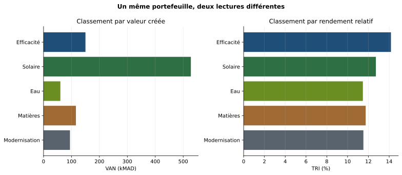
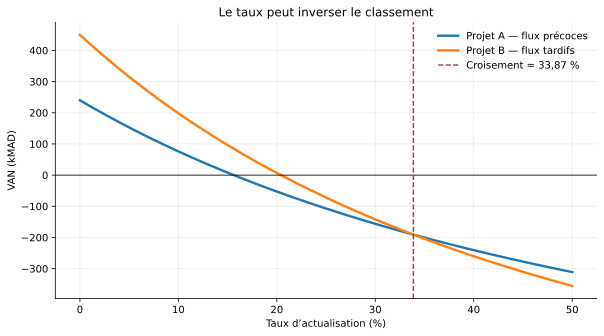

```{webr}
#| label: live-setup-seance2
#| include: false
options(width = 110)
```

::: {.hero-banner}
**Question directrice de la séance**

Lorsque plusieurs investissements sont financièrement recevables mais que leurs indicateurs se contredisent, **quelle règle de décision permet de comparer, classer et défendre les projets ?**
:::

<div id="code-toolbar-anchor"></div>

# 0. Fiche de séance

| Élément | Contenu |
|---|---|
| Durée | 3 h 30 — 210 minutes |
| Public | Professionnels en activité — niveau avancé |
| Prérequis | Flux incrémentaux, actualisation, VAN et scénario de référence |
| Cas fil rouge | Portefeuille de transition de l’entreprise Atlas Process |
| Production finale | Classement argumenté et recommandation au comité |
| Outils | Raisonnement financier, tableur ou R |

## Objectifs opérationnels

À l’issue de la séance, les participants doivent pouvoir :

1. distinguer projet indépendant, mutuellement exclusif et contingent ;
2. calculer et interpréter VAN, TRI, délai simple, délai actualisé et indice de profitabilité ;
3. résoudre un conflit de classement entre VAN et TRI ;
4. raisonner en flux différentiels lorsque deux options sont exclusives ;
5. comparer des projets de durées différentes par annuité équivalente ou chaîne de remplacement ;
6. reconnaître les situations où le TRI est ambigu ou trompeur ;
7. sélectionner un portefeuille sous contrainte de capital sans confondre classement et optimisation ;
8. transformer les résultats en recommandation conditionnelle et contrôlable.

## Déroulé des 210 minutes

| Temps | Séquence | Activité dominante | Livrable |
|---:|---|---|---|
| 0–15 min | Retour au comité | Histoire, diagnostic et formulation du problème | Carte des conflits |
| 15–40 min | Architecture des décisions | Concepts, typologie et règles de recevabilité | Arbre de décision |
| 40–75 min | VAN, TRI et taux de croisement | Calcul, graphique et exercice | Note sur le critère dominant |
| 75–100 min | Échelle et flux différentiels | Applications R et exercice guidé | Choix entre options exclusives |
| 100–110 min | Pause | — | — |
| 110–140 min | Durées de vie différentes | Annuité équivalente et chaîne de remplacement | Comparaison corrigée |
| 140–165 min | Payback, TRI multiples et taux | Audit des limites des indicateurs | Liste des alertes |
| 165–195 min | Portefeuille sous contrainte | Atelier de comité et optimisation discrète | Portefeuille recommandé |
| 195–210 min | Ticket, synthèse et transition | Décision individuelle puis débrief | Recommandation finale |

# 1. Retour au comité : plusieurs bons projets, plusieurs classements

## 1.1 La suite de la petite histoire

Lors de la première séance, vous avez démonté une présentation commerciale trop séduisante. Les coûts pertinents, le besoin en fonds de roulement, le scénario sans projet et la valeur terminale ont été rétablis. Atlas Process dispose désormais d’un dossier d’investissement défendable.

Mais le comité ne reçoit jamais un seul dossier. Le directeur financier place maintenant cinq projets sur la table : efficacité énergétique, solaire, économie d’eau, valorisation des matières et modernisation industrielle. Tous contribuent à la transition. Tous ont passé un premier filtre technique. Pourtant, leurs chiffres ne racontent pas la même histoire : le solaire crée le plus de valeur totale, l’efficacité énergétique affiche le rendement relatif le plus élevé, la modernisation récupère plus vite les ressources engagées, et le projet eau répond à une priorité environnementale mais conserve une marge financière étroite.

Votre mission devient plus exigeante : **ne plus seulement déterminer si un projet est acceptable, mais décider lequel doit passer avant les autres et pourquoi.**

::: {.oral-comment}
**Commentaire à lire aux participants.** « La séance 1 nous a appris à construire des flux crédibles. Aujourd’hui, nous supposons ces flux suffisamment solides pour comparer les projets. Le danger change : il ne vient plus seulement d’un mauvais calcul, mais d’une mauvaise règle de classement. »
:::

## 1.2 Diagnostic d’ouverture

Décidez individuellement si chaque affirmation est vraie, fausse ou indécidable.

1. Le projet qui possède le TRI le plus élevé doit toujours être choisi.
2. Si deux projets ont une VAN positive, l’entreprise peut accepter les deux.
3. Un délai de récupération court signifie nécessairement que le projet crée davantage de valeur.
4. Pour deux projets exclusifs de même risque, la VAN mesure directement l’effet sur la valeur de l’entreprise.
5. Un projet long doit toujours avoir une VAN supérieure à un projet court.
6. Sous rationnement du capital, classer les projets par VAN suffit.
7. Une modification du taux d’actualisation peut inverser un classement.
8. Un TRI unique existe pour toute série de flux.

<details class="correction"><summary>Correction commentée du diagnostic</summary>

1. **Faux.** Le TRI est un taux relatif. Pour des projets exclusifs, il peut favoriser un petit projet alors qu’un projet plus grand crée davantage de valeur absolue.
2. **Indécidable.** Oui s’ils sont indépendants, finançables et exécutables simultanément ; non s’ils sont exclusifs ou si une ressource rare empêche leur combinaison.
3. **Faux.** Le délai ignore les flux postérieurs au seuil et, dans sa version simple, la valeur temps de l’argent.
4. **Vrai sous les hypothèses du modèle.** Pour des flux comparables et un taux cohérent, la VAN mesure la valeur créée aujourd’hui.
5. **Faux.** La durée n’assure rien : l’échelle, le profil des flux et le risque comptent. La durée impose toutefois une correction si le service doit être renouvelé.
6. **Faux.** Sous un budget indivisible, il faut comparer des combinaisons. L’indice de profitabilité aide, mais ne garantit pas toujours l’optimum discret.
7. **Vrai.** Lorsque les profils temporels diffèrent, les courbes de VAN peuvent se croiser.
8. **Faux.** Des flux non conventionnels peuvent produire plusieurs TRI ou aucun TRI économiquement utile.

**Lecture stratégique.** Cinq erreurs fréquentes sont déjà visibles : confondre acceptation et classement, rendement relatif et valeur absolue, liquidité et création de valeur, projet et portefeuille, indicateur et décision.
</details>

# 2. Avant les indicateurs : qualifier la relation entre projets

## 2.1 Trois configurations

| Relation | Définition | Règle de décision initiale | Exemple |
|---|---|---|---|
| Indépendants | Accepter l’un ne modifie pas la faisabilité ou les flux de l’autre | Accepter chaque projet à VAN positive si les ressources le permettent | Solaire sur un site et récupération de matières sur un autre |
| Mutuellement exclusifs | Choisir une option empêche l’autre | Retenir l’option qui maximise la valeur sur une base comparable | Deux technologies pour la même chaudière |
| Contingents | La valeur ou la faisabilité d’un projet dépend d’un autre | Évaluer le paquet et la séquence | Solaire conditionné par le renforcement préalable du réseau interne |

Cette qualification est antérieure au calcul. Une comparaison correcte d’indicateurs appliqués à une relation mal définie produit une décision incorrecte avec une apparence de précision.

### La relation dépend de la décision observée

Les mêmes projets peuvent changer de catégorie selon le niveau d’analyse. Deux investissements réalisés sur des sites distincts sont techniquement indépendants. Ils deviennent concurrents si une même enveloppe, une même équipe d’ingénierie ou une même fenêtre d’arrêt limite leur réalisation. À l’inverse, deux projets présentés séparément peuvent former un seul programme économique si les économies de l’un ne sont possibles qu’après l’autre.

Il faut donc préciser trois objets :

1. **l’unité de décision** : équipement, site, programme ou portefeuille ;
2. **la ressource qui crée la dépendance** : capital, temps, compétence, capacité physique ou autorisation ;
3. **la période de dépendance** : immédiate, temporaire ou permanente.

### Complémentarité et double comptage

Deux projets sont complémentaires lorsque leur valeur combinée excède la somme de leurs valeurs isolées. Par exemple, un système de pilotage peut améliorer la performance d’un équipement efficace. À l’inverse, l’efficacité énergétique réduit la consommation sur laquelle sont calculées les économies d’un projet solaire : additionner deux dossiers construits sur la même consommation initiale peut alors surestimer la valeur du portefeuille.

On peut formaliser l’interaction par :

$$Synergie_{AB}=VAN(A+B)-VAN(A)-VAN(B).$$

Une synergie positive indique une complémentarité ; une synergie négative révèle une cannibalisation, un double comptage ou une incompatibilité. Le calcul de portefeuille doit utiliser les flux conjoints lorsque cette interaction est significative.

## 2.2 Acceptation, classement et allocation

Ces trois décisions ne doivent pas être confondues :

- **acceptation isolée** : le projet crée-t-il de la valeur au regard du taux requis ?
- **classement** : parmi des options comparables, laquelle crée le plus de valeur ?
- **allocation** : quelle combinaison maximise la valeur sous plusieurs contraintes ?

La VAN répond directement à la première question. Elle contribue à la deuxième. Pour la troisième, elle doit être intégrée à un problème de portefeuille.

### La frontière d’efficience du programme d’investissement

Pour chaque niveau de ressources, l’entreprise peut identifier la combinaison réalisable qui produit la valeur la plus élevée. L’ensemble de ces meilleures combinaisons forme une frontière d’efficience : un portefeuille situé sous cette frontière est dominé, car une autre combinaison utilise autant ou moins de ressources tout en créant davantage de valeur.

Cette représentation clarifie deux notions :

- le **coût d’opportunité du capital** est la valeur du meilleur portefeuille abandonné ;
- le **prix implicite de la contrainte** mesure la valeur additionnelle qu’une unité de ressource supplémentaire permettrait de créer.

Sous contrainte forte, la question n’est donc plus seulement « ce projet est-il rentable ? », mais « ce projet mérite-t-il la ressource davantage que l’alternative marginale ? ».

::: {.oral-comment}
**Commentaire à lire.** « La concurrence entre projets n’est pas toujours dans la technologie. Elle naît souvent dans l’organisation : même équipe, même arrêt d’usine, même budget. Avant de classer des chiffres, nous devons identifier ce qui empêche réellement de tout faire. »
:::

## 2.3 Exercice — Qualifier avant de calculer

Classez les situations suivantes :

a. Remplacer une ligne par la technologie X ou Y ;  
b. Installer des panneaux et rénover l’isolation sur deux bâtiments distincts ;  
c. Installer une unité de récupération de chaleur seulement si un système de mesure est déployé ;  
d. Arbitrer entre réparer l’équipement actuel et le remplacer ;  
e. Financer cinq projets avec 5 millions de MAD et une seule équipe technique.

<details class="correction"><summary>Correction détaillée</summary>

- **a : exclusivité.** Les deux technologies rendent le même service et occupent le même actif. Il faut comparer les flux différentiels.
- **b : indépendance technique**, mais cette indépendance peut disparaître si le budget ou les équipes sont communs.
- **c : contingence.** Le système de mesure est un préalable. Il faut évaluer le paquet ou intégrer sa valeur de plateforme.
- **d : exclusivité intertemporelle.** « Réparer » n’est pas absence de décision : c’est une option concurrente avec ses propres flux.
- **e : allocation sous contraintes multiples.** Les projets peuvent être techniquement indépendants tout en étant économiquement concurrents.

**Interprétation.** La relation n’est pas une propriété purement technique. Elle dépend de la ressource rare retenue : capital, équipe, capacité d’arrêt ou accès au site.
</details>

# 3. Les critères : ce qu’ils mesurent et ce qu’ils ne mesurent pas

## 3.1 Valeur actuelle nette

Pour un projet dont les flux incrémentaux sont $F_0,\ldots,F_T$ et le taux requis $r$ :

$$VAN(r)=\sum_{t=0}^{T}\frac{F_t}{(1+r)^t}.$$

La VAN est un **montant de valeur créé aujourd’hui**. Elle additionne des flux datés après les avoir rendus comparables. Pour un projet isolé : accepter si $VAN>0$. Pour des projets exclusifs comparables : retenir celui dont la VAN est la plus élevée.

Trois conditions soutiennent cette règle : les flux sont incrémentaux, le taux reflète correctement le temps et le risque, et les alternatives couvrent le même service économique.

### Intuition économique de la VAN

Un dirham disponible aujourd’hui peut être placé, rembourser une dette ou financer un autre projet. Un dirham futur doit donc être ramené à son équivalent présent. Le facteur $1/(1+r)^t$ remplit cette fonction. Plus le flux est éloigné et plus le taux est élevé, plus sa contribution actuelle diminue.

La VAN peut être lue de trois manières équivalentes :

- **surplus après rémunération du capital** : les flux remboursent l’investissement et rémunèrent le taux requis ; le reliquat est la VAN ;
- **variation de valeur aujourd’hui** : sous les hypothèses du modèle, accepter un projet à VAN positive augmente la valeur de l’entreprise de ce montant ;
- **marge économique** : la VAN indique combien les hypothèses peuvent se détériorer, en valeur actuelle, avant d’atteindre l’indifférence.

Une VAN n’est pas un bénéfice comptable, une trésorerie disponible immédiatement ou le montant total des économies. C’est un équivalent présent construit à partir de flux futurs conditionnels.

### Additivité et intérêt pour le portefeuille

Si les flux des projets sont correctement mesurés et sans interaction, alors :

$$VAN(A+B)=VAN(A)+VAN(B).$$

Cette propriété d’additivité permet de passer du projet au portefeuille. Le TRI, lui, n’est pas additif : la moyenne des TRI de deux projets n’est généralement pas le TRI du portefeuille. C’est une raison fondamentale pour privilégier la VAN dans l’allocation.

## 3.2 Taux de rentabilité interne

Le TRI est toute valeur $r^*$ telle que :

$$0=\sum_{t=0}^{T}\frac{F_t}{(1+r^*)^t}.$$

Il exprime un rendement relatif implicite. Pour un flux conventionnel — décaissement initial suivi d’encaissements — accepter si le TRI dépasse le taux requis. Mais le TRI ne mesure pas directement combien de valeur est créée.

### Ce que signifie réellement « rendement interne »

Le TRI est le taux qui rend exactement équivalents la valeur actuelle des encaissements et celle des décaissements. Il est « interne » parce qu’il est calculé uniquement à partir du profil de flux. Il ne décrit ni le rendement effectivement obtenu sur un marché, ni le coût observé du financement, ni une probabilité de succès.

Son attrait tient à son unité en pourcentage, facile à communiquer. Cette simplicité masque quatre hypothèses ou difficultés :

1. l’échelle du projet disparaît ;
2. le calendrier des flux influence fortement le résultat ;
3. des changements de signe multiples peuvent produire plusieurs solutions ;
4. comparer le TRI à un seuil suppose que ce seuil est cohérent avec le risque des flux.

### VAN et TRI : accord d’acceptation, conflit de classement

Pour un projet conventionnel isolé, VAN et TRI donnent normalement la même décision d’acceptation : si $TRI>r$, alors $VAN(r)>0$. Le conflit apparaît surtout lorsqu’il faut **classer des projets exclusifs** présentant des échelles ou calendriers différents. Cette distinction est centrale : un indicateur peut être correct pour accepter séparément deux projets et inadéquat pour choisir entre eux.

## 3.3 Délai de récupération

Le délai simple est la première date à laquelle le cumul non actualisé devient positif. Le délai actualisé applique la même logique aux flux actualisés. Ces indicateurs renseignent sur l’exposition et la vitesse de récupération, mais ignorent une partie de la valeur économique.

Le délai répond à une préoccupation de **liquidité et d’exposition**, non directement de rentabilité. Il devient pertinent lorsqu’une entreprise risque de manquer de trésorerie avant que les flux lointains se matérialisent, ou lorsque la technologie peut devenir obsolète. Il doit alors être utilisé comme contrainte complémentaire : par exemple « VAN positive et récupération actualisée inférieure à six ans ».

Fixer un seuil de payback sans justification revient à appliquer un taux implicite très particulier et à attribuer une valeur nulle à tous les flux postérieurs au seuil.

## 3.4 Indice de profitabilité

$$IP=\frac{VA\ des\ flux\ positifs}{VA\ des\ ressources\ engagées}.$$

Avec un seul décaissement initial, $IP=1+VAN/I_0$. L’indice mesure la valeur actuelle obtenue par unité de capital mobilisée. Il est utile sous contrainte budgétaire divisible, mais peut échouer lorsque les projets sont indivisibles.

### Ratio marginal ou ratio moyen ?

L’indice est un ratio moyen pour chaque projet. Or une allocation optimale exige de connaître la valeur marginale de la dernière unité de capital. Lorsque les projets sont divisibles et sans interaction, classer les IP peut approcher cette logique. Lorsque les projets sont indivisibles, un projet très performant mais de taille particulière peut empêcher de remplir efficacement le budget. Le problème ressemble alors à un « sac à dos » : il faut tester les combinaisons.

## 3.5 Tableau de discipline

| Critère | Unité | Question utile | Limite principale |
|---|---:|---|---|
| VAN | kMAD | Combien de valeur aujourd’hui ? | Dépend du taux et de la qualité des flux |
| TRI | % | Quel rendement implicite ? | Conflits d’échelle/temps, TRI multiples |
| Délai simple | années | Quand récupère-t-on nominalement la mise ? | Ignore actualisation et flux tardifs |
| Délai actualisé | années | Quand récupère-t-on la mise en valeur actuelle ? | Ignore encore les flux après le seuil |
| IP | ratio | Quelle valeur par unité de capital ? | Classement imparfait des projets indivisibles |

### Une même donnée, quatre phrases différentes

Supposons un projet de 1 000 kMAD, une VAN de 120, un TRI de 14 % et un délai de quatre ans :

- « il crée 120 kMAD aujourd’hui » est une phrase de **valeur** ;
- « son rendement interne est 14 % » est une phrase de **rentabilité relative** ;
- « la mise nominale est récupérée en quatre ans » est une phrase d’**exposition** ;
- « il produit 1,12 de valeur actuelle brute par unité engagée » est une phrase d’**efficience du capital**.

Ces formulations ne sont pas interchangeables. Demander aux étudiants de toujours nommer l’unité et la question à laquelle répond l’indicateur réduit fortement les erreurs d’interprétation.

## 3.6 Exemple entièrement guidé

Un projet exige 1 000 kMAD aujourd’hui et génère 450 kMAD à la fin de chacune des trois prochaines années. Le taux requis est 10 %.

**Étape 1 — dater.** Le flux initial est $F_0=-1\,000$. Les trois encaissements sont $F_1=F_2=F_3=450$.

**Étape 2 — actualiser séparément.**

$$VA(F_1)=\frac{450}{1{,}10}=409{,}09,$$

$$VA(F_2)=\frac{450}{1{,}10^2}=371{,}90,$$

$$VA(F_3)=\frac{450}{1{,}10^3}=338{,}09.$$

**Étape 3 — additionner.**

$$VAN=-1\,000+409{,}09+371{,}90+338{,}09=119{,}08\ kMAD.$$

Le projet rembourse donc économiquement les 1 000 kMAD, rémunère le capital à 10 % et crée encore environ 119 kMAD aujourd’hui.

**Étape 4 — calculer le délai simple.** Après deux ans, le cumul vaut $-1\,000+450+450=-100$. Il faut encore $100/450=0{,}22$ année. Le délai simple est environ 2,22 ans.

**Étape 5 — comparer les messages.** La VAN dit que le projet crée 119,08 kMAD ; le délai dit que la mise nominale est récupérée après environ 2,22 ans. Ces informations sont compatibles, mais elles ne répondent pas à la même question.

<details class="correction"><summary>Question de compréhension</summary>

Si l’on ajoutait un quatrième flux de 450 après la récupération de la mise, le délai simple resterait 2,22 ans, tandis que la VAN augmenterait de $450/(1{,}10)^4=307{,}36$ kMAD. C’est la démonstration directe de l’information ignorée par le délai : tous les flux situés après la date de récupération sont exclus de son calcul.
</details>

::: {.key-point}
**Hiérarchie de lecture :** la VAN est le critère de création de valeur ; le TRI communique un rendement ; le délai décrit une exposition ; l’IP renseigne sur l’intensité capitalistique. Aucun indicateur secondaire ne doit être interprété comme une autre forme de VAN.
:::

# 4. Cas fil rouge — Le portefeuille de transition

## 4.1 Données synthétiques

Les flux ont été audités selon la méthode de la séance 1. Ils sont exprimés en kMAD et actualisés à 10 % dans le scénario central.

| Projet | Investissement initial | Durée | Profil simplifié | Contribution dominante |
|---|---:|---:|---|---|
| Efficacité | 1 200 | 6 ans | 310 par an | Réduction énergétique rapide |
| Solaire | 3 200 | 15 ans | 480 par an, puis 800 | Décarbonation de long terme |
| Eau | 900 | 10 ans | 150 par an, puis 250 | Réduction du stress hydrique |
| Matières | 1 800 | 7 ans | Flux croissants puis décroissants | Circularité et achats évités |
| Modernisation | 2 500 | 6 ans | Flux front-loaded | Productivité et efficacité |

## 4.2 Application R — Calcul simultané des critères

```{webr}
#| label: application-1
#| code-fold: true
#| code-summary: "Développer/réduire le script R complet"
van <- function(flux, taux) {
  sum(flux / (1 + taux)^(seq_along(flux) - 1))
}

tri <- function(flux, borne_basse = -0.99, borne_haute = 10) {
  f <- function(r) van(flux, r)
  grille <- seq(borne_basse, borne_haute, length.out = 20000)
  valeurs <- vapply(grille, f, numeric(1))
  changements <- which(valeurs[-length(valeurs)] * valeurs[-1] <= 0)
  if (length(changements) == 0) return(NA_real_)
  uniroot(f, c(grille[changements[1]], grille[changements[1] + 1]))$root
}

delai_simple <- function(flux) {
  cumul <- cumsum(flux)
  k <- which(cumul >= 0)[1]
  if (is.na(k)) return(Inf)
  if (k == 1) return(0)
  annee_avant <- k - 2
  reste <- -cumul[k - 1]
  annee_avant + reste / flux[k]
}

delai_actualise <- function(flux, taux) {
  flux_actualises <- flux / (1 + taux)^(seq_along(flux) - 1)
  delai_simple(flux_actualises)
}

annuite_equivalente <- function(van_projet, taux, duree) {
  facteur <- (1 - (1 + taux)^(-duree)) / taux
  van_projet / facteur
}

indice_profitabilite <- function(flux, taux) {
  va_pos <- sum(pmax(flux, 0) / (1 + taux)^(seq_along(flux) - 1))
  va_neg <- -sum(pmin(flux, 0) / (1 + taux)^(seq_along(flux) - 1))
  va_pos / va_neg
}

fmt <- function(x, digits = 2) {
  format(round(x, digits), big.mark = " ", decimal.mark = ",",
         nsmall = digits, scientific = FALSE)
}

portefeuille_transition <- function() {
  list(
    Efficacite = c(-1200, rep(310, 6)),
    Solaire = c(-3200, rep(480, 14), 800),
    Eau = c(-900, rep(150, 9), 250),
    Matieres = c(-1800, 260, 310, 390, 470, 520, 480, 420),
    Modernisation = c(-2500, 800, 750, 650, 500, 400, 300)
  )
}

tableau_criteres <- function(taux = 0.10) {
  projets <- portefeuille_transition()
  sortie <- do.call(rbind, lapply(names(projets), function(nom) {
    f <- projets[[nom]]
    data.frame(
      Projet = nom,
      Investissement = -f[1],
      Duree = length(f) - 1,
      VAN = van(f, taux),
      TRI = tri(f),
      Delai = delai_simple(f),
      Delai_actualise = delai_actualise(f, taux),
      IP = indice_profitabilite(f, taux)
    )
  }))
  row.names(sortie) <- NULL
  sortie
}

application1 <- function(taux = 0.10) {
  tab <- tableau_criteres(taux)
  tab$Rang_VAN <- rank(-tab$VAN, ties.method = "min")
  tab$Rang_TRI <- rank(-tab$TRI, ties.method = "min")
  tab$Rang_Delai <- rank(tab$Delai, ties.method = "min")
  print(transform(tab,
    VAN = round(VAN, 2), TRI = round(100 * TRI, 2),
    Delai = round(Delai, 2), Delai_actualise = round(Delai_actualise, 2),
    IP = round(IP, 3)), row.names = FALSE)
  invisible(tab)
}

application1(0.10)
```

<details class="correction"><summary>Résultats et interprétation détaillée</summary>

Les résultats de référence sont approximativement :

| Projet | VAN | TRI | Délai simple | IP |
|---|---:|---:|---:|---:|
| Efficacité | 150,13 | 14,17 % | 3,87 ans | 1,125 |
| Solaire | 527,52 | 12,72 % | 6,67 ans | 1,165 |
| Eau | 60,24 | 11,47 % | 6,00 ans | 1,067 |
| Matières | 115,94 | 11,74 % | 4,71 ans | 1,064 |
| Modernisation | 94,68 | 11,52 % | 3,60 ans | 1,038 |

**Lecture par critère.** La VAN classe le solaire premier ; le TRI classe l’efficacité première ; le délai privilégie la modernisation ; l’indice de profitabilité favorise ici le solaire. Le désaccord ne signifie pas qu’un calcul est faux. Chaque indicateur répond à une question différente.

**Lecture stratégique.** Si les projets sont indépendants et les ressources suffisantes, les cinq sont acceptables dans le scénario central. S’ils sont concurrents, le comité doit expliciter la contrainte et la relation entre eux avant de les classer.

**Marge de sécurité.** Eau, matières et modernisation restent proches de la frontière de rentabilité. Une VAN positive faible par rapport au capital engagé invite à tester le taux, les flux et les risques d’exécution.

**Conclusion de comité.** Ne pas annoncer « le meilleur projet » sans préciser : meilleur selon quelle fonction objectif, sous quelle contrainte et sur quel horizon.
</details>

{fig-alt="Deux graphiques en barres comparant les cinq projets selon leur VAN puis leur TRI"}

::: {.oral-comment}
**Commentaire à lire.** « Le tableau ne contient pas cinq réponses : il contient cinq descriptions partielles. Notre travail consiste à faire correspondre chaque indicateur à la décision qu’il peut réellement éclairer. »
:::

# 5. Conflit VAN–TRI : comprendre le taux de croisement

## 5.1 Pourquoi les classements se contredisent-ils ?

Deux mécanismes dominent :

- **l’échelle** : un petit projet peut produire un fort rendement sur peu de capital, tandis qu’un grand projet crée plus de valeur totale ;
- **le calendrier** : le TRI peut privilégier les flux précoces, alors qu’un taux requis faible donne davantage de poids aux flux tardifs.

Le taux de croisement est le TRI des flux différentiels $F_A-F_B$. À ce taux, les deux VAN sont égales. En dessous et au-dessus, le classement peut s’inverser.

### Décomposition du conflit temporel

Considérons deux projets de même coût. A verse davantage au début ; B verse davantage à la fin. Lorsque le taux augmente, la valeur actuelle des flux tardifs diminue plus fortement. La pente de la courbe de VAN dépend donc de la « durée financière » du projet : plus la valeur est éloignée, plus la VAN est sensible au taux.

On peut écrire la différence de valeur :

$$\Delta VAN(r)=VAN_B(r)-VAN_A(r)=\sum_t\frac{F_{B,t}-F_{A,t}}{(1+r)^t}.$$

Le classement est déterminé par le signe de $\Delta VAN$. Le taux de croisement $r_c$ vérifie $\Delta VAN(r_c)=0$. Cette approche transforme un désaccord entre deux indicateurs en une comparaison économique explicite des flux additionnels.

### Trois situations possibles

| Situation | Observation | Réponse |
|---|---|---|
| Aucun croisement pertinent | Une courbe reste au-dessus dans la zone plausible | Classement robuste au taux |
| Croisement loin du taux requis | Conflit théorique mais faible enjeu décisionnel | Conserver le classement central, documenter |
| Croisement proche du taux requis | Petite variation du taux inverse le choix | Approfondir risque, profil et scénario |

Le graphique est donc une analyse de stabilité. Il ne dispense jamais d’expliquer pourquoi 10 %, 12 % ou un autre taux est économiquement approprié.

## 5.2 Application R — Deux profils temporels

Le projet A verse 620 en années 1 et 2. Le projet B verse 1 450 uniquement en année 2. Chaque projet exige 1 000 aujourd’hui.

```{webr}
#| label: application-2
#| code-fold: true
#| code-summary: "Développer/réduire le script R complet"
van <- function(flux, taux) {
  sum(flux / (1 + taux)^(seq_along(flux) - 1))
}

tri <- function(flux, borne_basse = -0.99, borne_haute = 10) {
  f <- function(r) van(flux, r)
  grille <- seq(borne_basse, borne_haute, length.out = 20000)
  valeurs <- vapply(grille, f, numeric(1))
  changements <- which(valeurs[-length(valeurs)] * valeurs[-1] <= 0)
  if (length(changements) == 0) return(NA_real_)
  uniroot(f, c(grille[changements[1]], grille[changements[1] + 1]))$root
}

fmt <- function(x, digits = 2) {
  format(round(x, digits), big.mark = " ", decimal.mark = ",",
         nsmall = digits, scientific = FALSE)
}

application2 <- function() {
  A <- c(-1000, 620, 620)
  B <- c(-1000, 0, 1450)
  taux <- c(0.05, 0.10, 0.15, 0.20, 0.25)
  resultat <- data.frame(
    Taux = taux,
    VAN_A = vapply(taux, function(r) van(A, r), numeric(1)),
    VAN_B = vapply(taux, function(r) van(B, r), numeric(1))
  )
  print(round(resultat, 2), row.names = FALSE)
  cat("TRI A =", fmt(100 * tri(A)), "% ; TRI B =", fmt(100 * tri(B)), "%\n")
  invisible(resultat)
}

application2()
```

<details class="correction"><summary>Correction approfondie</summary>

À 10 %, la VAN de A est 76,03 kMAD et celle de B 198,35 kMAD. Les TRI sont respectivement 15,62 % et 20,42 %. Dans cette zone, B domine selon les deux critères. Cependant, la comparaison ne doit pas s’arrêter à ces deux nombres.

Les flux différentiels $A-B$ sont $(0;620;-830)$. Leur TRI vaut environ 33,87 % : il s’agit du taux de croisement. À un taux inférieur, la valeur tardive de B reste importante ; à un taux supérieur, le flux précoce de A devient relativement plus précieux.

**Interprétation économique.** Le taux de croisement n’est pas nécessairement le coût du capital de l’entreprise. Il décrit la frontière mathématique entre deux classements. Le taux pertinent reste celui exigé par le risque du projet et la politique d’investissement.

**Décision.** À un taux requis de 10 %, retenir B si les options sont exclusives et de même risque. Ne pas choisir un taux parce qu’il produit le classement désiré.
</details>

{fig-alt="Courbes de VAN des projets A et B selon le taux d’actualisation, se croisant vers 33,87 pour cent"}

## 5.3 Exercice — Construire la courbe de VAN

Pour A et B :

1. calculez les VAN à 5 %, 20 % et 40 % ;
2. identifiez la zone dans laquelle le classement s’inverse ;
3. expliquez pourquoi « le projet au TRI supérieur » n’est pas une règle suffisante.

<details class="correction"><summary>Correction guidée</summary>

À 5 %, $VAN_A=152{,}83$ et $VAN_B=315{,}19$. À 20 %, les VAN sont environ −52,78 et 6,94. À 40 %, A finit par dépasser B, car le flux de B est entièrement repoussé à l’année 2.

Le basculement intervient autour de 33,87 %. Ce résultat montre que le calendrier des flux interagit avec le taux. Il ne justifie pas d’utiliser 33,87 % : il permet seulement de comprendre la contradiction éventuelle.

**Lecture à transmettre.** Une courbe de VAN répond à une question de robustesse : « si la valorisation du temps et du risque changeait, la préférence serait-elle stable ? » Elle ne remplace pas la justification économique du taux central.
</details>

## 5.4 Règle professionnelle en cas de conflit

Pour des projets mutuellement exclusifs et correctement comparables :

1. calculer les VAN au taux requis ;
2. construire les flux différentiels de l’option la plus coûteuse moins l’option la moins coûteuse ;
3. vérifier que l’investissement additionnel possède une VAN positive ;
4. utiliser le TRI différentiel comme information complémentaire ;
5. retenir l’option qui maximise la VAN, sauf contrainte explicite non intégrée.

### Arbre de résolution pédagogique

1. **Les deux VAN sont-elles négatives ?** Rejeter les deux ou reconstruire les options.
2. **Une seule VAN est-elle positive ?** Retenir celle-ci si les autres contraintes sont satisfaites.
3. **Les deux VAN sont-elles positives et les projets indépendants ?** Accepter les deux si les ressources le permettent.
4. **Les deux VAN sont-elles positives et les projets exclusifs ?** Comparer les VAN sur une base cohérente.
5. **Le TRI contredit-il la VAN ?** Examiner échelle, calendrier, flux différentiels et taux de croisement.
6. **La contrainte de capital est-elle réelle ?** Passer à l’optimisation du portefeuille.

Cette séquence évite de mobiliser un outil complexe avant d’avoir identifié la nature exacte du désaccord.

# 6. Différences d’échelle : raisonner sur l’investissement additionnel

## 6.1 Rendement relatif et valeur absolue

Une entreprise ne maximise pas un pourcentage abstrait. Elle cherche à créer de la valeur avec des ressources rares. Un projet de 1 000 rapportant 20 % ne domine pas automatiquement un projet de 5 000 rapportant 15 % : il faut demander ce que produisent les 4 000 supplémentaires.

### Analogie du placement résiduel

Choisir le petit projet laisse une partie du capital disponible. Pour que ce choix domine le grand projet, il faudrait que le capital résiduel puisse être placé dans une alternative suffisamment rentable. Si aucune alternative comparable n’est identifiée, le classement par TRI introduit implicitement un usage fictif du reliquat.

Le raisonnement différentiel rend cette hypothèse visible :

$$Flux\ différentiel=Flux\ du\ grand\ projet-Flux\ du\ petit\ projet.$$

Si la VAN différentielle est positive, l’extension d’échelle crée de la valeur au taux requis. Si elle est négative, rester sur le petit projet est préférable. Le TRI différentiel peut indiquer le rendement de l’extension, mais la décision repose sur sa VAN au taux pertinent.

### Attention aux risques non comparables

Soustraire les flux ne suffit pas si le grand projet introduit un risque distinct : nouvelle technologie, exposition à un prix, dépendance réglementaire ou délai d’exécution. Il faut alors ajuster les scénarios ou les taux avec cohérence. L’analyse différentielle est une structure de comparaison, non une permission d’ignorer l’hétérogénéité du risque.

## 6.2 Application R — Petit projet ou grand projet ?

```{webr}
#| label: application-3
#| code-fold: true
#| code-summary: "Développer/réduire le script R complet"
van <- function(flux, taux) {
  sum(flux / (1 + taux)^(seq_along(flux) - 1))
}

tri <- function(flux, borne_basse = -0.99, borne_haute = 10) {
  f <- function(r) van(flux, r)
  grille <- seq(borne_basse, borne_haute, length.out = 20000)
  valeurs <- vapply(grille, f, numeric(1))
  changements <- which(valeurs[-length(valeurs)] * valeurs[-1] <= 0)
  if (length(changements) == 0) return(NA_real_)
  uniroot(f, c(grille[changements[1]], grille[changements[1] + 1]))$root
}

application3 <- function() {
  petit <- c(-1000, rep(360, 4))
  grand <- c(-5000, rep(1700, 4))
  r <- 0.10
  incrementaux <- grand - petit
  resultat <- data.frame(
    Projet = c("Petit", "Grand", "Grand moins Petit"),
    VAN = c(van(petit, r), van(grand, r), van(incrementaux, r)),
    TRI = c(tri(petit), tri(grand), tri(incrementaux))
  )
  print(transform(resultat, VAN = round(VAN, 2), TRI = round(100 * TRI, 2)),
        row.names = FALSE)
  invisible(resultat)
}

application3()
```

<details class="correction"><summary>Correction détaillée et lecture stratégique</summary>

À 10 %, le petit projet crée environ 141,15 kMAD avec un TRI de 16,37 %. Le grand projet crée environ 388,77 kMAD avec un TRI de 13,54 %. Le TRI classe le petit projet premier ; la VAN classe le grand projet premier.

Les flux différentiels « grand moins petit » sont $(-4\,000;1\,340;1\,340;1\,340;1\,340)$. Leur VAN est positive, environ 247,62 kMAD, et leur TRI est de 12,83 %. Le capital additionnel demandé par le grand projet rémunère donc le taux requis de 10 % et crée encore de la valeur.

**Interprétation.** Choisir le petit projet au seul motif de son TRI reviendrait à laisser 4 000 kMAD sans affectation, comme si leur rendement alternatif était implicitement supérieur au taux requis. Cette hypothèse doit être démontrée, pas cachée.

**Décision.** Si les options sont exclusives, de risque comparable et finançables, retenir le grand projet. Si le capital additionnel manque, le problème devient un problème d’allocation et non une victoire conceptuelle du TRI.
</details>

## 6.3 Exercice — Formuler la décision sans jargon

Rédigez trois phrases destinées au comité : résultat, mécanisme et condition.

<details class="correction"><summary>Proposition de formulation</summary>

« Le grand projet crée environ 389 kMAD, contre 141 kMAD pour le petit. Son taux de rendement est inférieur, mais les 4 000 kMAD additionnels créent eux-mêmes près de 248 kMAD au taux requis de 10 %. Nous recommandons donc le grand projet, sous réserve que ce capital additionnel ne prive pas l’entreprise d’un portefeuille encore plus créateur de valeur. »

Cette formulation évite deux erreurs : présenter le TRI inférieur comme une faiblesse décisive et ignorer le coût d’opportunité du budget.
</details>

# 7. Durées de vie différentes : rétablir un service comparable

## 7.1 Le problème de l’horizon

Comparer directement les VAN d’un équipement de trois ans et d’un équipement de sept ans peut être incorrect si l’entreprise doit assurer le service durablement. Le projet long vend davantage d’années de service. Deux méthodes classiques permettent de rétablir la comparabilité :

- l’**annuité équivalente** transforme la VAN en valeur annuelle constante ;
- la **chaîne de remplacement** répète les projets jusqu’à un horizon commun.

Ces méthodes supposent que les projets peuvent être remplacés dans des conditions comparables. Si la technologie, les prix ou la réglementation changent fortement, cette hypothèse doit être discutée.

### Identifier le véritable service économique

La comparaison porte rarement sur « deux machines » en soi. Elle porte sur le service qu’elles rendent : produire une unité, traiter un volume d’eau, économiser un MWh ou satisfaire une norme. Avant de corriger les durées, vérifier :

- que les capacités annuelles sont comparables ;
- que la qualité et la disponibilité du service sont équivalentes ;
- que les coûts d’arrêt et de remplacement sont inclus ;
- que la valeur terminale est traitée à l’horizon commun ;
- que le besoin persiste réellement après la première durée.

Si les capacités diffèrent, l’annuité équivalente doit être rapportée à l’unité de service : kMAD par tonne produite, par m³ économisé ou par MWh délivré.

## 7.2 Annuité équivalente

Pour une VAN $V$, un taux $r$ et une durée $n$ :

$$AE=\frac{V}{\frac{1-(1+r)^{-n}}{r}}.$$

L’annuité équivalente est le montant annuel constant ayant la même valeur actuelle que le projet.

Elle ne correspond pas nécessairement à un flux réellement observé. C’est une transformation de la VAN destinée à comparer des durées. Une annuité équivalente de 50 kMAD/an signifie : « sur sa durée, ce projet crée la même valeur qu’un surplus constant de 50 kMAD chaque année au taux retenu ».

### Relation entre annuité et coût annuel équivalent

Pour des projets de réduction de coûts, on peut annualiser le coût total plutôt que la VAN. Le **coût annuel équivalent** est particulièrement utile lorsque les alternatives procurent exactement le même service et que l’objectif consiste à minimiser le coût. On retient alors le coût annuel équivalent le plus faible.

La règle doit rester cohérente : maximiser une annuité de valeur ou minimiser un coût annuel, sans mélanger les signes et les fonctions objectifs.

## 7.3 Application R — Équipement court ou long

```{webr}
#| label: application-4
#| code-fold: true
#| code-summary: "Développer/réduire le script R complet"
van <- function(flux, taux) {
  sum(flux / (1 + taux)^(seq_along(flux) - 1))
}

annuite_equivalente <- function(van_projet, taux, duree) {
  facteur <- (1 - (1 + taux)^(-duree)) / taux
  van_projet / facteur
}

application4 <- function() {
  court <- c(-900, 390, 390, 390)
  long <- c(-1500, rep(360, 7))
  r <- 0.09
  resultat <- data.frame(
    Projet = c("Court", "Long"),
    Duree = c(3, 7),
    VAN = c(van(court, r), van(long, r)),
    AE = c(annuite_equivalente(van(court, r), r, 3),
           annuite_equivalente(van(long, r), r, 7))
  )
  print(transform(resultat,
                  Duree = round(Duree, 0),
                  VAN = round(VAN, 2),
                  AE = round(AE, 2)),
        row.names = FALSE)
  invisible(resultat)
}

application4()
```

<details class="correction"><summary>Correction détaillée</summary>

Au taux de 9 %, le projet court présente une VAN d’environ 87,20 kMAD, contre 311,86 kMAD pour le projet long. Les annuités équivalentes sont environ 34,45 et 61,96 kMAD par an.

**Étape 1 — lecture brute.** Le projet long crée davantage de valeur totale, mais il fonctionne quatre années supplémentaires.

**Étape 2 — normalisation.** Même après conversion en valeur annuelle, le projet long reste supérieur. Son avantage ne provient donc pas uniquement de sa durée.

**Étape 3 — validité.** Cette conclusion suppose que les deux technologies délivrent un service annuel comparable et que le besoin se répète. Pour un projet non renouvelable, l’annuité équivalente peut perdre son sens.

**Décision.** Retenir le projet long si l’entreprise a besoin du service sur la durée et si l’hypothèse de renouvellement est crédible.
</details>

## 7.4 Application R — Chaînes de remplacement

L’horizon commun minimal est 21 ans : sept répétitions du projet de trois ans et trois répétitions du projet de sept ans.

La chaîne de remplacement représente explicitement chaque cycle. À la date de remplacement, le nouvel investissement et l’éventuelle valeur terminale de l’ancien actif doivent être enregistrés simultanément. Une erreur fréquente consiste à oublier l’investissement futur ou à compter deux fois la valeur de revente.

### Choix de la méthode

| Méthode | Avantage | Limite | Usage conseillé |
|---|---|---|---|
| Annuité équivalente | Compacte et facile à expliquer | Cache le calendrier des remplacements | Service répétitif relativement stable |
| Chaîne de remplacement | Calendrier explicite | Horizon commun parfois très long | Vérification et projets avec flux irréguliers |
| Horizon fini commun | Réaliste pour un plan stratégique | Nécessite valeurs terminales cohérentes | Programme d’investissement à échéance définie |

Dans la pratique, l’horizon du plan de transition peut être préférable au plus petit commun multiple, à condition d’intégrer correctement les valeurs résiduelles à cette date.

```{webr}
#| label: application-5
#| code-fold: true
#| code-summary: "Développer/réduire le script R complet"
van <- function(flux, taux) {
  sum(flux / (1 + taux)^(seq_along(flux) - 1))
}

chaine_remplacement <- function(flux, repetitions) {
  n <- length(flux) - 1
  horizon <- n * repetitions
  total <- numeric(horizon + 1)
  for (k in 0:(repetitions - 1)) {
    idx <- k * n + seq_along(flux)
    total[idx] <- total[idx] + flux
  }
  total
}

application5 <- function() {
  A <- c(-900, 390, 390, 390)
  B <- c(-1500, rep(360, 7))
  r <- 0.09
  horizon <- 21
  chaine_A <- chaine_remplacement(A, horizon / 3)
  chaine_B <- chaine_remplacement(B, horizon / 7)
  resultat <- data.frame(
    Strategie = c("A répété sur 21 ans", "B répété sur 21 ans"),
    VAN = c(van(chaine_A, r), van(chaine_B, r))
  )
  print(transform(resultat, VAN = round(VAN, 2)), row.names = FALSE)
  invisible(resultat)
}

application5()
```

<details class="correction"><summary>Interprétation de la chaîne de remplacement</summary>

La chaîne additionne les investissements et les flux de chaque remplacement aux dates correspondantes. Elle ne multiplie pas simplement la VAN initiale : les projets futurs sont actualisés. Sur l’horizon commun de 21 ans, la chaîne du projet court produit une VAN d’environ 320,12 kMAD, contre 575,79 kMAD pour la chaîne du projet long.

Le classement doit être cohérent avec celui des annuités équivalentes lorsque les hypothèses de réplication sont identiques. Une divergence signale généralement une erreur de calendrier, de valeur terminale ou d’horizon.

**Limite stratégique.** Sur 21 ans, supposer des coûts, performances et technologies inchangés est exigeant. Le résultat doit être accompagné d’un scénario de progrès technologique ou d’une option de réexamen.
</details>

## 7.5 Exercice — Quand ne pas annualiser ?

Parmi les cas suivants, indiquez si l’annuité équivalente est appropriée : concession unique de cinq ans ; pompe renouvelable ; dépollution ponctuelle ; logiciel remplacé périodiquement ; acquisition d’un terrain.

<details class="correction"><summary>Correction raisonnée</summary>

- **Pompe et logiciel :** méthode potentiellement appropriée si le service se répète et si les remplacements sont comparables.
- **Concession unique et dépollution ponctuelle :** annualisation généralement inappropriée comme règle de choix, car le besoin ou le droit n’est pas répétitif.
- **Terrain :** l’actif n’a pas une durée d’usage finie analogue ; il faut intégrer sa valeur terminale et l’usage alternatif.

Le critère n’est donc pas la simple différence de durée, mais la répétabilité du service économique.
</details>

# 8. Délai de récupération : indicateur d’exposition, non de valeur

## 8.1 Deux versions, deux usages

Le délai simple cumule les flux nominaux. Le délai actualisé cumule les flux après actualisation. Le second corrige la valeur temps de l’argent, mais tous deux cessent de regarder ce qui se passe après la récupération.

Le délai peut être utile lorsqu’une entreprise affronte une contrainte de liquidité, un risque d’obsolescence ou une forte incertitude politique. Il devient dangereux lorsqu’un seuil arbitraire remplace l’évaluation complète.

### Calcul avec interpolation

Si le cumul est encore négatif à la fin de l’année $k$ et devient positif pendant l’année $k+1$, une approximation est :

$$Délai=k+\frac{Montant\ restant\ à\ récupérer\ à\ la\ fin\ de\ k}{Flux\ de\ l'année\ k+1}.$$

Cette interpolation suppose que le flux annuel se répartit régulièrement. Pour un paiement concentré en fin d’année, elle donne une impression de précision excessive. Il faut alors annoncer la convention.

### Payback et risque : une relation imparfaite

Un délai court réduit l’exposition temporelle, mais ne mesure pas tous les risques. Un projet peut récupérer rapidement grâce à un prix très volatil. Un autre peut récupérer lentement avec des flux contractuellement garantis. Le délai ne remplace donc ni l’analyse des scénarios ni l’évaluation de la qualité des contreparties.

| Usage recevable | Usage abusif |
|---|---|
| Contrainte de liquidité explicite | Mesure générale de rentabilité |
| Indicateur d’exposition technologique | Substitut à la VAN |
| Filtre secondaire homogène | Classement de projets aux durées différentes |
| Alerte sur les flux tardifs | Preuve qu’un projet « se rembourse » économiquement |

## 8.2 Application R — Un projet presque à VAN nulle

```{webr}
#| label: application-6
#| code-fold: true
#| code-summary: "Développer/réduire le script R complet"
van <- function(flux, taux) {
  sum(flux / (1 + taux)^(seq_along(flux) - 1))
}

tri <- function(flux, borne_basse = -0.99, borne_haute = 10) {
  f <- function(r) van(flux, r)
  grille <- seq(borne_basse, borne_haute, length.out = 20000)
  valeurs <- vapply(grille, f, numeric(1))
  changements <- which(valeurs[-length(valeurs)] * valeurs[-1] <= 0)
  if (length(changements) == 0) return(NA_real_)
  uniroot(f, c(grille[changements[1]], grille[changements[1] + 1]))$root
}

delai_simple <- function(flux) {
  cumul <- cumsum(flux)
  k <- which(cumul >= 0)[1]
  if (is.na(k)) return(Inf)
  if (k == 1) return(0)
  annee_avant <- k - 2
  reste <- -cumul[k - 1]
  annee_avant + reste / flux[k]
}

delai_actualise <- function(flux, taux) {
  flux_actualises <- flux / (1 + taux)^(seq_along(flux) - 1)
  delai_simple(flux_actualises)
}

application6 <- function() {
  projet <- c(-1200, 150, 240, 330, 430, 520)
  r <- 0.10
  resultat <- data.frame(
    Critere = c("Délai simple", "Délai actualisé", "VAN", "TRI"),
    Valeur = c(delai_simple(projet), delai_actualise(projet, r),
               van(projet, r), 100 * tri(projet)),
    Unite = c("années", "années", "kMAD", "%")
  )
  affichage <- resultat
  affichage$Valeur <- ifelse(
    is.finite(resultat$Valeur),
    format(round(resultat$Valeur, 2), decimal.mark = ",", nsmall = 2),
    "Non récupéré sur l'horizon"
  )
  print(affichage, row.names = FALSE)
  invisible(resultat)
}

application6()
```

<details class="correction"><summary>Correction détaillée</summary>

Le projet investit 1 200 et génère des flux croissants de 150 à 520. Son délai simple est d’environ 4,10 ans. En revanche, le cumul des flux actualisés reste négatif à la fin de l’année 5 : le délai actualisé n’est donc pas atteint sur l’horizon étudié. Le programme affiche explicitement « Non récupéré sur l’horizon » au lieu de `Inf`. À 10 %, la VAN est légèrement négative, environ −0,78 kMAD, et le TRI est très proche de 10 %.

**Interprétation.** Le projet peut respecter une règle interne de récupération en cinq ans tout en ne créant pas de valeur au taux requis. Le payback ne détecte pas ce déficit marginal.

**Lecture managériale.** Une VAN aussi proche de zéro ne justifie ni un rejet mécanique ni une approbation automatique. Elle indique que la décision dépend des hypothèses omises, des externalités non monétarisées, de la marge d’erreur et du coût d’opportunité.

**Recommandation.** Utiliser le délai comme contrainte secondaire ; conserver la VAN comme mesure de valeur et expliciter tout bénéfice stratégique séparé.
</details>

## 8.3 Exercice — Deux projets au même payback

Projet X : $(-1\,000;500;500;0;0)$ ; projet Y : $(-1\,000;500;500;500;500)$.

1. Comparez les délais simples.
2. Comparez qualitativement les VAN.
3. Identifiez l’information détruite par le délai.

<details class="correction"><summary>Correction</summary>

Les deux projets récupèrent la mise à la fin de l’année 2. Pourtant, Y possède deux flux additionnels de 500 en années 3 et 4 : sa VAN est nécessairement supérieure pour tout taux supérieur à −100 %.

Le payback détruit toute information après la date de récupération. Il peut donc déclarer équivalents deux projets dont la création de valeur est très différente.
</details>

# 9. Quand le TRI cesse d’être une boussole fiable

## 9.1 Flux non conventionnels

Un flux est dit non conventionnel lorsque son signe change plusieurs fois, par exemple investissement initial, revenus, puis coût majeur de démantèlement. L’équation de VAN peut alors posséder plusieurs racines. Le TRI n’est plus unique.

### Pourquoi plusieurs changements de signe posent problème

La VAN est un polynôme en $1/(1+r)$. Chaque changement de signe ouvre la possibilité de plusieurs racines, sans que leur nombre soit systématiquement égal au nombre de changements. Le logiciel peut retourner la première racine trouvée, une racine dépendant de la valeur initiale ou une erreur. Le résultat informatique n’est donc pas une garantie d’unicité économique.

Les projets environnementaux sont particulièrement exposés à ce profil : remise en état, recyclage, démantèlement, provision de fermeture, renouvellement majeur ou remboursement d’une subvention conditionnelle.

### Protocole minimal avant de publier un TRI

1. afficher la série complète de flux et leurs signes ;
2. compter les changements de signe ;
3. calculer la VAN sur une grille de taux économiquement plausible ;
4. rechercher les changements de signe de la VAN ;
5. présenter la VAN au taux requis même si un TRI unique existe.

## 9.2 Application R — Deux TRI pour un même projet

```{webr}
#| label: application-7
#| code-fold: true
#| code-summary: "Développer/réduire le script R complet"
van <- function(flux, taux) {
  sum(flux / (1 + taux)^(seq_along(flux) - 1))
}

fmt <- function(x, digits = 2) {
  format(round(x, digits), big.mark = " ", decimal.mark = ",",
         nsmall = digits, scientific = FALSE)
}

application7 <- function() {
  non_conventionnel <- c(-100, 230, -132)
  grille <- seq(-0.5, 1.5, by = 0.01)
  valeurs <- vapply(grille, function(r) van(non_conventionnel, r), numeric(1))
  changements <- which(valeurs[-length(valeurs)] * valeurs[-1] <= 0)
  racines <- vapply(changements, function(i) {
    uniroot(function(r) van(non_conventionnel, r), c(grille[i], grille[i + 1]))$root
  }, numeric(1))
  cat("TRI multiples :", paste(fmt(100 * unique(round(racines, 8))), collapse = "% et "), "%\n")
  cat("VAN à 10 % =", fmt(van(non_conventionnel, 0.10)), "\n")
  invisible(racines)
}

application7()
```

<details class="correction"><summary>Correction et interprétation</summary>

Pour $(-100;230;-132)$, la VAN s’annule autour de 10 % et de 20 %. Le projet possède donc deux TRI. Dire que « le TRI est 10 % » ou « 20 % » ne fournit pas une règle de décision univoque.

À 10 %, la VAN est nulle par construction. Entre les deux racines, son signe diffère de celui observé à l’extérieur. La règle « accepter si TRI supérieur au taux » devient ambiguë.

**Origine économique.** Le dernier décaissement peut représenter un démantèlement, une remise en état ou une obligation environnementale. L’irrégularité n’est donc pas exceptionnelle en finance verte.

**Décision.** Revenir à la courbe de VAN et au taux requis. Le problème n’est pas corrigé en choisissant arbitrairement l’une des racines.
</details>

## 9.3 TRI modifié : utilité et prudence

Le TRI modifié sépare un taux de financement pour les décaissements et un taux de réinvestissement pour les encaissements. Il élimine certaines ambiguïtés et rend l’hypothèse de réinvestissement explicite. Mais il demeure un taux synthétique : pour des options exclusives, la VAN reste la mesure directe de création de valeur.

Une formulation courante est :

$$TRIM=\left(\frac{VF\ des\ flux\ positifs\ capitalisés}{VA\ des\ flux\ négatifs}\right)^{1/T}-1.$$

Le taux de financement actualise les décaissements ; le taux de réinvestissement capitalise les encaissements jusqu’à l’horizon. Le TRIM est plus interprétable seulement si ces deux taux sont justifiés. Changer leurs valeurs peut modifier le classement : la transparence des hypothèses reste indispensable.

## 9.4 Exercice conceptuel — Démantèlement solaire

Un projet solaire génère des économies pendant vingt ans, puis impose un coût de démantèlement. Quelles vérifications effectuer avant de présenter un TRI ?

<details class="correction"><summary>Correction attendue</summary>

1. vérifier le nombre de changements de signe ;
2. tracer ou calculer la VAN sur une grille de taux ;
3. rechercher plusieurs racines ou l’absence de racine ;
4. contrôler la valeur terminale, les garanties et la date du démantèlement ;
5. présenter la VAN au taux requis et les sensibilités au coût terminal ;
6. éviter de résumer la décision à un TRI unique.

**Lecture stratégique.** Une obligation environnementale tardive peut être faible en valeur actuelle tout en restant majeure pour la conformité et la réputation. La décision financière ne supprime pas l’obligation réelle.
</details>

# 10. Le taux d’actualisation : variable de décision, non bouton de classement

## 10.1 Cohérence fondamentale

Le taux doit être cohérent avec : la devise et l’inflation des flux, leur traitement fiscal, leur risque systématique, la structure de financement retenue et l’horizon. Un taux nominal s’applique à des flux nominaux ; un taux réel à des flux réels.

La finance durable n’autorise pas à diminuer arbitrairement le taux pour rendre un projet « vert » rentable. Les bénéfices environnementaux doivent être intégrés dans les flux lorsqu’ils constituent des effets monétaires incrémentaux démontrables, ou présentés séparément lorsqu’ils restent non monétaires.

### Décomposer le taux pour mieux l’expliquer

Dans une présentation simplifiée, le taux requis peut être compris comme la combinaison de :

- la valeur temps de l’argent ;
- l’inflation attendue si les flux sont nominaux ;
- une rémunération du risque non diversifiable ;
- les effets fiscaux et la structure de financement lorsque le CMPC est utilisé.

Cette décomposition ne signifie pas que l’on additionne mécaniquement des primes indépendantes. Elle sert à contrôler la cohérence économique du taux et à éviter qu’une marge arbitraire absorbe toutes les incertitudes.

### Flux certains équivalents et taux ajusté du risque

Deux approches conceptuelles existent :

1. ajuster les flux en scénarios ou équivalents certains, puis les actualiser à un taux cohérent ;
2. conserver les flux attendus et ajuster le taux pour leur risque systématique.

Cumuler une forte décote pessimiste des flux et une prime de risque élevée peut compter deux fois la même incertitude. À l’inverse, utiliser des flux optimistes avec un taux standard peut la sous-estimer.

### Nominal et réel

La relation de Fisher exacte est :

$$(1+r_{nominal})=(1+r_{réel})(1+\pi).$$

Actualiser des économies énergétiques indexées sur les prix avec un taux réel sans retirer l’inflation crée une incohérence. L’erreur peut être importante pour des actifs de quinze ou vingt ans.

### Taux unique ou taux par projet ?

Un taux unique améliore la comparabilité mais suppose des risques homogènes. Des taux différenciés peuvent être justifiés si les expositions systématiques diffèrent. Toutefois, l’ajustement doit reposer sur une méthode commune : il ne faut pas accorder un taux faible au projet préféré et un taux élevé à son concurrent.

## 10.2 Application R — Sensibilité de la VAN du projet eau

```{webr}
#| label: application-8
#| code-fold: true
#| code-summary: "Développer/réduire le script R complet"
van <- function(flux, taux) {
  sum(flux / (1 + taux)^(seq_along(flux) - 1))
}

portefeuille_transition <- function() {
  list(
    Efficacite = c(-1200, rep(310, 6)),
    Solaire = c(-3200, rep(480, 14), 800),
    Eau = c(-900, rep(150, 9), 250),
    Matieres = c(-1800, 260, 310, 390, 470, 520, 480, 420),
    Modernisation = c(-2500, 800, 750, 650, 500, 400, 300)
  )
}

application8 <- function() {
  f <- portefeuille_transition()$Eau
  taux <- c(0.06, 0.08, 0.10, 0.12, 0.15)
  resultat <- data.frame(Taux = taux,
    VAN = vapply(taux, function(r) van(f, r), numeric(1)))
  print(transform(resultat, Taux = 100 * Taux, VAN = round(VAN, 2)), row.names = FALSE)
  invisible(resultat)
}

application8()
```

<details class="correction"><summary>Lecture détaillée</summary>

La VAN du projet eau diminue lorsque le taux augmente, car une part importante de sa valeur se situe dans les années lointaines. Elle vaut environ 259,85 kMAD à 6 %, 152,83 à 8 %, 60,24 à 10 %, −20,27 à 12 % et −122,47 à 15 %. La décision bascule donc entre 10 % et 12 % ; la marge centrale reste modeste face à un investissement de 900 kMAD.

**Interprétation.** Une petite variation de taux ne mesure pas à elle seule le risque hydrique. Elle mesure l’effet d’une autre valorisation du temps et du risque sur les flux modélisés.

**Erreur à éviter.** Appliquer un taux préférentiel sans justification produit une subvention cachée. Si l’entreprise veut accepter une rentabilité financière plus faible pour atteindre un objectif hydrique, elle doit rendre ce sacrifice explicite.

**Décision.** Présenter la VAN financière, l’impact hydrique, la marge de sécurité et la règle stratégique séparément.
</details>

## 10.3 Questions de comité sur le taux

- Les flux et le taux sont-ils tous deux nominaux ou réels ?
- Le risque déjà réduit dans les flux est-il ajouté une seconde fois dans le taux ?
- Les projets comparés présentent-ils réellement le même risque ?
- Une garantie, un contrat d’achat ou une subvention modifie-t-elle les flux, le risque ou les deux ?
- Le taux est-il utilisé pour mesurer ou pour forcer un classement ?

# 11. Du classement au portefeuille sous contrainte

## 11.1 Pourquoi le classement projet par projet ne suffit plus

Avec un budget limité, le comité choisit une combinaison. Le projet à VAN maximale peut absorber le capital et empêcher deux projets dont la VAN cumulée serait supérieure. Le problème devient :

$$\max_{x_i\in\{0,1\}}\sum_i VAN_i x_i$$

sous :

$$\sum_i I_i x_i\leq B,$$

et éventuellement des contraintes de dépendance, d’exclusion, de capacité ou d’impact.

### Rationnement faible et rationnement fort

- **Rationnement faible** : l’entreprise impose volontairement une enveloppe interne, par prudence, gouvernance ou capacité d’exécution.
- **Rationnement fort** : l’accès aux ressources externes est effectivement limité ou trop coûteux.

Cette distinction influence la décision. Sous rationnement faible, une VAN élevée non financée peut justifier de réexaminer l’enveloppe. Sous rationnement fort, le coût d’opportunité du capital devient central et la combinaison doit être optimisée strictement.

### Contraintes au-delà du budget

Le modèle général peut intégrer :

| Contrainte | Écriture illustrative | Sens |
|---|---|---|
| Budget | $\sum I_ix_i\leq B$ | capital disponible |
| Exclusivité | $x_A+x_B\leq1$ | une seule technologie |
| Dépendance | $x_B\leq x_A$ | B exige A |
| Capacité | $\sum h_ix_i\leq H$ | heures d’ingénierie |
| Cible verte | $\sum e_ix_i\geq E^*$ | résultat environnemental minimal |
| Diversification | $\sum_{i\in secteur}s_ix_i\leq S$ | concentration maximale |

Une cible environnementale transforme la frontière de choix. Le coût financier de l’ambition supplémentaire peut être mesuré par la perte de VAN entre le portefeuille purement financier et le meilleur portefeuille respectant la cible.

### Divisibilité et indivisibilité

Si chaque projet peut être financé par fractions et si sa valeur est proportionnelle, le classement par indice de profitabilité devient puissant. Mais une chaudière, une ligne ou un système de contrôle est souvent indivisible. Les rendements peuvent également décroître ou dépendre d’un seuil technique. L’optimisation binaire $x_i\in\{0,1\}$ représente alors mieux la décision.

## 11.2 Application R — Valeur par unité de capital

```{webr}
#| label: application-9
#| code-fold: true
#| code-summary: "Développer/réduire le script R complet"
van <- function(flux, taux) {
  sum(flux / (1 + taux)^(seq_along(flux) - 1))
}

tri <- function(flux, borne_basse = -0.99, borne_haute = 10) {
  f <- function(r) van(flux, r)
  grille <- seq(borne_basse, borne_haute, length.out = 20000)
  valeurs <- vapply(grille, f, numeric(1))
  changements <- which(valeurs[-length(valeurs)] * valeurs[-1] <= 0)
  if (length(changements) == 0) return(NA_real_)
  uniroot(f, c(grille[changements[1]], grille[changements[1] + 1]))$root
}

delai_simple <- function(flux) {
  cumul <- cumsum(flux)
  k <- which(cumul >= 0)[1]
  if (is.na(k)) return(Inf)
  if (k == 1) return(0)
  annee_avant <- k - 2
  reste <- -cumul[k - 1]
  annee_avant + reste / flux[k]
}

delai_actualise <- function(flux, taux) {
  flux_actualises <- flux / (1 + taux)^(seq_along(flux) - 1)
  delai_simple(flux_actualises)
}

annuite_equivalente <- function(van_projet, taux, duree) {
  facteur <- (1 - (1 + taux)^(-duree)) / taux
  van_projet / facteur
}

indice_profitabilite <- function(flux, taux) {
  va_pos <- sum(pmax(flux, 0) / (1 + taux)^(seq_along(flux) - 1))
  va_neg <- -sum(pmin(flux, 0) / (1 + taux)^(seq_along(flux) - 1))
  va_pos / va_neg
}

fmt <- function(x, digits = 2) {
  format(round(x, digits), big.mark = " ", decimal.mark = ",",
         nsmall = digits, scientific = FALSE)
}

portefeuille_transition <- function() {
  list(
    Efficacite = c(-1200, rep(310, 6)),
    Solaire = c(-3200, rep(480, 14), 800),
    Eau = c(-900, rep(150, 9), 250),
    Matieres = c(-1800, 260, 310, 390, 470, 520, 480, 420),
    Modernisation = c(-2500, 800, 750, 650, 500, 400, 300)
  )
}

tableau_criteres <- function(taux = 0.10) {
  projets <- portefeuille_transition()
  sortie <- do.call(rbind, lapply(names(projets), function(nom) {
    f <- projets[[nom]]
    data.frame(
      Projet = nom,
      Investissement = -f[1],
      Duree = length(f) - 1,
      VAN = van(f, taux),
      TRI = tri(f),
      Delai = delai_simple(f),
      Delai_actualise = delai_actualise(f, taux),
      IP = indice_profitabilite(f, taux)
    )
  }))
  row.names(sortie) <- NULL
  sortie
}

application9 <- function() {
  tab <- tableau_criteres(0.10)
  resultat <- tab[, c("Projet", "Investissement", "VAN", "IP")]
  resultat$Valeur_par_1000_investis <- 1000 * resultat$VAN / resultat$Investissement
  print(transform(resultat, VAN = round(VAN, 2), IP = round(IP, 3),
                  Valeur_par_1000_investis = round(Valeur_par_1000_investis, 2)),
        row.names = FALSE)
  invisible(resultat)
}

application9()
```

<details class="correction"><summary>Interprétation approfondie</summary>

L’indice de profitabilité et la VAN par 1 000 kMAD engagés décrivent l’intensité de création de valeur. Ils permettent d’identifier les projets efficaces en capital.

Dans le cas central, les IP sont environ 1,125 pour l’efficacité, 1,165 pour le solaire, 1,067 pour l’eau, 1,064 pour les matières et 1,038 pour la modernisation. Les valeurs créées par 1 000 kMAD engagés sont respectivement 125,11 ; 164,85 ; 66,93 ; 64,41 et 37,87 kMAD. Le solaire domine donc également selon ces ratios dans les données retenues.

Cependant, classer par ratio peut laisser un reliquat budgétaire inutilisable. Avec des projets indivisibles, une combinaison moins bien classée individuellement peut produire une VAN totale supérieure.

**Règle pratique.** Utiliser l’indice pour présélectionner et comprendre ; utiliser l’énumération ou l’optimisation pour décider.
</details>

## 11.3 Application R — Budget de 5 000 kMAD

```{webr}
#| label: application-10
#| code-fold: true
#| code-summary: "Développer/réduire le script R complet"
van <- function(flux, taux) {
  sum(flux / (1 + taux)^(seq_along(flux) - 1))
}

portefeuille_transition <- function() {
  list(
    Efficacite = c(-1200, rep(310, 6)),
    Solaire = c(-3200, rep(480, 14), 800),
    Eau = c(-900, rep(150, 9), 250),
    Matieres = c(-1800, 260, 310, 390, 470, 520, 480, 420),
    Modernisation = c(-2500, 800, 750, 650, 500, 400, 300)
  )
}

application10 <- function(budget = 5000, taux = 0.10, afficher = TRUE) {
  projets <- portefeuille_transition()
  noms <- names(projets)
  cout <- vapply(projets, function(x) -x[1], numeric(1))
  valeur <- vapply(projets, function(x) van(x, taux), numeric(1))
  combinaisons <- expand.grid(rep(list(c(0, 1)), length(projets)))
  names(combinaisons) <- noms
  combinaisons$Cout <- as.vector(as.matrix(combinaisons[, noms]) %*% cout)
  combinaisons$VAN <- as.vector(as.matrix(combinaisons[, noms]) %*% valeur)
  faisables <- combinaisons[combinaisons$Cout <= budget, ]
  faisables <- faisables[order(-faisables$VAN), ]
  if (afficher) {
    print(head(transform(faisables, Cout = round(Cout, 0), VAN = round(VAN, 2)), 8),
          row.names = FALSE)
  }
  invisible(faisables)
}

application10(5000, 0.10)
```

<details class="correction"><summary>Correction du portefeuille</summary>

L’algorithme énumère les $2^5=32$ combinaisons, calcule leur coût et leur VAN, élimine celles qui dépassent 5 000 kMAD, puis classe les portefeuilles faisables.

Avec les paramètres centraux, la combinaison **Solaire + Efficacité** mobilise 4 400 kMAD et crée environ 677,65 kMAD. Elle domine notamment Solaire + Matières, qui utilise exactement 5 000 kMAD mais crée moins de valeur.

**Interprétation.** Dépenser la totalité du budget n’est pas l’objectif. Le reliquat de 600 kMAD n’est pas une inefficience si aucun projet indivisible supplémentaire ne peut être ajouté. La fonction objectif est la VAN, non le taux d’utilisation de l’enveloppe.

**Condition.** Cette recommandation reste valide seulement si les projets sont additionnels, exécutables simultanément et sans double comptage de leurs économies.
</details>

## 11.4 Application R — Dépendance technique

Supposons que le solaire ne puisse être engagé sans le projet d’efficacité, qui stabilise d’abord la demande énergétique.

```{webr}
#| label: application-11
#| code-fold: true
#| code-summary: "Développer/réduire le script R complet"
van <- function(flux, taux) {
  sum(flux / (1 + taux)^(seq_along(flux) - 1))
}

portefeuille_transition <- function() {
  list(
    Efficacite = c(-1200, rep(310, 6)),
    Solaire = c(-3200, rep(480, 14), 800),
    Eau = c(-900, rep(150, 9), 250),
    Matieres = c(-1800, 260, 310, 390, 470, 520, 480, 420),
    Modernisation = c(-2500, 800, 750, 650, 500, 400, 300)
  )
}

application10 <- function(budget = 5000, taux = 0.10, afficher = TRUE) {
  projets <- portefeuille_transition()
  noms <- names(projets)
  cout <- vapply(projets, function(x) -x[1], numeric(1))
  valeur <- vapply(projets, function(x) van(x, taux), numeric(1))
  combinaisons <- expand.grid(rep(list(c(0, 1)), length(projets)))
  names(combinaisons) <- noms
  combinaisons$Cout <- as.vector(as.matrix(combinaisons[, noms]) %*% cout)
  combinaisons$VAN <- as.vector(as.matrix(combinaisons[, noms]) %*% valeur)
  faisables <- combinaisons[combinaisons$Cout <= budget, ]
  faisables <- faisables[order(-faisables$VAN), ]
  if (afficher) {
    print(head(transform(faisables, Cout = round(Cout, 0), VAN = round(VAN, 2)), 8),
          row.names = FALSE)
  }
  invisible(faisables)
}

application11 <- function() {
  # Le solaire n'est recevable que si l'efficacité énergétique est sélectionnée.
  tab <- application10(5000, 0.10, afficher = FALSE)
  contraint <- tab[!(tab$Solaire == 1 & tab$Efficacite == 0), ]
  cat("Meilleur portefeuille avec dépendance :\n")
  print(head(transform(contraint, Cout = round(Cout, 0), VAN = round(VAN, 2)), 5),
        row.names = FALSE)
  invisible(contraint)
}

application11()
```

<details class="correction"><summary>Correction et portée stratégique</summary>

La contrainte s’écrit $x_{solaire}\leq x_{efficacité}$. Toute combinaison contenant le solaire sans efficacité est éliminée.

Dans le cas central, le portefeuille Solaire + Efficacité était déjà optimal et demeure faisable. La contrainte ne change donc pas la solution, mais elle change sa justification et son séquençage.

**Point de gouvernance.** Une contrainte non active aujourd’hui peut devenir décisive si le budget, les VAN ou les capacités évoluent. Elle doit rester documentée dans le modèle.
</details>

## 11.5 Application R — Robustesse du portefeuille

Tous les flux positifs sont réduits de 12 %.

```{webr}
#| label: application-12
#| code-fold: true
#| code-summary: "Développer/réduire le script R complet"
van <- function(flux, taux) {
  sum(flux / (1 + taux)^(seq_along(flux) - 1))
}

tri <- function(flux, borne_basse = -0.99, borne_haute = 10) {
  f <- function(r) van(flux, r)
  grille <- seq(borne_basse, borne_haute, length.out = 20000)
  valeurs <- vapply(grille, f, numeric(1))
  changements <- which(valeurs[-length(valeurs)] * valeurs[-1] <= 0)
  if (length(changements) == 0) return(NA_real_)
  uniroot(f, c(grille[changements[1]], grille[changements[1] + 1]))$root
}

delai_simple <- function(flux) {
  cumul <- cumsum(flux)
  k <- which(cumul >= 0)[1]
  if (is.na(k)) return(Inf)
  if (k == 1) return(0)
  annee_avant <- k - 2
  reste <- -cumul[k - 1]
  annee_avant + reste / flux[k]
}

delai_actualise <- function(flux, taux) {
  flux_actualises <- flux / (1 + taux)^(seq_along(flux) - 1)
  delai_simple(flux_actualises)
}

annuite_equivalente <- function(van_projet, taux, duree) {
  facteur <- (1 - (1 + taux)^(-duree)) / taux
  van_projet / facteur
}

indice_profitabilite <- function(flux, taux) {
  va_pos <- sum(pmax(flux, 0) / (1 + taux)^(seq_along(flux) - 1))
  va_neg <- -sum(pmin(flux, 0) / (1 + taux)^(seq_along(flux) - 1))
  va_pos / va_neg
}

fmt <- function(x, digits = 2) {
  format(round(x, digits), big.mark = " ", decimal.mark = ",",
         nsmall = digits, scientific = FALSE)
}

portefeuille_transition <- function() {
  list(
    Efficacite = c(-1200, rep(310, 6)),
    Solaire = c(-3200, rep(480, 14), 800),
    Eau = c(-900, rep(150, 9), 250),
    Matieres = c(-1800, 260, 310, 390, 470, 520, 480, 420),
    Modernisation = c(-2500, 800, 750, 650, 500, 400, 300)
  )
}

tableau_criteres <- function(taux = 0.10) {
  projets <- portefeuille_transition()
  sortie <- do.call(rbind, lapply(names(projets), function(nom) {
    f <- projets[[nom]]
    data.frame(
      Projet = nom,
      Investissement = -f[1],
      Duree = length(f) - 1,
      VAN = van(f, taux),
      TRI = tri(f),
      Delai = delai_simple(f),
      Delai_actualise = delai_actualise(f, taux),
      IP = indice_profitabilite(f, taux)
    )
  }))
  row.names(sortie) <- NULL
  sortie
}

application12 <- function() {
  projets <- portefeuille_transition()
  base <- tableau_criteres(0.10)
  # Stress commun : -12 % sur tous les flux positifs.
  stress <- vapply(projets, function(f) {
    g <- f; g[g > 0] <- 0.88 * g[g > 0]; van(g, 0.10)
  }, numeric(1))
  resultat <- data.frame(Projet = base$Projet, VAN_centrale = base$VAN,
                         VAN_stress = stress,
                         Basculement = stress < 0)
  print(transform(resultat, VAN_centrale = round(VAN_centrale, 2),
                  VAN_stress = round(VAN_stress, 2)), row.names = FALSE)
  invisible(resultat)
}

application12()
```

<details class="correction"><summary>Lecture du stress commun</summary>

Le stress identifie les projets dont la VAN bascule sous zéro. Il ne prédit pas l’avenir : il teste la résistance à une détérioration commune. Après réduction de 12 % des flux positifs, les VAN deviennent environ −11,88 kMAD pour l’efficacité, +80,22 pour le solaire, −54,99 pour l’eau, −113,97 pour les matières et −216,68 pour la modernisation.

Sans contrainte de dépendance, le portefeuille optimal stressé devient le solaire seul, avec une VAN de 80,22 kMAD : lui ajouter l’efficacité réduirait la VAN à 68,34 kMAD. Si la dépendance de l’application 11 est maintenue — le solaire exige l’efficacité — le couple Solaire + Efficacité reste néanmoins le meilleur portefeuille faisable, avec 68,34 kMAD. La recommandation dépend donc explicitement de la contrainte technique.

**Interprétation avancée.** Appliquer −12 % à tous les projets facilite la comparaison, mais suppose une dépendance parfaite du choc. Un modèle plus riche distinguerait les facteurs : prix de l’électricité, disponibilité, eau économisée, matières valorisées et délai.
</details>

## 11.6 Articuler valeur financière et objectifs environnementaux

Un comité de transition ne peut pas toujours réduire la décision à une VAN financière. Certains résultats — sécurité hydrique, conformité future, résilience ou réduction d’émissions — restent imparfaitement monétisés. Trois architectures sont possibles.

### Architecture 1 — Monétarisation dans les flux

Un effet environnemental entre dans les flux s’il modifie réellement les encaissements ou décaissements de l’entreprise : taxe carbone évitée, coût d’achat d’eau, certificat vendu, pénalité évitée ou économie de matière. Le prix, le volume et l’additionnalité doivent être documentés.

### Architecture 2 — Prix interne ou valeur tutélaire

L’entreprise peut appliquer un prix interne du carbone pour tester la robustesse ou orienter le capital. Ce prix n’est pas nécessairement un flux de trésorerie. Il faut alors présenter deux VAN :

$$VAN_{financière} \quad et \quad VAN_{ajustée}=VAN_{financière}+VA(Impact\times Prix\ interne).$$

La séparation rend visible la part de la décision attribuable à la convention stratégique.

### Architecture 3 — Optimisation sous cible

Plutôt que de monétariser, le comité impose une cible physique : tonnes de CO₂ évitées, m³ d’eau économisés ou taux de matières valorisées. Il maximise ensuite la VAN parmi les portefeuilles respectant cette cible.

Cette approche permet de calculer le **coût d’opportunité environnemental** :

$$Coût\ de\ l'ambition=VAN_{max\ sans\ cible}-VAN_{max\ avec\ cible}.$$

Le comité peut alors répondre explicitement : combien de valeur financière accepte-t-il de sacrifier pour atteindre une ambition environnementale supplémentaire ?

### Prévenir le double comptage

Si l’économie d’électricité est déjà valorisée dans les flux, ajouter une seconde « valeur carbone » calculée à partir des mêmes kWh peut être légitime seulement si elle correspond à un effet distinct non inclus — par exemple un prix interne séparé — et si les deux lectures sont clairement distinguées. Une même taxe carbone incluse dans le prix de l’électricité ne doit pas être ajoutée une deuxième fois.

::: {.key-point}
**Règle de transparence :** toute contribution environnementale doit apparaître soit comme flux financier démontré, soit comme ajustement stratégique séparé, soit comme contrainte physique. Elle ne doit jamais circuler silencieusement entre ces trois registres.
:::

## 11.7 Gouvernance de la décision de portefeuille

Une bonne optimisation ne suffit pas si les données ne sont pas gouvernées. La note au comité doit préciser :

- la version des flux et le responsable de chaque hypothèse ;
- la date de validité des devis et des prix ;
- les interactions entre projets ;
- la règle de réoptimisation en cas de choc ;
- les décisions irréversibles et les points d’arrêt ;
- le calendrier de revue ex post.

Le portefeuille doit être conçu comme une décision adaptative. Un projet placé en liste d’attente conserve une valeur optionnelle : il peut entrer si le budget augmente, si un projet échoue ou si ses propres preuves s’améliorent.

# 12. Atelier de comité — 30 minutes

## 12.1 Mandat

En groupes de trois ou quatre, préparez une recommandation pour une enveloppe de 5 000 kMAD. Le comité exige :

1. un portefeuille central ;
2. un projet écarté malgré une VAN positive ;
3. une condition technique ou contractuelle ;
4. une analyse de robustesse ;
5. un indicateur environnemental par projet retenu ;
6. une réponse à une modification surprise du budget.

## 12.2 Répartition des rôles

- directeur financier : valeur et cohérence du taux ;
- responsable durabilité : impacts et double comptage ;
- responsable opérations : capacités, séquence et dépendances ;
- contradicteur : scénario adverse et coût d’opportunité.

## 12.3 Grille d’évaluation

| Critère | Points |
|---|---:|
| Qualification correcte des relations | 3 |
| Usage cohérent des indicateurs | 4 |
| Portefeuille faisable et calculé | 4 |
| Robustesse et seuils | 3 |
| Articulation finance–environnement | 3 |
| Recommandation claire et conditionnelle | 3 |

<details class="correction"><summary>Trame de correction de l’atelier</summary>

**Décision centrale.** Retenir Efficacité + Solaire, pour un investissement total de 4 400 kMAD et une VAN cumulée d’environ 677,65 kMAD.

**Pourquoi pas le projet au meilleur TRI seulement ?** L’efficacité possède le meilleur TRI mais ne mobilise qu’une partie du budget. L’ajout du solaire augmente fortement la valeur totale.

**Pourquoi écarter des VAN positives ?** Le budget et l’indivisibilité empêchent d’accepter tous les projets. Écarter ne signifie pas détruire : les projets peuvent constituer une liste d’attente.

**Conditions.** Validation de l’absence de double comptage entre réduction de consommation et production solaire ; devis ferme ; capacité de l’équipe ; calendrier ; protocole de mesure des MWh évités et produits.

**Stress.** Recalculer la combinaison si les flux positifs baissent. Si le classement change, définir à l’avance la règle de réallocation.

**Modification surprise.** Si le budget baisse, ne pas supprimer mécaniquement le dernier projet de la liste : réoptimiser toutes les combinaisons.
</details>

::: {.oral-comment}
**Commentaire à lire.** « Un portefeuille n’est pas une liste de projets séduisants. C’est une combinaison faisable, choisie contre d’autres combinaisons, avec un coût d’opportunité explicitement assumé. »
:::

# 13. Ticket de sortie — Décider en cinq minutes

Deux équipements exclusifs exigent chacun 1 500 kMAD. Au taux requis de 11 % :

- A : $(-1\,500;480;480;480;480)$ ;
- B : $(-1\,500;50;250;650;1\,200)$.

Calculez VAN et TRI, puis rédigez une recommandation de quatre lignes. Votre réponse doit préciser le critère dominant et la raison.

```{webr}
#| label: ticket-sortie
#| code-fold: true
#| code-summary: "Développer/réduire le script R complet"
van <- function(flux, taux) {
  sum(flux / (1 + taux)^(seq_along(flux) - 1))
}

tri <- function(flux, borne_basse = -0.99, borne_haute = 10) {
  f <- function(r) van(flux, r)
  grille <- seq(borne_basse, borne_haute, length.out = 20000)
  valeurs <- vapply(grille, f, numeric(1))
  changements <- which(valeurs[-length(valeurs)] * valeurs[-1] <= 0)
  if (length(changements) == 0) return(NA_real_)
  uniroot(f, c(grille[changements[1]], grille[changements[1] + 1]))$root
}

ticket_sortie <- function() {
  A <- c(-1500, rep(480, 4))
  B <- c(-1500, 100, 350, 550, 750)
  r <- 0.11
  incrementaux <- B - A
  resultat <- data.frame(
    Projet = c("A", "B", "B moins A"),
    VAN = c(van(A, r), van(B, r), van(incrementaux, r)),
    TRI = c(tri(A), tri(B), tri(incrementaux))
  )
  print(transform(resultat, VAN = round(VAN, 2), TRI = round(100 * TRI, 2)),
        row.names = FALSE)
  invisible(resultat)
}

ticket_sortie()
```

<details class="correction"><summary>Correction détaillée du ticket de sortie</summary>

**1. Calculer les VAN.** À 11 %, A présente une VAN d’environ −10,83 kMAD ; B présente une VAN d’environ 13,70 kMAD.

**2. Calculer les TRI.** Le TRI de A est proche de 10,66 % et celui de B de 11,30 %. A ne franchit pas le taux requis ; B le franchit faiblement.

**3. Construire les flux différentiels.** $B-A=(0;-430;-230;170;720)$. Leur VAN est 24,53 kMAD. Passer de A à B améliore donc la valeur au taux requis.

**4. Interpréter la marge.** La VAN de B est positive mais petite relativement à 1 500 kMAD. Son profil très tardif le rend sensible au retard et à la performance de la quatrième année.

**5. Recommander.** « Nous recommandons B plutôt que A : sa VAN est positive de 13,70 kMAD à 11 %, et les flux différentiels B−A créent 24,53 kMAD. L’avantage reste étroit et concentré en fin de période ; l’autorisation doit donc être conditionnée à la sécurisation du flux de 1 200 kMAD et au respect du calendrier. »

**Pourquoi cette réponse est complète.** Elle choisit, justifie avec la VAN différentielle, reconnaît la fragilité et transforme celle-ci en condition vérifiable.
</details>

# 14. Synthèse de la séance

## 14.1 La chaîne de décision comparative

| Étape | Question | Outil |
|---|---|---|
| 1. Recevabilité | Les flux sont-ils audités ? | Méthode de la séance 1 |
| 2. Relation | Indépendance, exclusivité ou contingence ? | Carte des dépendances |
| 3. Acceptation | Chaque projet crée-t-il de la valeur ? | VAN au taux requis |
| 4. Conflit | VAN et TRI classent-ils différemment ? | Courbes et taux de croisement |
| 5. Échelle | Le capital additionnel crée-t-il de la valeur ? | Flux différentiels |
| 6. Durée | Le service et l’horizon sont-ils comparables ? | Annuité ou remplacement |
| 7. Exposition | Quand les ressources sont-elles récupérées ? | Délais simple et actualisé |
| 8. Robustesse | Le classement résiste-t-il ? | Taux, stress et scénarios |
| 9. Allocation | Quelle combinaison maximise la valeur ? | Optimisation sous contraintes |
| 10. Autorisation | Sous quelles conditions engager ? | Note de comité |

## 14.2 Douze messages essentiels

1. Un projet acceptable n’est pas nécessairement prioritaire.
2. La relation entre projets doit être qualifiée avant le classement.
3. La VAN mesure une valeur absolue ; le TRI mesure un rendement relatif.
4. Pour des projets exclusifs, la VAN au taux requis est le critère central.
5. Le taux de croisement explique un conflit ; il ne fixe pas le taux requis.
6. Une différence d’échelle se résout par les flux différentiels.
7. Une différence de durée exige de vérifier la répétabilité du service.
8. Le payback mesure une exposition et ignore les flux ultérieurs.
9. Des flux non conventionnels peuvent produire plusieurs TRI.
10. Un taux préférentiel ne doit pas servir à cacher un objectif environnemental.
11. Sous budget limité, il faut comparer des portefeuilles, pas seulement des rangs.
12. Une décision solide annonce valeur, contrainte, robustesse et condition.

## 14.3 Checklist de la note au comité

- [ ] les projets sont indépendants, exclusifs ou contingents ;
- [ ] les flux couvrent des services et horizons comparables ;
- [ ] le taux est cohérent avec les flux et les risques ;
- [ ] VAN et TRI sont calculés sans confusion d’unité ;
- [ ] les conflits d’échelle utilisent des flux différentiels ;
- [ ] les durées différentes sont corrigées si le service se répète ;
- [ ] le délai est traité comme indicateur secondaire ;
- [ ] les changements de signe et TRI multiples sont contrôlés ;
- [ ] la contrainte budgétaire porte sur des combinaisons faisables ;
- [ ] les dépendances et capacités d’exécution sont intégrées ;
- [ ] les résultats environnementaux restent visibles ;
- [ ] la recommandation contient une condition et une règle de révision.

## 14.4 Transition vers la séance 3

Le comité sait maintenant comparer et classer des projets lorsque leurs flux sont crédibles. Mais une nouvelle difficulté apparaît : le budget de 5 000 kMAD n’est pas une donnée naturelle. Il dépend de la capacité de financement, du coût des ressources, des contraintes de dette, des subventions disponibles et des autres besoins de l’entreprise.

**La séance 3 déplacera donc la question :** après avoir déterminé quels projets créent de la valeur, comment définir l’enveloppe d’investissement, articuler ressources internes et externes, et relier le coût du capital aux caractéristiques des projets de transition ? Nous distinguerons décision d’investissement et décision de financement sans perdre leur coordination stratégique.

::: {.oral-comment}
**Commentaire final à lire.** « Aujourd’hui, nous avons appris à choisir entre des projets. La prochaine séance nous obligera à regarder l’autre côté du bilan : d’où viennent les ressources, à quel coût, avec quelles contraintes, et comment ces contraintes modifient-elles le programme d’investissement ? »
:::

## Travail interséance

À partir d’un projet de votre organisation, construisez une fiche contenant : flux audités, VAN, TRI, délai, relation avec deux projets concurrents, risque de conflit de classement et contrainte de ressource dominante. Ajoutez une recommandation de six lignes distinguant acceptation isolée et priorité dans le portefeuille.

# 15. Références et lectures dirigées

1. Berk, J. et DeMarzo, P. *Finance d’entreprise*, 6e éd., Pearson, 2024, chapitre 7, notamment choix d’investissement, projets mutuellement exclusifs et contraintes de ressources. [Sommaire et extrait officiels Pearson](https://online.flippingbook.com/view/314625099/1/).
2. Schoenmaker, D. et Schramade, W. *Corporate Finance for Long-Term Value*, Springer, 2023, chapitre 7 « Capital Budgeting ». [Chapitre en accès ouvert chez Springer](https://link.springer.com/chapter/10.1007/978-3-031-35009-2_7).
3. OpenStax. *Principles of Finance*, section 16.2 « Net Present Value Method » et section 16.3 « Internal Rate of Return ». [Manuel ouvert](https://openstax.org/details/books/principles-finance).
4. Brealey, R., Myers, S. et Allen, F. *Principles of Corporate Finance*, McGraw-Hill, chapitres consacrés aux critères d’investissement et au rationnement du capital.

Les données Atlas Process sont fictives et conçues pour l’apprentissage. Les paramètres ne constituent ni des données de marché ni une recommandation d’investissement.

# 16. Annexe technique — Script R consolidé

Le volet suivant contient le modèle complet : fonctions de VAN, TRI, délais, annuité équivalente, indice de profitabilité, comparaison des cinq projets, chaînes de remplacement, stress et optimisation discrète.

<!-- FULL_R_SCRIPT_BEGIN -->
<details class="r-code full-r-script"><summary>Développer le script R complet</summary>
<pre><code class="language-r"># Séance 2 — Comparer et classer des investissements verts
# Unité monétaire : milliers de MAD (kMAD). Données fictives et pédagogiques.
# R de base uniquement.

van &lt;- function(flux, taux) {
  sum(flux / (1 + taux)^(seq_along(flux) - 1))
}

tri &lt;- function(flux, borne_basse = -0.99, borne_haute = 10) {
  f &lt;- function(r) van(flux, r)
  grille &lt;- seq(borne_basse, borne_haute, length.out = 20000)
  valeurs &lt;- vapply(grille, f, numeric(1))
  changements &lt;- which(valeurs[-length(valeurs)] * valeurs[-1] &lt;= 0)
  if (length(changements) == 0) return(NA_real_)
  uniroot(f, c(grille[changements[1]], grille[changements[1] + 1]))$root
}

delai_simple &lt;- function(flux) {
  cumul &lt;- cumsum(flux)
  k &lt;- which(cumul &gt;= 0)[1]
  if (is.na(k)) return(Inf)
  if (k == 1) return(0)
  annee_avant &lt;- k - 2
  reste &lt;- -cumul[k - 1]
  annee_avant + reste / flux[k]
}

delai_actualise &lt;- function(flux, taux) {
  flux_actualises &lt;- flux / (1 + taux)^(seq_along(flux) - 1)
  delai_simple(flux_actualises)
}

annuite_equivalente &lt;- function(van_projet, taux, duree) {
  facteur &lt;- (1 - (1 + taux)^(-duree)) / taux
  van_projet / facteur
}

indice_profitabilite &lt;- function(flux, taux) {
  va_pos &lt;- sum(pmax(flux, 0) / (1 + taux)^(seq_along(flux) - 1))
  va_neg &lt;- -sum(pmin(flux, 0) / (1 + taux)^(seq_along(flux) - 1))
  va_pos / va_neg
}

fmt &lt;- function(x, digits = 2) {
  format(round(x, digits), big.mark = &quot; &quot;, decimal.mark = &quot;,&quot;,
         nsmall = digits, scientific = FALSE)
}

portefeuille_transition &lt;- function() {
  list(
    Efficacite = c(-1200, rep(310, 6)),
    Solaire = c(-3200, rep(480, 14), 800),
    Eau = c(-900, rep(150, 9), 250),
    Matieres = c(-1800, 260, 310, 390, 470, 520, 480, 420),
    Modernisation = c(-2500, 800, 750, 650, 500, 400, 300)
  )
}

tableau_criteres &lt;- function(taux = 0.10) {
  projets &lt;- portefeuille_transition()
  sortie &lt;- do.call(rbind, lapply(names(projets), function(nom) {
    f &lt;- projets[[nom]]
    data.frame(
      Projet = nom,
      Investissement = -f[1],
      Duree = length(f) - 1,
      VAN = van(f, taux),
      TRI = tri(f),
      Delai = delai_simple(f),
      Delai_actualise = delai_actualise(f, taux),
      IP = indice_profitabilite(f, taux)
    )
  }))
  row.names(sortie) &lt;- NULL
  sortie
}

application1 &lt;- function(taux = 0.10) {
  tab &lt;- tableau_criteres(taux)
  tab$Rang_VAN &lt;- rank(-tab$VAN, ties.method = &quot;min&quot;)
  tab$Rang_TRI &lt;- rank(-tab$TRI, ties.method = &quot;min&quot;)
  tab$Rang_Delai &lt;- rank(tab$Delai, ties.method = &quot;min&quot;)
  print(transform(tab,
    VAN = round(VAN, 2), TRI = round(100 * TRI, 2),
    Delai = round(Delai, 2), Delai_actualise = round(Delai_actualise, 2),
    IP = round(IP, 3)), row.names = FALSE)
  invisible(tab)
}

application2 &lt;- function() {
  A &lt;- c(-1000, 620, 620)
  B &lt;- c(-1000, 0, 1450)
  taux &lt;- c(0.05, 0.10, 0.15, 0.20, 0.25)
  resultat &lt;- data.frame(
    Taux = taux,
    VAN_A = vapply(taux, function(r) van(A, r), numeric(1)),
    VAN_B = vapply(taux, function(r) van(B, r), numeric(1))
  )
  print(round(resultat, 2), row.names = FALSE)
  cat(&quot;TRI A =&quot;, fmt(100 * tri(A)), &quot;% ; TRI B =&quot;, fmt(100 * tri(B)), &quot;%\n&quot;)
  invisible(resultat)
}

taux_croisement &lt;- function(flux_A, flux_B) {
  tri(flux_A - flux_B)
}

application3 &lt;- function() {
  petit &lt;- c(-1000, rep(360, 4))
  grand &lt;- c(-5000, rep(1700, 4))
  r &lt;- 0.10
  incrementaux &lt;- grand - petit
  resultat &lt;- data.frame(
    Projet = c(&quot;Petit&quot;, &quot;Grand&quot;, &quot;Grand moins Petit&quot;),
    VAN = c(van(petit, r), van(grand, r), van(incrementaux, r)),
    TRI = c(tri(petit), tri(grand), tri(incrementaux))
  )
  print(transform(resultat, VAN = round(VAN, 2), TRI = round(100 * TRI, 2)),
        row.names = FALSE)
  invisible(resultat)
}

application4 &lt;- function() {
  court &lt;- c(-900, 390, 390, 390)
  long &lt;- c(-1500, rep(360, 7))
  r &lt;- 0.09
  resultat &lt;- data.frame(
    Projet = c(&quot;Court&quot;, &quot;Long&quot;),
    Duree = c(3, 7),
    VAN = c(van(court, r), van(long, r)),
    AE = c(annuite_equivalente(van(court, r), r, 3),
           annuite_equivalente(van(long, r), r, 7))
  )
  print(transform(resultat,
                  Duree = round(Duree, 0),
                  VAN = round(VAN, 2),
                  AE = round(AE, 2)),
        row.names = FALSE)
  invisible(resultat)
}

chaine_remplacement &lt;- function(flux, repetitions) {
  n &lt;- length(flux) - 1
  horizon &lt;- n * repetitions
  total &lt;- numeric(horizon + 1)
  for (k in 0:(repetitions - 1)) {
    idx &lt;- k * n + seq_along(flux)
    total[idx] &lt;- total[idx] + flux
  }
  total
}

application5 &lt;- function() {
  A &lt;- c(-900, 390, 390, 390)
  B &lt;- c(-1500, rep(360, 7))
  r &lt;- 0.09
  horizon &lt;- 21
  chaine_A &lt;- chaine_remplacement(A, horizon / 3)
  chaine_B &lt;- chaine_remplacement(B, horizon / 7)
  resultat &lt;- data.frame(
    Strategie = c(&quot;A répété sur 21 ans&quot;, &quot;B répété sur 21 ans&quot;),
    VAN = c(van(chaine_A, r), van(chaine_B, r))
  )
  print(transform(resultat, VAN = round(VAN, 2)), row.names = FALSE)
  invisible(resultat)
}

application6 &lt;- function() {
  projet &lt;- c(-1200, 150, 240, 330, 430, 520)
  r &lt;- 0.10
  resultat &lt;- data.frame(
    Critere = c(&quot;Délai simple&quot;, &quot;Délai actualisé&quot;, &quot;VAN&quot;, &quot;TRI&quot;),
    Valeur = c(delai_simple(projet), delai_actualise(projet, r),
               van(projet, r), 100 * tri(projet)),
    Unite = c(&quot;années&quot;, &quot;années&quot;, &quot;kMAD&quot;, &quot;%&quot;)
  )
  affichage &lt;- resultat
  affichage$Valeur &lt;- ifelse(
    is.finite(resultat$Valeur),
    format(round(resultat$Valeur, 2), decimal.mark = &quot;,&quot;, nsmall = 2),
    &quot;Non récupéré sur l&#x27;horizon&quot;
  )
  print(affichage, row.names = FALSE)
  invisible(resultat)
}

application7 &lt;- function() {
  non_conventionnel &lt;- c(-100, 230, -132)
  grille &lt;- seq(-0.5, 1.5, by = 0.01)
  valeurs &lt;- vapply(grille, function(r) van(non_conventionnel, r), numeric(1))
  changements &lt;- which(valeurs[-length(valeurs)] * valeurs[-1] &lt;= 0)
  racines &lt;- vapply(changements, function(i) {
    uniroot(function(r) van(non_conventionnel, r), c(grille[i], grille[i + 1]))$root
  }, numeric(1))
  cat(&quot;TRI multiples :&quot;, paste(fmt(100 * unique(round(racines, 8))), collapse = &quot;% et &quot;), &quot;%\n&quot;)
  cat(&quot;VAN à 10 % =&quot;, fmt(van(non_conventionnel, 0.10)), &quot;\n&quot;)
  invisible(racines)
}

application8 &lt;- function() {
  f &lt;- portefeuille_transition()$Eau
  taux &lt;- c(0.06, 0.08, 0.10, 0.12, 0.15)
  resultat &lt;- data.frame(Taux = taux,
    VAN = vapply(taux, function(r) van(f, r), numeric(1)))
  print(transform(resultat, Taux = 100 * Taux, VAN = round(VAN, 2)), row.names = FALSE)
  invisible(resultat)
}

application9 &lt;- function() {
  tab &lt;- tableau_criteres(0.10)
  resultat &lt;- tab[, c(&quot;Projet&quot;, &quot;Investissement&quot;, &quot;VAN&quot;, &quot;IP&quot;)]
  resultat$Valeur_par_1000_investis &lt;- 1000 * resultat$VAN / resultat$Investissement
  print(transform(resultat, VAN = round(VAN, 2), IP = round(IP, 3),
                  Valeur_par_1000_investis = round(Valeur_par_1000_investis, 2)),
        row.names = FALSE)
  invisible(resultat)
}

application10 &lt;- function(budget = 5000, taux = 0.10, afficher = TRUE) {
  projets &lt;- portefeuille_transition()
  noms &lt;- names(projets)
  cout &lt;- vapply(projets, function(x) -x[1], numeric(1))
  valeur &lt;- vapply(projets, function(x) van(x, taux), numeric(1))
  combinaisons &lt;- expand.grid(rep(list(c(0, 1)), length(projets)))
  names(combinaisons) &lt;- noms
  combinaisons$Cout &lt;- as.vector(as.matrix(combinaisons[, noms]) %*% cout)
  combinaisons$VAN &lt;- as.vector(as.matrix(combinaisons[, noms]) %*% valeur)
  faisables &lt;- combinaisons[combinaisons$Cout &lt;= budget, ]
  faisables &lt;- faisables[order(-faisables$VAN), ]
  if (afficher) {
    print(head(transform(faisables, Cout = round(Cout, 0), VAN = round(VAN, 2)), 8),
          row.names = FALSE)
  }
  invisible(faisables)
}

application11 &lt;- function() {
  # Le solaire n&#x27;est recevable que si l&#x27;efficacité énergétique est sélectionnée.
  tab &lt;- application10(5000, 0.10, afficher = FALSE)
  contraint &lt;- tab[!(tab$Solaire == 1 &amp; tab$Efficacite == 0), ]
  cat(&quot;Meilleur portefeuille avec dépendance :\n&quot;)
  print(head(transform(contraint, Cout = round(Cout, 0), VAN = round(VAN, 2)), 5),
        row.names = FALSE)
  invisible(contraint)
}

application12 &lt;- function() {
  projets &lt;- portefeuille_transition()
  base &lt;- tableau_criteres(0.10)
  # Stress commun : -12 % sur tous les flux positifs.
  stress &lt;- vapply(projets, function(f) {
    g &lt;- f; g[g &gt; 0] &lt;- 0.88 * g[g &gt; 0]; van(g, 0.10)
  }, numeric(1))
  resultat &lt;- data.frame(Projet = base$Projet, VAN_centrale = base$VAN,
                         VAN_stress = stress,
                         Basculement = stress &lt; 0)
  print(transform(resultat, VAN_centrale = round(VAN_centrale, 2),
                  VAN_stress = round(VAN_stress, 2)), row.names = FALSE)
  invisible(resultat)
}

ticket_sortie &lt;- function() {
  A &lt;- c(-1500, rep(480, 4))
  B &lt;- c(-1500, 100, 350, 550, 750)
  r &lt;- 0.11
  incrementaux &lt;- B - A
  resultat &lt;- data.frame(
    Projet = c(&quot;A&quot;, &quot;B&quot;, &quot;B moins A&quot;),
    VAN = c(van(A, r), van(B, r), van(incrementaux, r)),
    TRI = c(tri(A), tri(B), tri(incrementaux))
  )
  print(transform(resultat, VAN = round(VAN, 2), TRI = round(100 * TRI, 2)),
        row.names = FALSE)
  invisible(resultat)
}

verifier &lt;- function() {
  stopifnot(abs(van(c(-100, 110), .10)) &lt; 1e-8)
  stopifnot(delai_simple(c(-100, 60, 60)) &gt; 1)
  tab &lt;- tableau_criteres(0.10)
  stopifnot(nrow(tab) == 5)
  stopifnot(abs(tab$VAN[tab$Projet == &quot;Efficacite&quot;] - 150.1308168) &lt; 1e-5)
  stopifnot(abs(tab$VAN[tab$Projet == &quot;Solaire&quot;] - 527.5236188) &lt; 1e-5)
  stopifnot(abs(tab$TRI[tab$Projet == &quot;Efficacite&quot;] - 0.1416682) &lt; 1e-5)
  stopifnot(is.infinite(delai_actualise(c(-1200, 150, 240, 330, 430, 520), 0.10)))
  portefeuille &lt;- application10(5000, 0.10, afficher = FALSE)
  stopifnot(nrow(portefeuille) &gt; 0)
  stopifnot(abs(portefeuille$VAN[1] - 677.6544357) &lt; 1e-5)
  stopifnot(portefeuille$Efficacite[1] == 1, portefeuille$Solaire[1] == 1)
  # Les fonctions contenant des colonnes textuelles doivent s&#x27;exécuter sans erreur.
  stopifnot(length(capture.output(application4())) &gt; 0)
  stopifnot(length(capture.output(application5())) &gt; 0)
  stopifnot(length(capture.output(application6())) &gt; 0)
  TRUE
}

# Appels suggérés :
# application1(); application2(); application3(); application4()
# application5(); application6(); application7(); application8()
# application9(); application10(); application11(); application12()
# ticket_sortie(); verifier()
</code></pre>
</details>
<!-- FULL_R_SCRIPT_END -->
